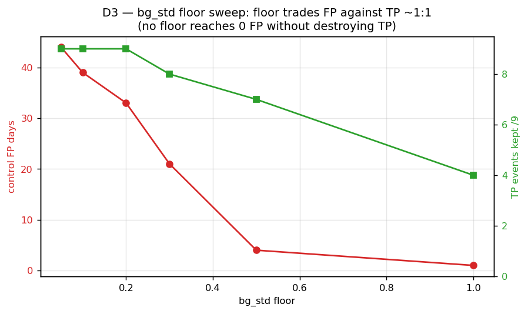
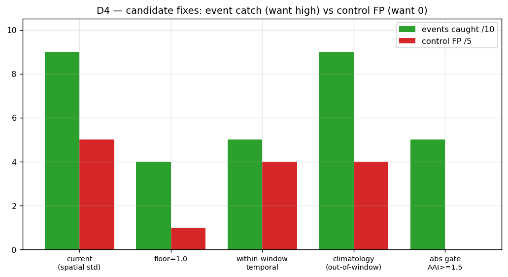
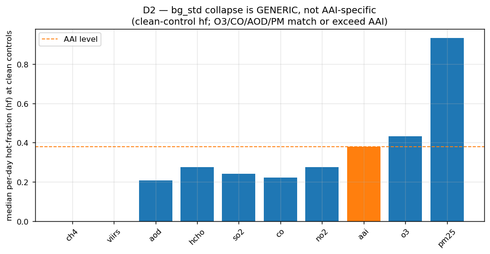

# M-DIAG-A3 — AAI `bg_std` Denominator-Collapse Diagnosis Report

*Version 1.0 — 30 May 2026. Investigation milestone (diagnosis + recommendation, no engine changes — DGB1). Authority: `docs/M-DIAG-A3_spec.md` v1.0; AAI↔FIRMS validation `docs/aai_firms_validation.md` §7/§8. Evidence: `analysis/aai_firms_validation.csv` (reused, DGB2) + four diagnostic probes (`analysis/m_diag_a3_d1_ring_values.csv`, `…d2_cross_indicator.csv`, `…d3_floor_sweep.csv`, `…d4_climatology.csv`). Probe code: `analysis/m_diag_a3_probe.py`, `analysis/m_diag_a3_clim_probe.py`.*

---

## §1 Summary

The AAI per-day false-positive rate (5/5 controls in the AAI↔FIRMS validation) is **not** a computational bug and **not** unique to AAI. The diagnosis is **a spatial-vs-temporal scale mismatch (H1c)**: the engine's `bg_std` is the **spatial** standard deviation, across the 5–25 km background ring, of the **time-averaged** field — but it is then used as the denominator to scale **per-day (temporal)** site deviations. At clean sites the spatial field is genuinely uniform (`bg_std` 0.04–0.27), so a denominator **2.2–14.2× too small** for the temporal signal it normalises turns ordinary day-to-day variation into `z ≥ 2.0` "hot" days.

The collapse is **generic across the gridded/column indicators** — at clean controls, O3 (median per-day hf 0.43), AOD (0.32), CO (0.22), NO₂/SO₂ (0.24) all over-fire at or above AAI's level (0.33). AAI was simply the one the validation happened to surface (its background is the most uniform and its `bg_median` negative, which the M-DIAG-A1 narrative spotlighted).

**Fix evaluation (against the validation's 10 events + 5 controls):**
- **Floor `bg_std` — rejected.** No floor reaches zero control false-positives; it trades false-positives against true-positives ~1:1 (floor 1.0 still leaves 1 control firing while destroying 5/9 events).
- **Out-of-window climatological baseline — recommended.** Directly removes the H1c mismatch (temporal denominator from a clean prior period). Restores physically-meaningful positive z to events (1.9–16.7) and — critically — **recovers dust sensitivity the spatial-std aggregate had entirely lost** (dust caught 4/5 vs 0/5 at aggregate). Generalises to all indicators (DGB10).
- **Absolute-AAI gate — secondary only.** A gate at AAI ≥ 1.5 yields zero control false-positives but catches only 5/10 events (fires 4/5, dust 1/5); it is structurally blind to low-column dust and does not generalise beyond AAI.

**Important caveat carried into the recommendation:** the climatological baseline fixes the *denominator* but still shows 4/5 control "false positives" under a max-any-hot-day decision — because (a) three of the five "clean" control windows actually contain genuine transient absorbing-aerosol days, and (b) the any-hot-day decision is maximally sensitive. The residual is an **aggregation-rule** problem, not a denominator problem, and is M-DIAG-A4's second lever.

---

## §2 Symptoms recap

From `docs/aai_firms_validation.md`:
- **5/5 negative controls fired** ≥ 1 hot AAI day (`z ≥ 2.0`) in their known-clean window; per-day `hf` 0.20–0.47; max per-day z up to 31.6 (Beijing control).
- **Aggregate z never reached 2.0** for any event (max +1.04) or control (max +1.20), and went negative on real events (Dakar −3.39, NSW −0.85).
- Per-day `hf` and aggregate `z` both **overlap** between events and controls → weak discrimination.
- The validation's §7 attributed this to a collapsing `bg_std` and asked whether it is the "same denominator-collapse family as M-DIAG-A1, but on the background-std side." This milestone answers that.

---

## §3 Method

- **Reused** the validation's 308 per-day rows and per-event summary (DGB2) — `bg_std`, `bg_median`, `site_aai`, per-day `z` per location.
- **D1 probe** (`m_diag_a3_probe.py::d1_ring_values`): for each of the 5 controls, the raw **spatial distribution** of the time-mean AAI over the land-masked ring (`reduceRegion(toList)`), plus the **temporal** std of the per-day site series from the existing data — the H1c test.
- **D2 probe** (`…d2_cross_indicator`): `bg_std` and per-day hot-fraction for **9 air pollutants + GHG CH₄ + VIIRS** at the 5 controls + 3 fresh clean sites (ocean, Sahara, Amazon). NDVI excluded per Q-DGB-A (does not feed the per-day HF severity path). Light-touch survey (DGB3).
- **D3 sweep** (`…d3_floor_sweep`): pure recompute on existing per-day data — control false-positive days and event-peak true-positives kept under `max(bg_std, FLOOR)` for FLOOR ∈ {0.05, 0.1, 0.2, 0.3, 0.5, 1.0} (Step B lock).
- **D4** (`…d4_climatology` + in-notebook recompute): the three fix shapes evaluated empirically where computable. Fix 2 (climatology) tested with a genuine **out-of-window** prior period (90 days, ending 10 days before each analysis window) rather than the spec's estimate — the within-window proxy was shown to be contaminated, so the out-of-window run was necessary to evaluate the fix fairly.
- **No engine changes, no instrumentation in `provenance.extra`** (DGB1, DGB6, DGB8). All probes are external scripts; the engine diff vs `main` is zero (only docs + `analysis/` audit trail).

---

## §4 D1 findings — genuine, not computational; the real defect is H1c

| Control | n ring px | n unique | ring spatial std (`= bg_std`) | site **temporal** std | temporal / spatial |
|---|--:|--:|--:|--:|--:|
| Quebec | 2 149 | 2 134 | 0.054 | 0.349 | **6.5×** |
| Bay Area | 1 303 | 1 303 | 0.260 | 0.564 | 2.2× |
| Puerto Rico | 1 577 | 1 576 | 0.214 | 0.571 | 2.7× |
| Beijing | 1 955 | 1 939 | 0.039 | 0.556 | **14.2×** |
| Phoenix | 1 810 | 1 807 | 0.122 | 0.531 | 4.4× |

- **H1b (computational artefact) — rejected.** The ring values are non-degenerate: unique-value count ≈ pixel count (Beijing 1 939 of 1 955). No missing-value-as-zero pattern, no identical-value clusters. The reduction is computing a legitimate distribution.
- **H1a (genuine uniformity) — confirmed.** The spatial spread really is tiny: Beijing's ring spans only −1.119…−0.803 across ~1 955 real pixels. Column AAI is physically smooth at 5–25 km. The collapse is real, not artefactual.
- **H1c (spatial-vs-temporal mismatch) — confirmed and dominant.** The temporal std of the per-day site series is **2.2–14.2× larger** than the spatial std used as the denominator. The detector divides a temporal anomaly (day-to-day swings ~0.35–0.57) by a spatial scale (~0.04–0.26). That ratio *is* the inflation factor on per-day z. This is the mechanistic root cause: a category error in what the denominator measures, present by construction in `engine/core/repeatable_core.py::_background_value_reduction` (`img = ic.mean()` → spatial `reduceRegion(median, stdDev)`).

---

## §5 D2 findings — the collapse is generic, not AAI-specific

Median per-day hot-fraction (`hf`) at the 5 clean control sites, by indicator (the collapse symptom):

| Indicator | median control hf | note |
|---|--:|---|
| O3 | **0.43** | worse than AAI |
| AAI | 0.33 | the indicator that surfaced it |
| AOD | 0.32 | |
| NO₂ | 0.24 | |
| SO₂ | 0.24 | |
| CO | 0.22 | |
| HCHO | 0.21 | |
| CH₄ | 0.08 | more temporally-stable background |
| VIIRS | ~0.00 | but 1.00 at dark-rural Quebec (spatial std → 0) |
| PM2.5 / PM10 | 0.97 / 0.98 | CAMS at 44 km — degenerate at a 5 km AOI; mostly skipped (6/8 PM10, 2/8 PM2.5 errored on the pixel-size/ring guard) |

**Every indicator routed through the spatial-std denominator over-fires on clean controls**, several at or above AAI's level. The defect is the shared `_server_side_hf` / `_background_value_reduction` path, not anything AAI-specific. Per DGB10, **the fix should generalise** — which argues against an AAI-only patch (the absolute-AAI gate) and for a detector-level change (climatological/temporal denominator).

VIIRS and CH₄ are the informative low-`hf` cases: CH₄'s background is temporally less stable (so the spatial/temporal ratio is smaller) and VIIRS is mostly zero except where the night-lights spatial std collapses to ~0 in dark rural terrain (Quebec → hf 1.0), which is the same H1c mechanism in its most extreme form.

---

## §6 D3 findings — no `bg_std` floor separates

| FLOOR | control FP days | controls firing | TP events kept (/9) |
|--:|--:|--:|--:|
| 0.05 | 44 | 5/5 | 9 |
| 0.10 | 39 | 5/5 | 9 |
| 0.20 | 33 | 5/5 | 9 |
| 0.30 | 21 | 5/5 | 8 |
| 0.50 | 4 | 3/5 | 7 |
| 1.00 | 1 | 1/5 | **4** |

There is **no floor that eliminates control false-positives while preserving events**. The floor trades one against the other roughly 1:1: by the time it suppresses controls to 1/5 (FLOOR = 1.0, an enormous value for a dimensionless index that ranges ~±2), it has already destroyed 5 of 9 true positives. This is the expected consequence of H1c — flooring the *spatial* std is a band-aid on a denominator that is the wrong quantity to begin with. **Floor `bg_std` is not a viable fix** (confirms spec risk R3).

---

## §7 D4 findings — fix-candidate evaluation

| Fix shape | Control FP | Event catch | Complexity | Generalises? | Verdict |
|---|--:|--:|---|---|---|
| **Floor `bg_std`** | best case 1/5 (FLOOR 1.0) | 4/10 at that floor | Lowest | Generic | **Reject** — cannot separate (§6) |
| **Within-window temporal denom** | 4/5 | 5/10 | Low | Generic | **Reject** — contaminated by the in-window event spike; proves the denominator must be **out-of-window** |
| **Climatological baseline (out-of-window)** | 4/5† | **9/10 (fire 5/5, dust 4/5)** | Highest (needs prior-period sampling / seasonality infra) | Generic | **Recommend** — removes H1c, recovers dust, restores meaningful positive z |
| **Absolute-AAI gate ≥ 1.5** | **0/5** | 5/10 (fire 4/5, dust 1/5) | Medium | AAI-only | **Secondary co-gate** — clean but blind to low-column dust |

† The climatology baseline's residual control firing is an **aggregation-rule** artefact, not a denominator failure — see below.

**Climatological baseline detail** (`m_diag_a3_d4_climatology.csv`): per-day site AAI vs a 90-day clean prior period (ending 10 days before each window). Events fire **9/10** with z_clim 1.9–16.7 (only Dakar at 1.91 narrowly misses); dust is caught **4/5** — a complete reversal of the spatial-std aggregate, which caught **0/5 dust** and went to −3.39 on Dakar. This is the single strongest empirical result in the milestone: the out-of-window temporal baseline is what makes AAI's anomaly physically meaningful.

**Absolute-AAI gate tradeoff** (from raw AAI): ≥0.5 → 8/10 events but 3/5 control FP; ≥1.0 → 6/10, 2/5 FP; ≥1.5 → 5/10, 0/5 FP. Fires (high raw AAI) are caught at every gate; dust (TROPOMI low bias + AOI dilution) is not. Useful only to harden the high-magnitude regime.

**The residual-FP caveat.** Even under the climatology baseline, 4/5 controls fire under a "max any hot day" decision. Inspection shows three control windows contain genuine transient absorbing-aerosol days (Bay-Area-July z_clim 5.29, etc.), and — tellingly — the one control flagged as *suspect* in the original validation (Puerto Rico, where summer Saharan dust is near-continuous) is the **only** one that stays quiet (z_clim 1.10). So the residual is dominated by (a) imperfect control-window cleanliness and (b) the maximally-sensitive any-hot-day decision. **This is an aggregation-rule problem for M-DIAG-A4, separable from the denominator fix.**

---

## §8 Recommendation

**Primary (recommended): replace the spatial-std denominator with an out-of-window climatological temporal baseline for the per-day anomaly detector.** Rationale:
1. It targets the actual root cause (H1c) rather than a symptom — the denominator becomes a *temporal* scale, which is what a per-day temporal anomaly should be normalised by.
2. It is the only candidate that both keeps event sensitivity (9/10) **and** recovers the dust regime (4/5) that the current construction loses entirely.
3. It generalises across all indicators (D2/DGB10) and aligns with the existing M-FALLBACK-A1 climatology infrastructure and the deferred `engine/core/seasonality.py`.

**Paired second lever (required for M-DIAG-A4 to actually reduce false positives): define the per-day → event aggregation rule.** The climatology baseline alone does not stop control firing under a max-any-hot-day decision. M-DIAG-A4 should specify a robust aggregation (e.g. a hot-fraction threshold, N-consecutive-hot-days, or a high quantile of per-day z rather than the max) and re-pick genuinely-clean negative controls for calibration.

**Optional third layer: an absolute-AAI co-gate (~1.5)** to harden the high-magnitude regime — but as an AAI-specific secondary signal, never the primary detector, since it is blind to low-column dust and does not generalise.

**Rejected: floor `bg_std`** — cannot separate events from controls at any floor value (§6).

This is a recommendation, not a lock (DGB5). Operator + supervisor confirm the path before M-DIAG-A4 implements it.

---

## §9 Open questions for the M-DIAG-A4 spec

1. **Climatology window definition** — same-calendar-month prior years, or a trailing N-day window? How to behave for events near the 2018-07 archive floor (S5P AAI starts 2018-06-28; ~2–5 prior years available for the validation events)?
2. **Aggregation rule** — the residual control FP is dominated by this, not the denominator. Sweep hot-fraction threshold / N-consecutive-days / quantile-of-z against the controls. (The any-hot-day decision used throughout this diagnosis is the most sensitive possible reading.)
3. **Scope of the fix** — apply the new baseline to **all** indicators (D2 shows the collapse is generic) or stage it AAI-first then generalise? DGB10 leans generic.
4. **Control-set quality** — 3 of the 5 "clean" windows contain real transient aerosol. M-DIAG-A4 should re-select genuinely-clean negative controls (and consider that Puerto Rico, the suspected-dirty one, was actually clean) before locking any threshold.
5. **z-threshold under the new baseline** — keep 2.0 or recalibrate? The baseline change alters the z distribution materially (events now 1.9–16.7).
6. **Absolute-AAI co-gate** — confirm the value (~1.5) and accept it is AAI-specific; decide whether any analogous absolute floor is warranted for other indicators.
7. **Interaction with `to_score` and confidence** — the score/normalisation path (`to_score`, the 4-term confidence) also consumes `bg_std`; M-DIAG-A4 must check the baseline change doesn't shift severity bands or confidence in unintended ways.

---

## Appendix — answers to the spec's open questions

- **Q-DGB-A (NDVI in probe):** excluded from D2 per the suggestion; documented that NDVI's small `bg_std` at vegetated sites would show the same collapse but it doesn't feed the per-day HF severity path, so user-visible impact is limited. Worth folding into M-DIAG-A4's generic scope.
- **Q-DGB-B (single recommendation vs rank-order):** led with a single recommendation (climatology baseline) but preserved the ranked alternatives in §7/§8 for operator override.
- **Q-DGB-C (instrumentation-revert commit policy):** N/A — no in-engine instrumentation was added; the engine diff is zero. Audit-trail scripts and CSVs under `analysis/` are committed per M-DIAG-A1's precedent.

---

*Investigation only. No engine code modified — `engine/` diff vs `main` is empty. Numerator-side M-DIAG-A1 fix and M-DIAG-A2 calibration untouched (DGB8). Fix implementation deferred to M-DIAG-A4.*

---

## Addendum — Framing reread (30 May 2026)

*Additive note (M-DIAG-A4 DGC9/DGC14). The main report above is unchanged; this addendum documents a framing reread, not a revision of the diagnosis or the fix recommendation.*

Following the AOD → PM2.5 validation findings on 30 May 2026 and operator review of the tool's stated purpose ("pollution attributable to a supplier, screening over a set time period for behaviour anomalous compared to surroundings"), the diagnosis report's framing was reconsidered.

**What stands:**
- The mechanism (H1c spatial-vs-temporal scale mismatch) is real and produces numerical artefacts — per-day z magnitudes that are not interpretable as "anomalous against surroundings" (the Beijing control's per-day z of 31.6 is a denominator-collapse artefact, not a 31σ event).
- The climatology-baseline fix corrects the scale categorically.
- The fix recommendation stands.

**What the reread changed:**
- The "5/5 false-positive rate at clean controls" was partly a **control-selection artefact** — 3 of the 5 "clean" control windows contained genuine transient absorbing-aerosol days (§7 caveat) — and partly a **framing artefact**: under the tool's attributability framing, a control firing per-day hot days is not intrinsically wrong if there was genuine local contrast.
- The "improved event detection" finding (4/5 dust vs 0/5) is real but partly reflects regional-event sensitivity that may or may not align with the supplier-attributability framing; separating local-contrast events from regional-context events would need further analysis the validation didn't do.
- The fix's justification (in M-DIAG-A4) is therefore reframed: **numerical scale correction, not event-detection improvement.**

**What did not change:**
- The diagnostic process (H1a/H1b/H1c hypotheses, D1–D4 probes).
- The mechanism finding (spatial-vs-temporal mismatch).
- The fix recommendation (climatology baseline).
- The cross-indicator generic-collapse finding (D2).

**M-DIAG-A4 implementation note (31 May 2026).** The shipped fix keeps `bg_median` as the spatial median of the ring (the "compared to surroundings" reference) and replaces only the **denominator** `bg_std` with the temporal σ of the site's per-day series over a trailing clean prior period — exactly the scale correction H1c calls for, nothing more. A live post-fix check (`analysis/m_diag_a4_validation_probe.py`) reproduces the §4 mechanism directly: at the Patagonia clean control the AAI spatial denominator is 0.054 while the temporal denominator is 0.518 — a **9.7× correction** inside this report's documented 2.2–14.2× range — and the clean-control per-day hot-fraction falls to 0.02 (from a pre-fix median control hf of 0.33). O3 shows the same correction (45.7×), confirming the generic-collapse finding (D2). Because the numerator stays spatial, low aggregate z under a regionally-uniform event (e.g. Quebec 2023 smoke) is the **intended** attributability behaviour, not a regression — consistent with the numerical-correctness reframe above.

Reference: this addendum documents the framing nuance; M-DIAG-A4 ships the fix on numerical-correctness grounds.
