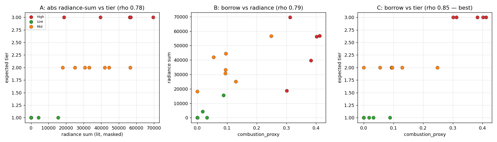

# M-GHG-SANITY-A1 — VIIRS Absolute-Intensity + Air-Borrow Sanity Check

*Version 1.0 — 1 June 2026. Pre-redesign empirical sanity check, no engine changes (GS10). Authority: `M-GHG-SANITY-A1_spec.md` v1.0; M-VIIRS-DIAG-A1 + M-CALIBRATION-SWEEP-A1 closed entries. Evidence: `analysis/m_ghg_sanity_a1_results.csv`, `…_analyses.png`, probe `analysis/m_ghg_sanity_a1_probe.py`. Produces evidence + options; does NOT pick Option I vs II (GS8).*

---

## §1 — Goal recap

Post-M-GHG-REDESIGN-A1 the GHG composite is **0.60 VIIRS sustained-contrast + 0.40 borrowed Air NO₂/CO (`combustion_proxy`)**. M-VIIRS-DIAG-A1 showed the VIIRS contrast grammar can't rank industrial intensity; the proposed redesign splits VIIRS into a **lit-contrast presence flag** + an **absolute-intensity GHG proxy**. Two assumptions need checking first:
- **A1 — absolute VIIRS radiance ranks GHG-relevant activity** at supplier sites.
- **A2 — the Air NO₂/CO borrow does meaningful GHG work** in the composite.

The combined answer informs **Option I** (retain the borrow) vs **Option II** (drop it). This check produces evidence; the operator decides.

## §2 — Methodology

17 AOIs (12 M-VIIRS-DIAG-A1 + 5 production seeds), window **2025-09-01→11-30**, radius **10 km** (uniform, GS5). Metrics per AOI: VIIRS absolute radiance — **mean / median / sum**, both **floor-masked (>1 nW/cm²/sr) and unmasked** (Step B), plus max and lit-pixel/day counts — alongside the existing `combustion_proxy` (Air borrow) and current `viirs_score`. Expected GHG-intensity tiers locked at Step B (High/Mid/Low). Spearman rank correlation (tiers mapped High=3/Mid=2/Low=1) for the three analyses (GS7).

**Ground-truth note carried from recon:** the *Patagonia seed* (−45.86, −67.50) is near **Comodoro Rivadavia, an oil/gas region** — not the diagnostic's pristine Patagonia (−51, −72.9). Tiered **Mid** (oil/gas), separate from `patagonia_diag` (Low). This concretely explains M-VIIRS-DIAG-A1 §7's "Patagonia scored 0.96." Distrito Federal seed native radius is 43 km (run at 10 km here for comparability — flagged).

## §3 — Per-AOI results (key columns)

| AOI | tier | rad_sum (masked) | rad_mean (masked) | combustion_proxy | viirs_score |
|---|--|--:|--:|--:|--:|
| yanbu | High | 69 545 | 44.0 | 0.31 | 0.78 |
| norilsk_seed | High | 56 776 | 13.9 | 0.41 | 0.93 |
| norilsk_diag | High | 56 211 | 13.7 | 0.40 | 0.93 |
| jamshedpur | High | 39 603 | 25.3 | 0.38 | 0.92 |
| korba | High | 18 775 | 12.0 | 0.30 | 0.79 |
| vadodara | Mid | 56 524 | 36.2 | 0.25 | 0.86 |
| patagonia_seed | Mid (oil) | 44 444 | 30.2 | 0.10 | 0.96 |
| distrito_federal_seed | Mid | 41 947 | 27.9 | 0.05 | 0.49 |
| rondonopolis | Mid | 33 177 | 22.7 | 0.10 | 0.97 |
| pavlodar | Mid | 30 753 | 18.3 | 0.09 | 0.96 |
| ploiesti | Mid | 25 090 | 12.8 | 0.13 | 0.78 |
| suape_seed | Mid | 18 129 | 17.6 | 0.00 | 0.22 |
| appalachia | Low | 15 510 | 9.7 | 0.09 | 0.73 |
| sapezal_seed | Low | 4 269 | 16.2 | 0.02 | 0.87 |
| amazon_wet | Low | 2.7 | 2.7 | 0.00 | 0.17 |
| nz_south | Low | 4.2 | 2.1 | 0.00 | 0.09 |
| patagonia_diag | Low | 0 | — | 0.03 | 0.13 |

(`rad_max` came back null across AOIs — reducer/coverage issue on the temporal-max image; the mean/median/sum reducers are intact and carry the analysis.)

## §4 — Analysis A: absolute intensity vs expected GHG intensity

Spearman ρ vs expected tier: **rad_sum_masked 0.78** (p<0.001), rad_sum_unmasked 0.78, rad_mean_unmasked 0.67, **rad_mean_masked 0.39**, rad_median_masked 0.39, viirs_score 0.52.

Tier means: rad_sum_masked — High **48 182**, Mid **35 723**, Low **3 957**; rad_mean_masked — High 21.8, **Mid 23.7**, Low 7.7.

**Verdict: partial.** Radiance **sum** separates *lit from dark* well (ρ 0.78) — but that's largely the Low/wilderness sites collapsing to ~0; it does **not** cleanly rank **High vs Mid intensity** (Vadodara-Mid 56 524 ≈ Norilsk-High 56 776). Radiance **mean** is worse — it **inverts** (Mid 23.7 > High 21.8), because per-pixel brightness reflects urban/lit density, not industrial intensity (Sapezal-Low reads mean 16; DF-Mid urban reads 28). **Absolute radiance is a good *presence* signal, a weak *intensity* signal.** Assumption A1 holds only in the weak "is there lit activity here" sense.

## §5 — Analysis B: Air borrow vs VIIRS absolute intensity (redundancy?)

Spearman ρ: cproxy vs **rad_sum_masked 0.79**, vs rad_mean_masked 0.31, vs viirs_score 0.61.

**Verdict: partially overlapping, not redundant.** The borrow correlates with radiance *sum* (0.79 — both rise with lit-industrial presence) but **not** with radiance *mean* (0.31). They rank different leaders: radiance tops out at the *brightest* sites (Yanbu, Vadodara, DF), the borrow tops out at the *highest-combustion* sites (Norilsk, Jamshedpur, Yanbu, Korba). They measure related-but-distinct things — **brightness/extent vs combustion chemistry** — so dropping one is not "free."

## §6 — Analysis C: Air borrow vs expected GHG intensity

**Spearman ρ = 0.85 (p<0.001) — the strongest of any metric measured.** Tier means: High **0.36**, Mid **0.10**, Low **0.03** — clean monotonic separation, and the four High-tier sites (Norilsk×2, Jamshedpur, Yanbu, Korba) are the **top five** combustion_proxy values.

**Verdict: the borrow is doing real, GHG-relevant work — better than any VIIRS metric.** It ranks expected intensity above radiance-sum (0.78) and well above the current VIIRS score (0.52). Exceptions worth noting: Suape (Mid port) = 0.00 and DF (Mid urban) = 0.05 — both lit but with no local NO₂/CO *anomaly* (regional/urban background, no standout), the known site-vs-ring limitation.

## §7 — Findings synthesis

The evidence supports, against the two assumptions:
- **A1 (absolute radiance ranks GHG intensity): weakly.** Radiance-sum is a solid *presence/attributability* signal (separates lit from dark, ρ 0.78) but a poor *intensity* ranker (doesn't separate High from Mid; mean inverts). Best used as the **lit-contrast/presence** leg of the redesign, not the severity-driving intensity leg.
- **A2 (the Air borrow does meaningful GHG work): yes, strongly.** `combustion_proxy` is the best intensity ranker measured (ρ 0.85, cleanly tiered).

Two evidence-aligned options for the redesign (operator decides — GS8):

- **Option I — retain the Air borrow.** Strongly supported by §6: the borrow is the best available GHG-intensity ranker; dropping it discards the strongest signal. Pairs naturally with a VIIRS **presence/lit-contrast** signal (radiance-sum or contrast), with the borrow carrying intensity. Caveat: the borrow inherits the site-vs-ring limitation (Suape/DF read low despite being lit).
- **Option II — drop the borrow, lean on VIIRS absolute intensity.** Supported only weakly: radiance separates presence but not High-vs-Mid intensity (mean inverts), so a VIIRS-only composite would rank brightness, not GHG intensity. Risk: lose the ρ-0.85 ranker for a ρ-0.78-presence / weak-intensity one.

A third shape the evidence hints at: **presence from VIIRS (radiance-sum / lit-contrast) + intensity from the Air borrow** — i.e. the two-signal split, but with the *intensity* role assigned to the borrow rather than to absolute radiance. The operator's redesign decision weighs these.

## §8 — Open questions

- **`rad_max` null** — the temporal-max reducer returned nothing usable; if max radiance matters to the redesign, the probe needs a fix (per-image max then spatial max). Mean/median/sum sufficed here.
- **Sapezal-Low reads "lit"** (radiance present, viirs 0.87) — agricultural-frontier town lights, not GHG industry; cproxy correctly ~0. A presence-only signal would false-flag it; the borrow does not.
- **Suape (port) and DF (urban) read low on the borrow** despite being lit — the site-vs-ring anomaly limitation (no local standout in a regionally-elevated area). Same family as the C1 regional-embedding note.
- **DF run at 10 km** (native 43 km) for comparability — its numbers aren't its production values.
- Cross-references: **M-VIIRS-EDGAR-A1** (external emissions benchmark) is the independent check this sanity test can't provide; the **VIIRS redesign spec** consumes these findings.

---

*Sanity check produced evidence for the redesign's Option I/II decision; it does not choose between them (GS8). No engine change (GS10) — `git diff HEAD -- engine/` empty.*
