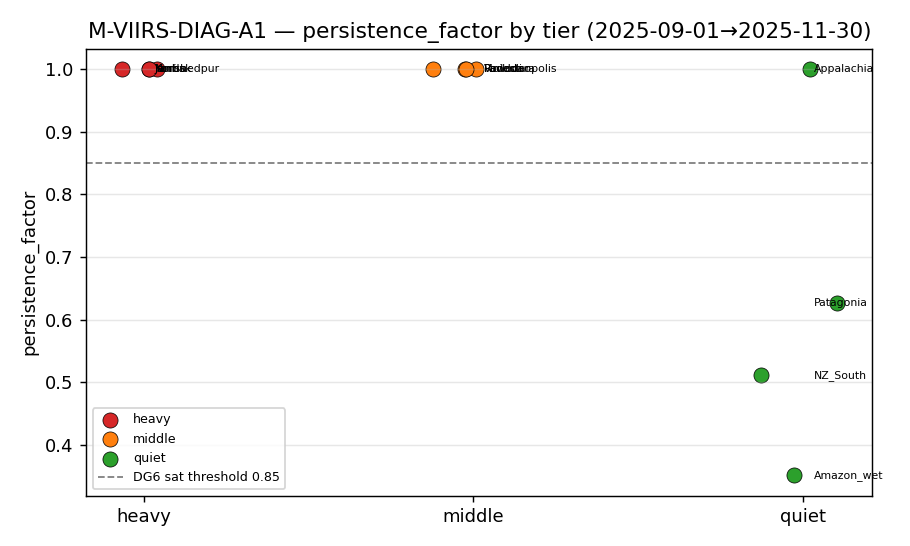
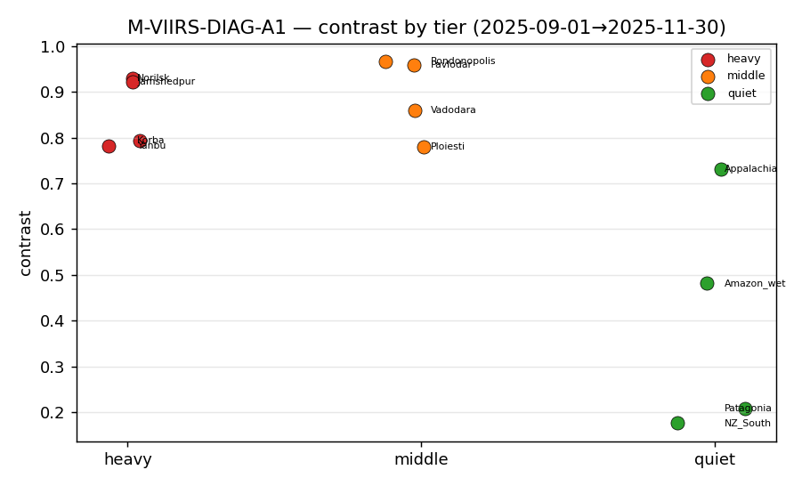
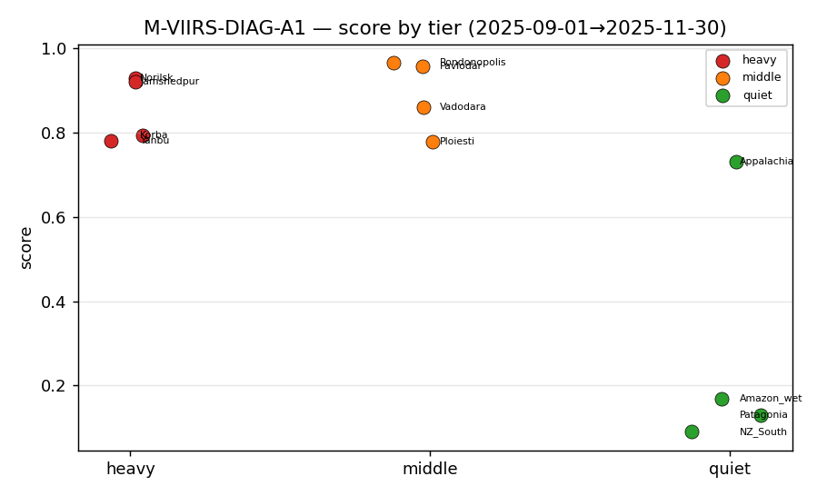

# M-VIIRS-DIAG-A1 — Mixed-AOI VIIRS Distribution Diagnostic

*Version 1.0 — 1 June 2026. Empirical diagnostic milestone (no engine changes, DG10). Authority: `M-VIIRS-DIAG-A1_spec.md` v1.0; M-GHG-REDESIGN-A1 closure (the "4/5 demo seeds lean High" observation). Evidence: `analysis/m_viirs_diag_a1_results.csv`, `…_pfloor_sweep.csv`, three plots, probe `analysis/m_viirs_diag_a1_probe.py`. Production code path: `engine.ghg.compute_viirs_sustained_contrast` (DG8).*

---

## §1 — Goal recap

M-GHG-REDESIGN-A1 re-grammared VIIRS night-lights as a **persistence-weighted ring-relative sustained-contrast** signal (`score = contrast_over_lit_window · persistence_factor`), and its closure flagged that **4 of 5 demo seeds lean High** on VIIRS. Two candidate explanations:

- **Benign** — the 5 demo AOIs are genuinely heavy-industrial; the score is correct; fix is cosmetic (add quieter AOIs).
- **Worth ruling out** — `P_FLOOR` / the lit-above-background threshold are loose enough that `persistence_factor` saturates too early, compressing the top of the score range.

This diagnostic runs the production scoring across a deliberately mixed 12-AOI set (4 heavy + 4 middle + 4 quiet) and inspects the distribution of `persistence_factor`, `contrast_over_lit_window`, and `viirs_score` to distinguish the two — then applies the pre-locked DG6 criteria to produce a verdict and a recommendation for the calibration sweep.

---

## §2 — Methodology

- **Code path (DG8):** `compute_viirs_sustained_contrast(aoi, window, "screening", ee)` — the production path, no debug forks. Metrics captured per AOI (DG5): `ghg.viirs.contrast` (= `contrast_over_lit_window`), `ghg.viirs.persistence` (raw lit fraction `n_lit/n_valid`), `ghg.viirs.score`. `persistence_factor` (the DG6 quantity) is derived as `_persistence_factor(persistence) = D + (1−D)·min(persistence/P_FLOOR, 1)`, with `D = 0.30`, `P_FLOOR = 0.60`.
- **AOI set (DG1–DG4, Step B locked):** radius **10 km**, window **2025-09-01 → 2025-11-30** (settled 90 days; avoids VNP46A2 latency near today).
- **Decision criteria (DG6), applied mechanically (precedence saturation → working → ambiguous):**
  - *saturation* if `#heavy pf>0.85 ≥ 3` **and** `#middle pf>0.85 ≥ 2`;
  - *working-correctly* if (not saturation) and (`#middle in [0.3,0.7] ≥ 3`) or (`#heavy in [0.6,0.95] ≥ 3` and `#heavy>0.95 ≤ 1`);
  - *ambiguous* otherwise.
- **P_FLOOR micro-sweep (§4.4):** run **unconditionally** (Step B); free, since `persistence_factor`/`score` are pure-math on the already-captured `persistence`/`contrast`.

| Tier | AOI | Ground-truth note |
|---|---|---|
| heavy | Norilsk (69.35, 88.20) | Nornickel smelter complex (also demo seed) |
| heavy | Korba (22.35, 82.68) | Coal-power + aluminium cluster, IN |
| heavy | Jamshedpur (22.80, 86.20) | Tata steel works, IN |
| heavy | Yanbu (24.09, 38.06) | Petrochemical/refining city, SA |
| middle | Ploiești (44.94, 26.03) | Mid-size oil-refining city, RO |
| middle | Pavlodar (52.29, 76.95) | Refinery + aluminium smelter, KZ |
| middle | Vadodara (22.31, 73.18) | Petrochem/industrial secondary city, IN |
| middle | Rondonópolis (−16.47, −54.64) | Soy-crushing agro-industrial hub, BR |
| quiet | Patagonia (−51.00, −72.90) | Patagonian steppe wilderness (M-DIAG-A4-vetted clean) |
| quiet | NZ South (−45.50, 170.00) | South Island rural |
| quiet | Appalachia (35.50, −82.50) | W. North Carolina forest |
| quiet | Amazon wet (−4.00, −63.00) | Central Amazon interior |

---

## §3 — Results

| AOI | tier | persistence | persistence_factor | contrast | viirs_score |
|---|---|--:|--:|--:|--:|
| Norilsk | heavy | 1.00 | **1.00** | 0.929 | 0.929 |
| Korba | heavy | 1.00 | **1.00** | 0.793 | 0.793 |
| Jamshedpur | heavy | 1.00 | **1.00** | 0.922 | 0.922 |
| Yanbu | heavy | 1.00 | **1.00** | 0.782 | 0.782 |
| Ploiești | middle | 1.00 | **1.00** | 0.780 | 0.780 |
| Pavlodar | middle | 1.00 | **1.00** | 0.958 | 0.958 |
| Vadodara | middle | 1.00 | **1.00** | 0.860 | 0.860 |
| Rondonópolis | middle | 1.00 | **1.00** | 0.967 | 0.967 |
| Patagonia | quiet | 0.280 | 0.627 | 0.207 | 0.130 |
| NZ South | quiet | 0.181 | 0.511 | 0.176 | 0.090 |
| Appalachia | quiet | **1.00** | **1.00** | 0.731 | 0.731 |
| Amazon wet | quiet | 0.044 | 0.352 | 0.481 | 0.169 |

**Observations:**

1. **`persistence_factor` saturates to 1.0 for every regularly-lit site** — all 4 heavy, all 4 middle, and one "quiet" site (Appalachia). It only falls below 1.0 at the three genuinely dark sites (Patagonia 0.63, NZ 0.51, Amazon 0.35), and even there the **0.30 discount floor** keeps it well above zero.
2. **The score reduces to `contrast`** wherever `persistence ≥ P_FLOOR` (i.e. `persistence_factor = 1.0` ⟹ `score = contrast`). That is 9 of 12 AOIs here. The persistence term does **no discriminating work** for any consistently-lit site.
3. **`contrast` does not separate the heavy and middle tiers.** Middle contrast (0.78–0.97) overlaps and even exceeds heavy contrast (0.78–0.93) — Pavlodar (0.96) and Rondonópolis (0.97) top the whole set. Industrial intensity is not recoverable from the score.
4. **A "quiet" site can score High.** Appalachia (forested rural NC) reads `persistence 1.0, score 0.73` — a false High. The dark-area **Michelson-contrast artefact** is visible at Amazon (contrast 0.48 on persistence 0.044): in near-dark scenes a tiny absolute brightness difference yields a large *relative* contrast.

---

## §4 — Verdict

**In plain words:** the night-lights score can't tell a heavy factory town from an ordinary lit town. We tested 12 places — 4 known heavy-industrial, 4 medium, 4 empty wilderness. **All 8 industrial and medium places hit the top of the scale, and so did one of the "empty" ones (a forested rural area in Appalachia).** Only the genuinely dark wilderness spots scored low. So a high night-lights score today mostly means *"this place has lights on most nights"*, not *"this place has heavy industry"* — the score stops separating once a site is lit at all. We also tried turning the one obvious tuning knob (`P_FLOOR`) across its whole range, and it changed **nothing** — so the problem isn't that knob; it's deeper in how the score is built. This matches the worrying explanation, not the benign one: the score leans High by construction, not because our demo sites happen to be heavy-industrial.

**Formally: SATURATION.** DG6 criteria applied mechanically:

| DG6 quantity | value | threshold | met? |
|---|--:|---|:--:|
| #heavy with pf > 0.85 | **4** / 4 | ≥ 3 | ✓ |
| #middle with pf > 0.85 | **4** / 4 | ≥ 2 | ✓ |

Both saturation conditions are satisfied (and by margin — *all* heavy and *all* middle saturate, not just the thresholds). The working-correctly conditions fail (middle cluster in [0.3,0.7] = 0; heavy in [0.6,0.95] not-all-top = 0, since all four heavy exceed 0.95). **Verdict bucket: saturation.** No ambiguity.

This rules **out** the benign explanation: the score leans High not because the AOIs are uniformly heavy-industrial, but because `persistence_factor` saturates for anything regularly lit and the score collapses to a Michelson contrast that itself runs high and does not rank intensity.

---

## §5 — P_FLOOR micro-sweep

Recomputed `persistence_factor`/`score` at `P_FLOOR ∈ {0.60, 0.66, 0.75, 0.90}` (pure-math on captured metrics):

| P_FLOOR | heavy saturating (pf>0.85) | middle saturating | quiet saturating |
|--:|--:|--:|--:|
| 0.60 (current) | 4/4 | 4/4 | 1/4 |
| 0.66 | 4/4 | 4/4 | 1/4 |
| 0.75 | 4/4 | 4/4 | 1/4 |
| 0.90 | 4/4 | 4/4 | 1/4 |

**The sweep is completely flat.** Raising `P_FLOOR` cannot de-saturate these sites, because their `persistence = 1.0`, and `persistence_factor = D + (1−D)·min(1.0/P_FLOOR, 1) = 1.0` for *any* `P_FLOOR ≤ 1.0`. **`P_FLOOR` is therefore not the effective calibration lever for the observed compression** — it only governs how partially-lit sites ramp up, not the fully-lit majority that drive the "lean High" effect.

The upstream lever is what makes `persistence` saturate in the first place: **`VIIRS_LIT_CONTRAST_THRESHOLD = 0.02`** is low enough that almost every timestep counts as "lit", pinning `persistence` at ~1.0. Exploring that threshold (and/or the contrast grammar) would require re-extracting the per-timestep contrast series — out of this diagnostic's locked §4.4 scope (P_FLOOR only), but flagged for the sweep below.

---

## §6 — Recommendation for the calibration sweep

**VIIRS tunables should enter sweep scope** (per Sweep Q1's conditional escalation) — the saturation verdict is met. **But the diagnostic specifically shows `P_FLOOR` is not the lever** (§5): tuning it alone will not spread the range while `persistence` saturates at 1.0. The sweep should instead investigate, in order:

1. **`VIIRS_LIT_CONTRAST_THRESHOLD` (0.02 → ?)** — the proximate cause of `persistence = 1.0` everywhere. Raising it would make `persistence` discriminate again (only sites lit *well* above background count as lit), which in turn lets `persistence_factor` and any `P_FLOOR` tuning do real work.
2. **The contrast grammar itself** — Michelson contrast `(site−ring)/(site+ring)` saturates toward 1 for any site brighter than its ring and is unstable in dark scenes (the Amazon/Appalachia artefacts). A magnitude-aware or absolute-radiance-anchored contrast may rank intensity better.
3. **Escalation to the purpose-built VIIRS method** already filed in `docs/v1x_followups.md` (lit-frequency ↔ GHG-emission correlation) — the M-DIAG-A4 closure foreshadowed that *"neither a spatial nor a temporal z-score is the right anomaly model for a temporally-stable GHG-activity proxy."* This diagnostic adds that **the current contrast·persistence grammar also does not rank industrial intensity** — strengthening the case that VIIRS needs a method change, not a threshold tweak.

Specific values are **not** proposed here (DG7) — the sweep decides with operator review.

---

## §7 — Open questions

- **Q1 — placement sensitivity (Q-DG-B anchor).** The 5 production seeds confirm the "lean High" observation: 4/5 have `persistence ≈ 1.0` and `score == contrast` — Patagonia seed **0.957**, Norilsk 0.931, Brasília 0.889, Amazon 0.682; only Suape (0.221) is low (and only because its contrast is low — persistence is still 0.90). Notably the **Patagonia *seed* scores 0.96** while this diagnostic's Patagonia point (a genuinely dark steppe location) scores **0.13** — the same name, very different result. VIIRS score is highly sensitive to exact AOI placement relative to any lit feature (town, road, flare). The sweep / demo-set work should note that the "quiet" Patagonia seed AOI is not actually dark.
- **Q2 — quiet-tier false High.** Appalachia (forested rural) scoring 0.73 is a genuine false positive worth carrying into the sweep's control thinking — a "quiet" tier is not reliably quiet under the current grammar.
- **Q3 — lit-threshold sweep deferred.** The most informative next sweep (LIT_CONTRAST_THRESHOLD) needs per-timestep re-extraction; flagged for the sweep, not run here (§4.4 lock was P_FLOOR-only).
- **Cross-reference:** M-VIIRS-EDGAR-A1 (external benchmark) is complementary but cannot detect this range compression — an internal scoring-grammar issue — which is why this direct distribution check was needed.

---

*No engine code modified (DG10). Diagnostic produces evidence + a recommendation for the calibration sweep's conditional VIIRS-tunables scope; it does not lock calibration values (DG7).*
