# Logical Wireframes — All Pages

**Version:** v4 — second-round decisions on screening time range, traffic-light bands, confidence dots, and Saved-Analyses export
**Date:** 13 May 2026
**Companion to:** PLFS v4, Indicators_Computation v3, GEE Database List v3, Indicator ID Schema v1
**Status:** Demo-scope — authentication deferred (see Appendix A); sign-out button on every page; no user-type defaulting.

### Changes since v3

- **P-04 (§P-04).** Time-range selector is **hidden in screening mode**. The selector renders only when the user hovers / commits to *Run Trend*. Screening always uses the latest valid 90-day composite per dataset (see `Indicators_Computation_v3.md` §0.5). Decision recorded as H4.
- **P-10 (§P-10).** Per-row **Export JSON** action added alongside Open and Delete. Provides a download safety hatch for the demo's browser-state-only saves: the user can export individual analyses to disk and re-import them (re-import deferred to v1.x). Decision recorded as H12.
- **Appendix C added — Traffic-light bands and confidence-dot spec.** Single shared definition of the visual scoring grammar used on P-05, P-06, and P-08. Tertile-based bands (red/amber/green) at 0.33 / 0.66; three-state filled dot for confidence at the same thresholds. Decision recorded as E2.
- **Cross-references updated** to `PLFS_v4.md`, `Indicators_Computation_v3.md`, `GEE_Database_List_v3.md`, and `Indicator_ID_Schema_v1.md`.

### Changes since v2

- **All result pages (P-05, P-06, P-08).** The action bar now carries a single **"Save as report"** button instead of separate Save and Generate Report buttons. The button both pushes the result to Saved Analyses and creates a report draft accessible from P-11.

### Changes since v1

All design choices flagged in v1 have been resolved. The behavioural changes that matter most for design and code:

- **P-04.** All indicators are **pre-selected by default**; the user deselects rather than builds up.
- **P-06.** User-type variation removed — both Policy Maker and MNC see the same view: trend map prominent, alert panel collapsed. Trend map shown consistently across all three pillars.
- **P-07.** Two-supplier comparison mode **scrapped**. Modes are whole supply chain and filtered subset only. **Hard cap of 30 nodes per run** for the demo (to keep satellite compute manageable). Save Configuration also scrapped.
- **P-08.** Risk matrix axes changed: now plots **two of the three pillar scores against each other** (user-selectable), not Severity vs Confidence. Top-N default is **5**. Retry-failed-nodes deferred to future extension. The Save action becomes **"Save as report"** — produces both a saved analysis entry and a report draft.
- **P-09.** "Open in workflow" shortcut from each indicator card **dropped**.
- **P-10.** Significantly simplified — list + open + delete only. Bulk select, compare, tags, and "add to report" from this page all **deferred** to future extensions.

These decisions lock the demo scope. Features marked "future extension" remain valid for a post-demo build.

---

## How to read this document

Each page wireframe follows the same 12-subsection template:

1. **Summary** — what the page is for, where it leads, what it produces.
2. **State model** — the sub-states the page moves through, with a state diagram.
3+. **State details** — one subsection per state.
4. **Component reference** — every UI element defined once, with the states it appears in.
5. **Validation rules**.
6. **Error states**.
7. **Side effects** — background work.
8. **Page-exit contract** — what must be true on leaving.
9. **Edge cases**.
10. **Open design choices** — decisions still to make.

Simple pages collapse sections to one line where they have nothing to say; complex pages expand them. The template guarantees every page wireframe answers the same questions.

This document is **logic-level**: it specifies behaviour, not visual styling. Colours, fonts, exact layouts are downstream design decisions the wireframes deliberately don't lock in.

---

## Demo-scope decisions

| Decision | Resolution |
|---|---|
| Authentication | **Deferred.** Anyone can access the tool; the user declares their type on entry. Full auth design preserved in Appendix A for the post-demo build. |
| Sign-out button | **On every page** in the persistent nav. Behaviour described in *Cross-page conventions* below. |
| User-type defaulting | **None.** Both Policy Maker and MNC cards are presented with equal weight; the user must make an explicit choice. |

---

## Cross-page conventions

These apply to every page from P-02 onwards (P-01 has no persistent nav since it's the entry).

### Persistent navigation

A top bar or side rail visible on every page from P-02 onwards contains, at minimum:

- **Active scope indicator** — shows the loaded supply-chain/region set with a "Change scope" link back to P-02.
- **Three persistent module links** — Indicator Library (P-09), Saved Analyses (P-10), Reports Page (P-11).
- **User-type indicator** — small label or chip showing whether the current session is in Policy Maker or MNC mode.
- **Sign out** — text link in the top-right, alongside the user-type indicator.

### Sign-out behaviour

Clicking sign out from any page:
1. Clears in-memory session state (`userType`, `supplyChain`, any in-progress analysis state).
2. Routes the user back to P-01.
3. Does **not** delete persisted Saved Analyses or Reports (those will be tied to user accounts post-auth; in the demo they're held only in browser state, so they clear with everything else).
4. In the demo, there's no token to invalidate — sign out is purely a state reset. The same button will invalidate the auth session once Appendix A is implemented.

### Loading and error patterns

Every page that fetches or computes follows the same pattern:

- **Loading**: in-state loading indicator (spinner + status line), inactive form controls greyed.
- **Computation failure**: inline error banner with retry, never a hard redirect. Partial results render with "not computed" placeholders for failed pieces.
- **Service unavailable**: top-banner retry prompt; the user keeps their in-progress state.

These conventions are referenced from each page's Error states subsection rather than re-described.

---

## Page index

| Page ID | Page name | Section |
|---|---|---|
| P-01 | Landing | §P-01 |
| P-02 | Scope set-up | §P-02 |
| P-03 | Workflow Hub | §P-03 |
| P-04 | Inspect — Setup | §P-04 |
| P-05 | Inspect — Results — Screening View | §P-05 |
| P-06 | Inspect — Results — Trend View | §P-06 |
| P-07 | Prioritisation — Setup | §P-07 |
| P-08 | Prioritisation — Results | §P-08 |
| P-09 | Indicator Library | §P-09 |
| P-10 | Saved Analyses | §P-10 |
| P-11 | Reports Page | §P-11 |

---

## P-01 — Landing

### Summary

| Field | Value |
|---|---|
| Purpose | Capture per-session user type. |
| Reachable from | Cold entry; sign-out from any page. |
| Exits to | P-02. |
| Inputs from prior pages | None. |
| Outputs to next pages | `session.userType ∈ {policy_maker, mnc}`. |
| Persistent modules touched | None (the demo has no per-user persistent store). |

### State model

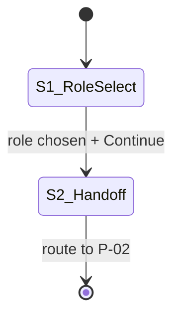

Two states. No auth, no error overlays, no transient authentication step.

### State S1 — User-type selection

- **Trigger.** Page load (cold entry or post-sign-out).
- **Visible components.** Brand mark (C1); value-proposition block (C2); two user-type cards (C3); Continue button (C4); footer documentation link (C5).
- **User actions.** Click one of the two cards to select; click Continue; click documentation link (opens overview in new tab).
- **Validation.** See §V1 below.
- **Transitions.** Continue with a role selected → S2.
- **Background work.** None until a card is selected; when one is selected, scope-cache pre-fetch begins for that user type.

### State S2 — Handoff

- **Trigger.** S1 Continue with role selected.
- **Visible components.** Brand mark (C1); minimal loading indicator with status line ("Setting up your workspace…").
- **User actions.** None.
- **Transitions.** Background loads complete → route to P-02.
- **Background work.** Scope-cache load completes (GSCO catalogue index for Policy Maker, upload-template metadata for MNC).
- **Maximum duration.** 5 seconds; after this, allow exit to P-02 anyway (P-02 will lazy-load if needed).

### Component reference

| ID | Component | Description | Appears in |
|---|---|---|---|
| C1 | Brand mark | GSCO tool name and logo. | S1, S2 |
| C2 | Value-proposition block | 2–3 sentences describing the tool, optional illustrative graphic. | S1 |
| C3 | User-type cards | Two cards side by side: "Policy Maker" and "MNC". Each shows title, one-paragraph use-case description, icon. Click toggles a selected state; only one selectable at a time. | S1 |
| C4 | Continue button | Disabled until a card is selected; primary action. | S1 |
| C5 | Documentation link | Footer-level link to overview docs; opens new tab. | S1 |
| C6 | Loading indicator | Spinner + one-line status text. | S2 |

### Validation rules

| ID | Rule | Where enforced | If violated |
|---|---|---|---|
| V1 | One user-type card selected | Client-side, gates C4 | Continue button disabled |

### Error states

None in the demo build. The only failure mode is scope-cache pre-fetch failure in S2, which is non-blocking — P-02 lazy-loads if the cache isn't ready.

### Side effects

| Event | Effect |
|---|---|
| Card selected in S1 | Scope-cache pre-fetch begins for the chosen user type. |
| S1 Continue | `session.userType` set; `session.id` set (a randomly generated session ID for the demo). |
| Route to P-02 | Analytics event `session_started` with `userType` property (if analytics enabled). |

### Page-exit contract

On leaving P-01:
- `session.userType` is one of `policy_maker` or `mnc`.
- `session.id` is set.
- Scope cache is either loaded or known to be loading.

### Edge cases

| Case | Handling |
|---|---|
| User signs out from a later page | Returns here in state S1 with all session state cleared. |
| User reloads the page after entering | Returns to S1; previous selection is not remembered (no persistence in demo). |
| User opens in two tabs | Each tab is independent — they can run as different user types simultaneously. |
| User navigates browser-back from P-02 | Returns to P-01 in state S1; previous selection is shown but not pre-selected. |

### Open design choices

| # | Question | Status |
|---|---|---|
| 1 | Pre-entry documentation access | **Resolved.** Footer link to overview docs only; full Indicator Library (P-09) requires entering the tool. |
| 2 | Welcome copy | **Open.** Final marketing-level copy for the value-proposition block (C2) — to be drafted with whoever owns the GSCO comms tone. |

---

## P-02 — Scope set-up

### Summary

| Field | Value |
|---|---|
| Purpose | Define the supply chain or region set the session will operate on. |
| Reachable from | P-01 (first time); P-03 / persistent nav (via "Change scope"). |
| Exits to | P-03. |
| Inputs from prior pages | `session.userType`. |
| Outputs to next pages | `supplyChain` object containing `{name, industry, nodes: [...]}`. |
| Persistent modules touched | Saved Analyses (optional save of the scope). |

### State model

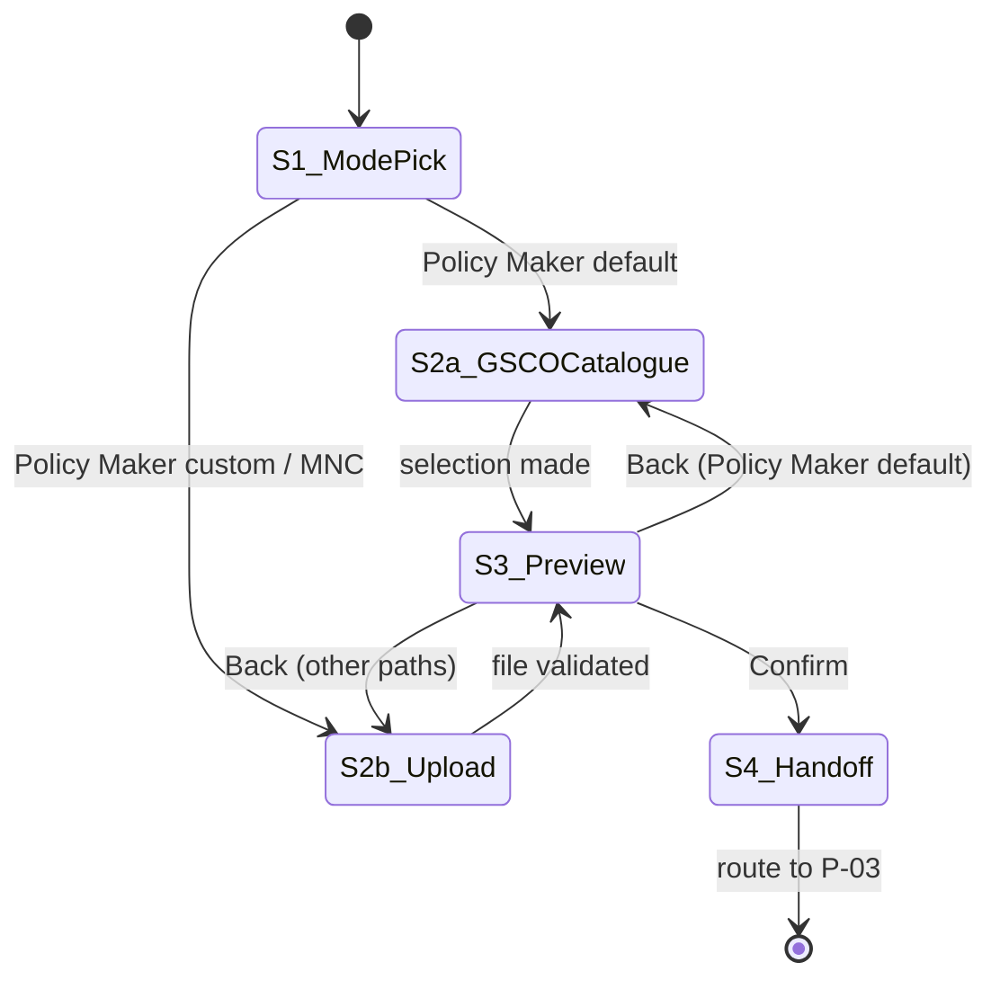

### State S1 — Mode pick

- **Trigger.** Page load.
- **Visible components.** Persistent nav (C0); page heading; mode selector (C1).
- **User-type behaviour.** Policy Maker sees three options: *Connect to GSCO catalogue* (default highlighted), *Upload custom regions*, *Manual entry*. MNC sees: *Upload supplier list* (default highlighted), *Manual entry*. The same uploader component serves both Policy Maker custom uploads and MNC supplier uploads.
- **User actions.** Pick a mode.
- **Transitions.** Selection → S2a (GSCO catalogue) or S2b (Upload or Manual entry).

### State S2a — GSCO catalogue selection

- **Trigger.** Mode = "Connect to GSCO catalogue" (Policy Maker only).
- **Visible components.** Persistent nav; industry-filtered catalogue dropdown (C2); preview map of the selected chain (C3); "Load this supply chain" button (C4).
- **User actions.** Choose industry filter; pick supply chain from dropdown; preview updates live; click Load.
- **Transitions.** Load → S3.
- **Errors.** GSCO catalogue API unavailable → fall back to S2b (the "Manual entry" option remains, so the user is never blocked).

### State S2b — Upload or manual entry

- **Trigger.** Mode = "Upload" or "Manual entry" (any user type).
- **Visible components.** Persistent nav; uploader (C5) with downloadable template link; manual-entry table (C6); validation messages panel (C7); preview map (C3); Continue button (C8).
- **User actions.** Drag-and-drop file or click to upload; or add rows manually to the entry table; review validation messages; click Continue when clean.
- **Validation.** See §V table.
- **Transitions.** Continue with valid data → S3.

### State S3 — Preview and confirm

- **Trigger.** S2a Load or S2b Continue.
- **Visible components.** Persistent nav; full preview map (C3); scope summary panel (C9): name, node count, geographic spread; "Save scope as session" toggle (C10); Confirm button (C11); Back link (C12).
- **User actions.** Review preview; optionally name the scope and toggle Save; click Confirm or Back.
- **Transitions.** Confirm → S4. Back → S2a or S2b depending on origin.

### State S4 — Handoff

- **Trigger.** S3 Confirm.
- **Visible components.** Loading indicator with status line.
- **User actions.** None.
- **Transitions.** Once `supplyChain` is committed to session state → route to P-03.
- **Background work.** If "Save scope as session" was toggled, push to Saved Analyses.

### Component reference

| ID | Component | Appears in |
|---|---|---|
| C0 | Persistent nav (per Cross-page conventions) | All states |
| C1 | Mode selector — list of 2 or 3 modes by user type | S1 |
| C2 | GSCO catalogue dropdown with industry filter | S2a |
| C3 | Preview map | S2a, S2b, S3 |
| C4 | Load button | S2a |
| C5 | File uploader (CSV/Excel) with template link | S2b |
| C6 | Manual-entry table (add row, edit, delete) | S2b |
| C7 | Validation messages panel | S2b |
| C8 | Continue button | S2b |
| C9 | Scope summary panel | S3 |
| C10 | "Save scope as session" toggle + name field | S3 |
| C11 | Confirm button | S3 |
| C12 | Back link | S3 |

### Validation rules

| ID | Rule | Where enforced |
|---|---|---|
| V1 | At least one node | Client-side on Continue/Load |
| V2 | All nodes have a `name` and either coordinates OR a geocodable address | Server-side after upload |
| V3 | `lat ∈ [−90, 90]`, `lon ∈ [−180, 180]` | Client-side on upload parse |
| V4 | If addresses are present, geocoding succeeds for ≥80% of them | Server-side; partial failure surfaces as warning, not blocker |
| V5 | CSV columns include `node_name`, `lat`, `lon` (or `address`) | Client-side on upload |
| V6 | If toggle Save is on, scope name is provided | Client-side on Confirm |

### Error states

| ID | Trigger | Surface | Recovery |
|---|---|---|---|
| E1 | File format unreadable | Inline message on uploader (C5) | User re-uploads or switches to manual entry |
| E2 | Geocoding fails for some addresses | Warning in C7 with per-row indicators; user can fix manually | User edits failed rows in C6 |
| E3 | GSCO catalogue API unavailable | Banner above C1; mode selector falls back to upload/manual only | User uploads instead |

### Side effects

| Event | Effect |
|---|---|
| Successful upload | Coordinates parsed; geocoding service called for any address-only rows; preview map updated |
| GSCO chain selected | Catalogue API fetches the full node set; preview map updated |
| Confirm | `supplyChain` set in session state; optional push to Saved Analyses |

### Page-exit contract

- `supplyChain.nodes` has length ≥ 1.
- Every node has valid coordinates.
- `supplyChain.name` is set (auto-filled from GSCO entry or user-supplied).

### Edge cases

| Case | Handling |
|---|---|
| Very large upload (>1000 nodes) | Show progress indicator during parse and geocode; warn that downstream prioritisation will be slow |
| Mixed coordinates + addresses in same file | Process both; geocode addresses; flag any conflicts (same node listed twice) |
| Returning to P-02 from P-03 via "Change scope" | Existing `supplyChain` shown as the starting state in S3, with Back available |
| User navigates away mid-upload | Upload is cancelled; session keeps any previously confirmed scope |

### Open design choices

| # | Question | Status |
|---|---|---|
| 1 | GSCO catalogue API contract | **Deferred** — to confirm with GSCO platform team. |
| 2 | Manual-entry table for small chains | **Resolved.** Keep — useful for quick demos and one-off entries. |
| 3 | Geocoding service choice | **Resolved.** Nominatim for the demo (free, no key). |

---

## P-03 — Workflow Hub

### Summary

| Field | Value |
|---|---|
| Purpose | Branch into Inspect or Prioritisation workflow; provide standing access to persistent modules. |
| Reachable from | P-02 (first time); workflow pages (via persistent nav). |
| Exits to | P-04 (Inspect Setup) or P-07 (Prioritisation Setup). |
| Inputs from prior pages | `supplyChain`, `userType`. |
| Outputs to next pages | `selectedWorkflow ∈ {inspect, prioritisation}`. |
| Persistent modules touched | All three are reachable from here. |

### State model

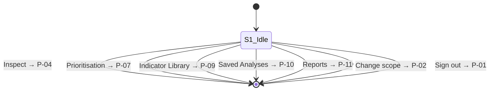

One state — the hub is a router.

### State S1 — Idle (workflow selection)

- **Trigger.** Page load.
- **Visible components.** Persistent nav (C0); welcome line with the active scope summary (C1); scope quick-stats panel (C2): number of nodes, geographic spread, industries/tiers represented; two workflow cards (C3): Inspect, Prioritisation.
- **User actions.** Click a workflow card → exits to the corresponding setup page. Click any persistent nav link → exits to that module. Click Change scope → exits to P-02. Click Sign out → exits to P-01.
- **Transitions.** All exits, no internal transitions.

### Component reference

| ID | Component | Appears in |
|---|---|---|
| C0 | Persistent nav | S1 |
| C1 | Welcome line + scope summary | S1 |
| C2 | Scope quick-stats panel — node count, geographic spread (countries / regions covered), industry or tier breakdown | S1 |
| C3 | Workflow cards — two large cards: Inspect and Prioritisation | S1 |

### Validation rules

None.

### Error states

None.

### Side effects

None.

### Page-exit contract

`session.userType` and `supplyChain` remain unchanged; the user has clicked exactly one navigation target.

### Edge cases

| Case | Handling |
|---|---|
| Scope cache pre-fetch hasn't finished | The workflow cards remain clickable; the chosen workflow's setup page waits for the cache if needed |
| User has saved analyses from a prior session (post-auth) | A small "Recent saves" surface on this page could be a future extension; not in v1 |

### Open design choices

| # | Question | Status |
|---|---|---|
| 1 | Show recent saved analyses on the hub? | **Future extension.** Adds value but not in the demo. |
| 2 | Quick stats on the loaded scope | **Resolved.** Yes — added as C2. |

---

## P-04 — Inspect — Setup

### Summary

| Field | Value |
|---|---|
| Purpose | Configure an Inspect analysis: one location, a radius, indicators, time range. |
| Reachable from | P-03 (Inspect card); persistent nav (Inspect link if exposed). |
| Exits to | P-05 (Run Screening) or P-06 (Run Trend). |
| Inputs from prior pages | `supplyChain`, `userType`. |
| Outputs to next pages | `aoi` (circular geometry), `selectedIndicators`, `analysisMode ∈ {screening, monitoring}`, `timeRange`, `centreMetadata`. |
| Persistent modules touched | Indicator Library (selection state syncs). |

### State model

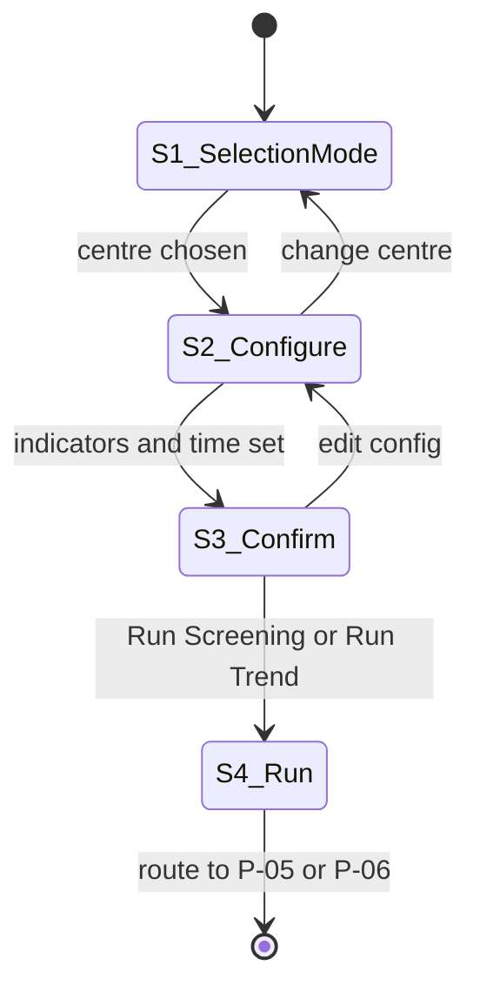

### State S1 — Selection mode

- **Trigger.** Page load.
- **Visible components.** Persistent nav (C0); mode toggle (C1); centre-input control (C2, varies by mode); map (C3).
- **Modes.**
  - *Region*: dropdown of regions from the loaded scope (Policy Maker default; falls back to manual region label for MNC).
  - *Supplier*: searchable dropdown of nodes from `supplyChain` (MNC default; Policy Maker also has access).
  - *Free coordinates*: lat/lon inputs validated client-side.
- **User actions.** Pick mode; pick or enter a centre; map updates to show the centre marker.
- **Transitions.** Centre chosen and valid → S2.

### State S2 — Configure

- **Trigger.** S1 centre chosen.
- **Visible components.** Persistent nav; centre summary (C4) with Change centre link; radius slider (C5); indicator selection panels (C6) by pillar; time range selector (C7, **shown only when the user moves towards Run Trend** — hidden in the default screening path); map showing centre + circular buffer (C3).
- **User actions.** Adjust radius (suggested defaults per mode); expand pillar panels to toggle indicators (or use a "comprehensive screening" preset that selects all); pick time range when configuring a trend run.
- **Transitions.** Change centre → S1. Continue or proceed → S3.

### State S3 — Confirm

- **Trigger.** S2 user signals ready.
- **Visible components.** Persistent nav; full configuration summary (C8); two run buttons (C9): Run Screening, Run Trend.
- **User actions.** Click Run Screening → S4 routing to P-05. Click Run Trend → S4 routing to P-06. Click Edit → S2.

### State S4 — Run (transient)

- **Trigger.** S3 run button clicked.
- **Visible components.** Loading indicator with status line ("Computing your <screening|trend> analysis…").
- **User actions.** None (or cancel, which returns to S3 with config preserved).
- **Transitions.** Once the analysis has been kicked off and the destination page is ready → route to P-05 or P-06. The compute completes on the destination page's S1.

### Component reference

| ID | Component | Appears in |
|---|---|---|
| C0 | Persistent nav | All states |
| C1 | Mode toggle: Region / Supplier / Free coordinates | S1 |
| C2 | Centre-input control (varies by mode) | S1 |
| C3 | Map with centre marker and (in S2+) circular buffer | S1, S2, S3 |
| C4 | Centre summary with "Change centre" link | S2, S3 |
| C5 | Radius slider with labelled stops (1, 5, 10, 25, 50, 100 km) and suggested-default chip | S2, S3 |
| C6 | Indicator selection panels (collapsible by pillar). **All indicators are pre-selected by default**; the user deselects ones they don't want. A "Reset to all selected" link restores the default. | S2, S3 |
| C7 | Time range selector — **hidden in screening mode** (screening always uses the latest valid 90-day composite per dataset). Shown when the user toggles toward Run Trend. Validates against per-dataset earliest-available date. | S2 (trend path), S3 (trend path) |
| C8 | Configuration summary | S3 |
| C9 | Run buttons: Run Screening / Run Trend | S3 |
| C10 | Loading indicator | S4 |

### Validation rules

| ID | Rule | Where enforced |
|---|---|---|
| V1 | Centre is set (mode-appropriate) | Client-side, gates transition to S2 |
| V2 | Free-coordinate lat/lon valid | Client-side, on entry |
| V3 | At least one indicator selected | Client-side, gates run buttons |
| V4 | Time range has start < end and start within data availability | Client-side; checked only when in trend path (selector hidden in screening) |
| V5 | Time range ≥ 12 months for trend (no minimum for screening — composite is fixed at 90 days) | Client-side; warning rather than block if outside |

### Error states

| ID | Trigger | Surface | Recovery |
|---|---|---|---|
| E1 | Selected supplier has missing or invalid coordinates | Inline message on C2; suggest free-coordinate entry | User picks another or types in coordinates |
| E2 | Radius too small for selected indicator (e.g. coarse-resolution CH₄ at 1 km) | Warning chip on radius slider with the affected indicator | User adjusts radius or accepts the warning |

### Side effects

| Event | Effect |
|---|---|
| Indicator toggled in C6 | Indicator Library (P-09) "active in workflow" state updates |
| Mode changed in S1 | Map view zooms to suggest a sensible default centre for the new mode |
| Run clicked | `aoi`, `selectedIndicators`, `analysisMode`, `timeRange`, `centreMetadata` set in session; compute kicked off |

### Page-exit contract

- `aoi` is a valid circular geometry derived from the chosen centre and radius.
- `selectedIndicators` is a non-empty list of indicator IDs.
- `analysisMode` is one of `screening` or `monitoring`.
- `timeRange` has valid start and end.

### Edge cases

| Case | Handling |
|---|---|
| User navigates back from P-05/P-06 | Returns to P-04 in state S3 with config preserved, so the user can re-run with edits |
| Indicator selected but data source is unavailable for the chosen time range | Warning at S3; user can deselect, change time range, or proceed (the indicator will be marked "not computed" in results) |
| Two-tab use with different scopes | Each tab independent; no cross-tab sync |

### Open design choices

| # | Question | Status |
|---|---|---|
| 1 | One Run button with mode toggle vs two Run buttons | **Resolved.** Two buttons — clearer than a toggle. |
| 2 | Indicator-selection default state | **Resolved.** All indicators pre-selected by default; user deselects to narrow. Reflected in C6. |
| 3 | Radius stops — fixed steps vs free slider | **Resolved.** Fixed steps (1, 5, 10, 25, 50, 100 km). |
| 4 | Time-range selector visibility for screening | **Resolved (v4).** Hidden in screening mode. Screening uses the latest valid 90-day composite per dataset (see `Indicators_Computation_v3.md` §0.5). The selector renders only when the user moves toward Run Trend. |

---

## P-05 — Inspect — Results — Screening View

### Summary

| Field | Value |
|---|---|
| Purpose | Present a snapshot of environmental conditions at the chosen location across the three pillars. |
| Reachable from | P-04 (Run Screening); P-10 (open a saved screening). |
| Exits to | P-06 (Switch to Trend); P-11 (via "Save as report"); drill-down stays on page; or sign-out / persistent nav. |
| Inputs from prior pages | `aoi`, `selectedIndicators`, `analysisMode=screening`, `timeRange`, `centreMetadata`, `userType`. |
| Outputs to next pages | `screeningResult` object; "Save as report" creates both a Saved Analyses entry and a report draft for P-11. |
| Persistent modules touched | Saved Analyses (on save), Reports (on generate), Indicator Library (on drill-down link). |

### State model

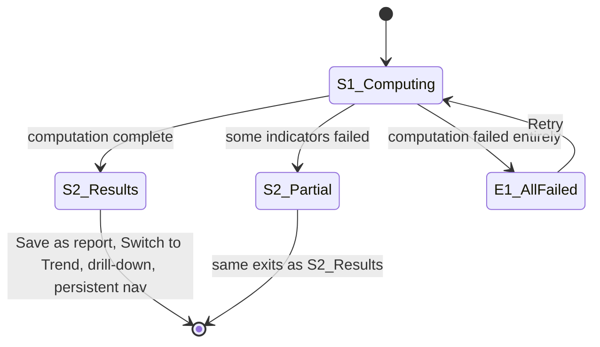

### State S1 — Computing

- **Trigger.** Entry from P-04 with a fresh run, or entry from P-10 with a saved result that needs to re-hydrate.
- **Visible components.** Persistent nav (C0); analysis header card (C1) with location, radius, time range, indicator list; progress indicator (C2) showing which pillar is currently computing.
- **User actions.** None (or cancel, which returns to P-04 with config preserved).
- **Transitions.** Compute completes → S2_Results (all indicators OK) or S2_Partial (some failed). Compute fails entirely → E1.
- **Background work.** For each selected indicator, the indicator engine runs the repeatable core method (site value, background, anomaly, z, hotspot frequency, confidence). Pillar aggregates compute once all single values are in.

### State S2 — Results display

- **Trigger.** Compute complete.
- **Visible components.** Persistent nav; analysis header card (C1); traffic-light summary (C3); primary visualisation (C4 — varies by `userType`); per-pillar drill-down panels (C5a, C5b, C5c); confidence panel (C6); verbal summary paragraph (C7); action bar (C8) with Save as report and Switch to Trend buttons.
- **User-type variation.**
  - *Policy Maker*: primary visualisation is a hotspot map of the AOI with selectable layer (Air, GHG, Nature) and intensity overlay on satellite imagery.
  - *MNC*: primary visualisation is a KPI tile grid — one tile per indicator, value, anomaly direction (↑/↓), confidence dot.
- **User actions.** Expand/collapse pillar panels; switch layer on the hotspot map (Policy Maker); click a KPI tile (MNC) to drill into that indicator; Save as report; Switch to Trend.
- **Transitions.** Save as report → stay, with toast confirmation; report draft simultaneously available from P-11; Switch to Trend → route to P-06 (with the same setup); drill-down → expands the corresponding panel in C5.

### State S2 — Partial results

- **Trigger.** Some indicators failed (data unavailable for time range, computation error on one pillar, etc.).
- **Visible components.** Same as S2_Results, plus a "partial coverage" banner (C9) listing which indicators failed and why; each failed indicator's slot in C5 shows a "not computed" placeholder with the failure reason.
- **User actions.** All S2_Results actions, plus "Retry failed indicators" in C9 which re-runs only the failed ones.

### Error state E1 — All failed

- **Trigger.** Computation failed entirely (e.g. Earth Engine service down).
- **Visible components.** Persistent nav; analysis header card; error banner with explanation and retry button.
- **User actions.** Retry → back to S1. Or navigate away.

### Component reference

| ID | Component | Appears in |
|---|---|---|
| C0 | Persistent nav | All states |
| C1 | Analysis header card: location name + coordinates, AOI summary (radius, area), time range, indicator list, computation timestamp | All states |
| C2 | Progress indicator with per-pillar status | S1 |
| C3 | Traffic-light summary: three pillar Follow-Up Priority chips (red/amber/green) with numeric score and confidence dot | S2_Results, S2_Partial |
| C4a | Hotspot map (Policy Maker primary viz) | S2_Results, S2_Partial (Policy Maker only) |
| C4b | KPI tile grid (MNC primary viz) | S2_Results, S2_Partial (MNC only) |
| C5a | Air Pollution drill-down panel | S2_Results, S2_Partial |
| C5b | GHG drill-down panel | S2_Results, S2_Partial |
| C5c | Nature/Land drill-down panel | S2_Results, S2_Partial |
| C6 | Confidence panel: three pillar confidence scores with limiting-factor explanations | S2_Results, S2_Partial |
| C7 | Verbal summary paragraph (server-generated) | S2_Results, S2_Partial |
| C8 | Action bar: Save as report, Switch to Trend | S2_Results, S2_Partial |
| C9 | Partial-coverage banner | S2_Partial |
| C10 | Error banner with retry | E1 |

### Validation rules

None — this is a display page. The compute itself enforces input validity from P-04.

### Error states

| ID | Trigger | Surface | Recovery |
|---|---|---|---|
| E1 | All indicators failed | C10 with retry | Retry returns to S1 |
| E2 | Some indicators failed | C9 banner in S2_Partial, plus per-indicator placeholders | Retry failed only, or accept partial |
| E3 | Save fails | Inline toast on C8 | User retries |
| E4 | Report generation fails (downstream P-11 issue) | Surfaces on P-11, not here | — |

### Side effects

| Event | Effect |
|---|---|
| Computation complete | `screeningResult` populated in session state with all values, confidence, AOI metadata, dataset provenance, timestamp |
| "Save as report" clicked | Push `screeningResult` to Saved Analyses with a user-supplied or auto-generated name; report draft simultaneously created and made available from P-11 |

### Page-exit contract

When leaving via "Save as report", `screeningResult` must be fully formed (or marked as partial with the failure list) and both Saved Analyses and a report draft must be populated. When leaving via Switch to Trend, the original setup state is preserved so P-06 can re-use it.

### Edge cases

| Case | Handling |
|---|---|
| User chose an indicator with very coarse resolution and a very small AOI | Result computed, but confidence is automatically low; the limiting factor is named in C6 |
| Anomaly score extremely high but confidence extremely low | Traffic-light defaults to amber rather than red, with an explanatory note — protect against false alarms |
| Computation takes >60 seconds | Progress indicator in C2 updates with a heartbeat; user can leave the page; on return the result is ready (or still loading) |
| User opens a saved analysis from years ago | The result is re-rendered with a "stale" indicator showing when it was computed; the user can re-run if they want fresh data |
| Indicator engine returns Inf/NaN | Slot in C5 shows "computation error"; treated as a partial-result case |

### Open design choices

| # | Question | Status |
|---|---|---|
| 1 | Drill-down: in-page expansion vs modal vs side panel | **Resolved.** In-page expansion of the C5 pillar panel. |
| 2 | Verbal summary tone | **Resolved.** Factual and brief, e.g. "Air pollution shows elevated NO₂ relative to background, with moderate confidence. Nature pillar shows stable land cover and healthy NDVI." |
| 3 | Drill-down: Earth Engine asset IDs and dates | **Resolved.** Collapsed by default, expandable. |
| 4 | Switch to Trend re-uses time range from setup vs prompts for new one | **Resolved.** Re-use the setup's time range; user can edit on P-06 if needed. |

---

## P-06 — Inspect — Results — Trend View

### Summary

| Field | Value |
|---|---|
| Purpose | Show how the chosen indicators have evolved over the time range, with anomaly detection and trend significance. |
| Reachable from | P-04 (Run Trend); P-05 (Switch to Trend); P-10 (open a saved trend analysis). |
| Exits to | P-05 (Switch to Screening); P-11 (via "Save as report"); drill-down stays on page. |
| Inputs from prior pages | Same as P-05 but with `analysisMode=monitoring`; default time range is 3 years if not explicitly set. |
| Outputs to next pages | `trendResult` object; "Save as report" creates both a Saved Analyses entry and a report draft for P-11. |
| Persistent modules touched | Saved Analyses, Reports, Indicator Library. |

### State model

Mirrors P-05's state model:

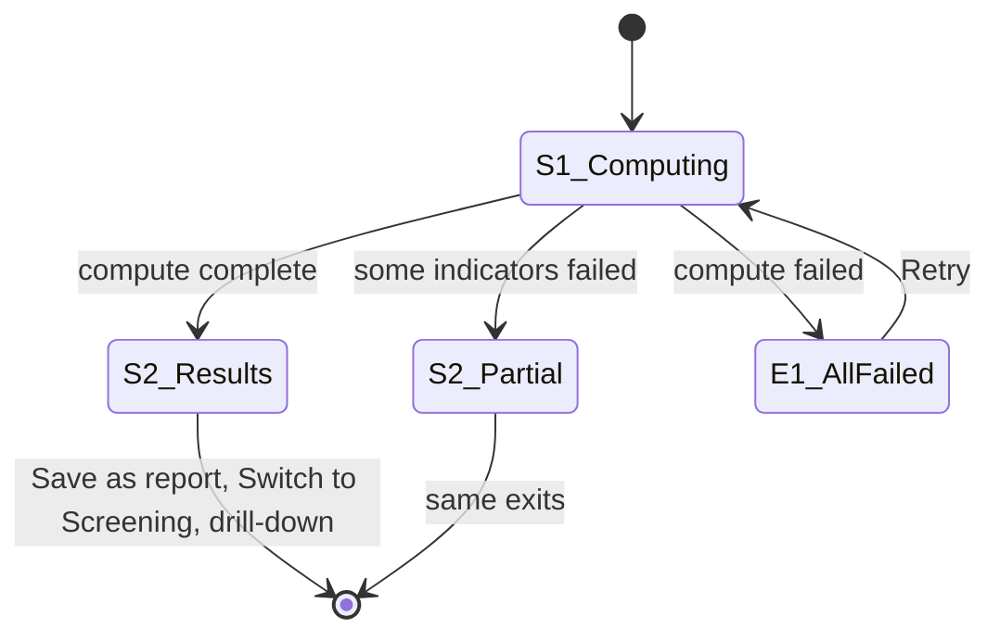

### State S1 — Computing

Same shape as P-05 S1, but the compute is per-time-bin (monthly or annual depending on indicator frequency) and additionally computes trend slopes and anomaly frequencies. Computation is typically slower than screening because it touches more time steps.

### State S2 — Results display

- **Trigger.** Compute complete.
- **Visible components.** Persistent nav (C0); analysis header card with time range (C1); per-pillar trend score cards (C2); time-series chart panel (C3); trend map (C4); alert panel (C5); anomaly-frequency mini-charts (C6); verbal trend summary (C7); action bar (C8): Save as report, Switch to Screening.
- **View defaults (same for both user types).** Trend map (C4) is prominent by default; alert panel (C5) is collapsed by default. The user can expand/collapse either panel.
- **User actions.** Click a chart in C3 to expand it; click an alert in C5 to scroll to the relevant chart; click a point on the trend map (C4) to see the time series at that location; Save as report; Switch to Screening.

### Component reference

| ID | Component | Appears in |
|---|---|---|
| C0 | Persistent nav | All |
| C1 | Analysis header card with time range and bin size | All |
| C2 | Per-pillar trend score cards (3 cards: Air, GHG, Nature; each shows trend direction and significance) | S2_Results, S2_Partial |
| C3 | Time-series chart panel — one chart per selected indicator with anomaly markers and baseline overlay | S2_Results, S2_Partial |
| C4 | Trend map — spatial rate-of-change visualisation. Shown consistently across all three pillars; coarse-resolution pillars (Air, GHG) render at their native resolution with an inline caveat about resolution. | S2_Results, S2_Partial |
| C5 | Alert panel — most recent anomalies, worsening trends significant at p<0.05, repeated anomaly clusters | S2_Results, S2_Partial |
| C6 | Anomaly-frequency mini-charts | S2_Results, S2_Partial |
| C7 | Verbal trend summary | S2_Results, S2_Partial |
| C8 | Action bar: Save as report, Switch to Screening | S2_Results, S2_Partial |
| C9 | Partial-coverage banner | S2_Partial |

### Validation rules

None at this page — input validity enforced upstream.

### Error states

Same pattern as P-05: E1 (all failed), E2 (some failed), E3 (save failure).

### Side effects

| Event | Effect |
|---|---|
| Compute complete | `trendResult` populated, including per-indicator slopes, p-values, anomaly counts |
| "Save as report" clicked | Push `trendResult` to Saved Analyses; report draft simultaneously created and made available from P-11 |

### Page-exit contract

`trendResult` is fully formed (or partial with explicit list of failures) at the moment "Save as report" is clicked, and both Saved Analyses and a report draft are populated.

### Edge cases

| Case | Handling |
|---|---|
| Time range too short for meaningful trend (<12 monthly points) | Trend slopes computed but flagged "low confidence" in C2 |
| Indicator has gaps in time series | Gaps shown as breaks in C3; not interpolated |
| Anomaly cluster at the end of the time range | Highlighted as "recent" in C5 with a distinct icon |
| All trends flat | Verbal summary states "no significant trend in any pillar" — the absence of change is itself information |

### Open design choices

| # | Question | Status |
|---|---|---|
| 1 | Bin size — fixed by indicator frequency or user-configurable | **Resolved.** Fixed (indicator's natural frequency). User override is a future extension. |
| 2 | Alert threshold tunability | **Resolved.** Fixed thresholds for v1 (p<0.05 for trend, 2σ for anomaly). |
| 3 | Trend map for Air/GHG pillars where resolution is coarse | **Resolved.** Show trend map consistently across all three pillars; coarse pillars carry an inline resolution caveat. |

---

## P-07 — Prioritisation — Setup

### Summary

| Field | Value |
|---|---|
| Purpose | Configure a batch analysis across many or all nodes of the supply chain. |
| Reachable from | P-03 (Prioritisation card). |
| Exits to | P-08. |
| Inputs from prior pages | `supplyChain`, `userType`. |
| Outputs to next pages | `prioritisationConfig` object: `{nodes, radius, timeRange, selectedIndicators, mode}`. |
| Persistent modules touched | Indicator Library (selection state). |

### State model

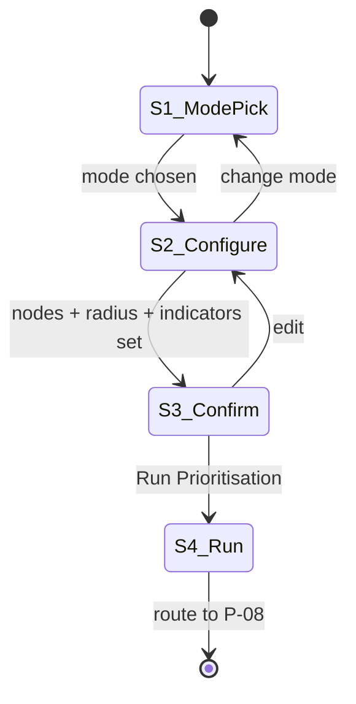

### State S1 — Mode pick

- **Trigger.** Page load.
- **Visible components.** Persistent nav (C0); mode toggle (C1) with two options: *Whole supply chain* / *Filtered subset*.
- **User actions.** Pick a mode.
- **Transitions.** Selection → S2.

### State S2 — Configure

- **Trigger.** S1 mode chosen.
- **Visible components.** Persistent nav; mode summary (C2); filter panel (C3, mode-dependent); node selection list/map (C4); fixed-radius selector (C5); indicator selection panels (C6, all pre-selected by default — same pattern as P-04); time range selector (C7); estimated compute time and node-count indicator (C8) with a **hard cap of 30 nodes** for the demo build.
- **User actions.** Apply filters; deselect any nodes from the auto-included set; pick radius; toggle indicators (or accept the default selection); set time range.
- **Transitions.** Continue → S3; change mode → S1.

### State S3 — Confirm

- **Trigger.** S2 user signals ready.
- **Visible components.** Persistent nav; full configuration summary (C9); Run Prioritisation button (C10); Edit link (C11).
- **User actions.** Click Run → S4; Edit → S2.

### State S4 — Run

- **Trigger.** S3 Run.
- **Visible components.** Loading indicator with status line and per-node progress ("Computing 4 of 17 suppliers…").
- **User actions.** Cancel (returns to S3).
- **Transitions.** Once compute starts in earnest → route to P-08 (which handles the compute completion and display).

### Component reference

| ID | Component | Appears in |
|---|---|---|
| C0 | Persistent nav | All |
| C1 | Mode toggle: Whole supply chain / Filtered subset | S1 |
| C2 | Mode summary chip | S2, S3 |
| C3 | Filter panel — by tier, region, sector, individual nodes (mode-dependent) | S2 |
| C4 | Node selection list with map view; supports check/uncheck and map-select | S2 |
| C5 | Fixed-radius selector (locked across all nodes; same 1/5/10/25/50/100 km stops as P-04) | S2 |
| C6 | Indicator selection panels (same as P-04; all indicators pre-selected by default) | S2 |
| C7 | Time range selector | S2 |
| C8 | Estimated compute time and node-count indicator with hard cap of 30 nodes | S2 |
| C9 | Configuration summary | S3 |
| C10 | Run Prioritisation button | S3 |
| C11 | Edit link | S3 |
| C12 | Loading indicator with per-node progress | S4 |

### Validation rules

| ID | Rule | Where enforced |
|---|---|---|
| V1 | At least one node selected | Client-side on Continue |
| V2 | At most 30 nodes selected (demo hard cap) | Client-side; Continue disabled if exceeded |
| V3 | Radius set | Client-side |
| V4 | At least one indicator selected | Client-side on Continue |
| V5 | Time range valid | Client-side |

### Error states

| ID | Trigger | Surface | Recovery |
|---|---|---|---|
| E1 | More than 30 nodes selected | Inline message on C8 with explanation of the demo cap | User trims selection |

### Side effects

| Event | Effect |
|---|---|
| Mode change | Filter panel reconfigures; node selection resets to mode default |
| Node selection change | Estimated compute time updates |
| Run clicked | `prioritisationConfig` set; per-node AOIs generated as circular buffers; batch job kicked off |

### Page-exit contract

- `prioritisationConfig.nodes` has length between 1 and 30 inclusive.
- `radius` is set.
- `selectedIndicators` is non-empty.
- `timeRange` is valid.

### Edge cases

| Case | Handling |
|---|---|
| User returns from P-08 with "Edit configuration" | Lands in S3 with the prior config; can step back to S2 |
| User hits the 30-node cap on a large supply chain | Filter UI in C3 helps them narrow; the cap is a hard block, not a warning |

### Open design choices

| # | Question | Status |
|---|---|---|
| 1 | Mode set — two-supplier comparison included? | **Resolved.** Scrapped for the demo. Modes are whole supply chain and filtered subset only. Two-supplier comparison may return as a future extension. |
| 2 | Node limit | **Resolved.** Hard cap of 30 for the demo (to keep satellite compute manageable). Post-demo: raise the cap as compute infrastructure scales. |
| 3 | "Prioritisation defaults" indicator preset | **Resolved.** All three pillar Follow-Up Priority Scores plus the highest-contributor single value per pillar. Same as P-04: all pre-selected by default. |
| 4 | Save Configuration option | **Resolved.** Scrapped. Save lives on the result page (P-08) as "Save as report". |

---

## P-08 — Prioritisation — Results

### Summary

| Field | Value |
|---|---|
| Purpose | Rank nodes by audit priority; provide two visualisations (Ranking table and Risk matrix) over the same result. |
| Reachable from | P-07 (Run); P-10 (open a saved prioritisation). |
| Exits to | Drill-down to P-05/P-06 for a specific node; P-11 (via "Save as report"); persistent nav. |
| Inputs from prior pages | `prioritisationConfig`. |
| Outputs to next pages | `prioritisationResult` object; "Save as report" creates both a Saved Analyses entry and a report draft for P-11. |
| Persistent modules touched | Saved Analyses, Reports, Indicator Library. |

### State model

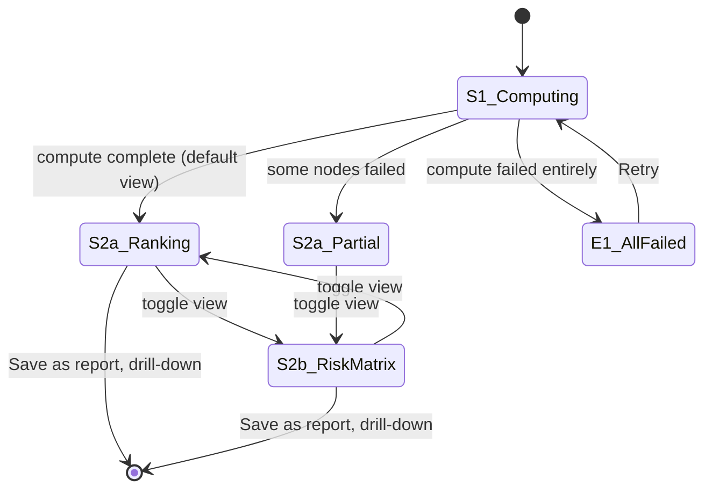

The view toggle between Ranking and Risk Matrix never re-runs the compute — same result, different rendering. **Retry-failed-nodes is deferred to a future extension** — in the demo, partial results are accepted as-is.

### State S1 — Computing

- **Trigger.** Entry from P-07 or from P-10 (re-hydrate).
- **Visible components.** Persistent nav (C0); analysis header card (C1) summarising scope; progress indicator with per-node status (C2).
- **User actions.** Cancel (returns to P-07).
- **Transitions.** All nodes done → S2a_Ranking. Some failed → S2a_Partial. All failed → E1.
- **Background work.** Per node: compute the three pillar Follow-Up Priority Scores, the composite, the confidence, severity, recurrence, affected area; then rank and percentile.

### State S2a — Ranking table view (default)

- **Trigger.** Compute complete.
- **Visible components.** Persistent nav; analysis header (C1); view-mode toggle at top of results (C3); top-N highlight banner (C4) defaulting to top 5; ranking table (C5); filter controls on the table (C6); action bar (C7): "Save as report", Export CSV.
- **User actions.** Sort/filter the table; click a row → drill-down to P-05 for that node; toggle view → S2b; click "Save as report" — saves the result to Saved Analyses *and* creates a report draft accessible from P-11; Export CSV.

### State S2b — Risk matrix view

- **Trigger.** S2a view-mode toggle.
- **Visible components.** Persistent nav; analysis header (C1); view-mode toggle (C3); scatter plot (C8); axis controls (C9); side mini-table of high-priority quadrant (C10); action bar (C7) with Export-as-image alongside "Save as report".
- **Axes.** Each axis is one of the three pillar Follow-Up Priority Scores. **Default: x = Air Pollution, y = Nature.** A toggle lets the user pick any pairing (Air × GHG, Air × Nature, GHG × Nature). Point size = composite priority score; point colour = traffic-light band on the composite.
- **Quadrant logic.** Top-right "Worst across both pillars" — high in both selected pillars; top-left "Worst in Y pillar"; bottom-right "Worst in X pillar"; bottom-left "Low concern". Quadrant lines sit at the median of each pillar score across the result set, with labels rendered in the empty corners.
- **User actions.** Hover/click a point → drill-down to P-05; swap axes (toggle between pillar pairings); toggle view → S2a; "Save as report"; Export image.

### Partial-result variant (S2a_Partial / S2b_Partial)

Same as the corresponding full state, with a partial-coverage banner (C11) listing which nodes failed and why. **No retry action in the demo** — partial results are accepted as-is; the user can re-run the prioritisation from P-07 if they want another attempt.

### Error state E1 — All failed

Standard pattern: error banner, retry button.

### Component reference

| ID | Component | Appears in |
|---|---|---|
| C0 | Persistent nav | All |
| C1 | Analysis header: scope summary (number of nodes, radius, time range), computation timestamp | All |
| C2 | Progress indicator with per-node status | S1 |
| C3 | View-mode toggle: Ranking table / Risk matrix | S2a, S2b, partial variants |
| C4 | Top-N highlight banner — default top 5 with a control to change | S2a |
| C5 | Ranking table — columns: Rank, Node name, Composite priority, Air, GHG, Nature, Confidence, Trend arrow, Affected area, Recurrence | S2a |
| C6 | Table filters: tier, region, score band | S2a |
| C7 | Action bar: "Save as report", Export (CSV in S2a, image in S2b) | S2a, S2b |
| C8 | Risk matrix scatter plot — axes are two of the three pillar Follow-Up Priority Scores (default x=Air, y=Nature); point size = composite priority; point colour = traffic-light band; quadrant labels at the corners | S2b |
| C9 | Axis controls — pillar-pair selector (Air×GHG, Air×Nature, GHG×Nature) | S2b |
| C10 | Side mini-table of nodes in the "Worst across both pillars" quadrant | S2b |
| C11 | Partial-coverage banner (lists failed nodes; no retry action in the demo) | S2a_Partial, S2b_Partial |
| C12 | Error banner | E1 |

### Validation rules

None — display page.

### Error states

| ID | Trigger | Surface | Recovery |
|---|---|---|---|
| E1 | All nodes failed compute | C12 banner with retry | Retry → S1 |
| E2 | Some nodes failed | C11 banner with failure list (no retry action in the demo) | User accepts partial or re-runs from P-07 |
| E3 | Save fails | Toast on C7 | Retry |

### Side effects

| Event | Effect |
|---|---|
| Compute complete | `prioritisationResult` populated |
| View toggle | View state and pillar-pair selection stored alongside result so a saved analysis remembers the last view |
| "Save as report" | Pushed to Saved Analyses; report draft simultaneously created and made available from P-11 |
| Drill-down to a node | Routes to P-05 for that node with the per-node screening result hydrated |

### Page-exit contract

`prioritisationResult` is fully formed (or partial with explicit failure list).

### Edge cases

| Case | Handling |
|---|---|
| Single node passed (mode=filtered, one node) | Page renders as a 1-row ranking and a 1-point scatter; not very useful but not broken |
| Tied scores | Stable secondary sort by node name |
| Confidence ≈ 0 for all nodes | Per-node confidence is shown in the ranking table; the verbal layer in the partial-coverage banner notes low data confidence if relevant |
| User toggles view rapidly | Both views are rendered from the same in-memory result — toggle is instant |
| User swaps risk-matrix axis pairing | All points reposition with the new pillar mapping; quadrant medians recomputed against the active pair |

### Open design choices

| # | Question | Status |
|---|---|---|
| 1 | Default view: Ranking or Risk matrix | **Resolved.** Ranking — table is more familiar and informative on first glance; matrix is the alternate. |
| 2 | Risk matrix axes | **Resolved.** Two of the three pillar Follow-Up Priority Scores, user-selectable. Default x=Air, y=Nature. |
| 3 | Top-N default | **Resolved.** Top 5. |
| 4 | Retry-failed-nodes behaviour | **Resolved.** Deferred to future extension; the demo accepts partial results as-is. |

---

## P-09 — Indicator Library (persistent)

### Summary

| Field | Value |
|---|---|
| Purpose | Reference catalogue of every indicator the tool can compute; definitions, formulas, sources, decision relevance. |
| Reachable from | Persistent nav from any page from P-03 onwards. |
| Exits to | Returns to the previous page (or any page via persistent nav). |
| Inputs from prior pages | Optional: active workflow's `selectedIndicators` for syncing the "active in workflow" markers. |
| Outputs to next pages | Optional: edited `selectedIndicators` if the user changed selections while browsing. |
| Persistent modules touched | This is a persistent module. |

### State model

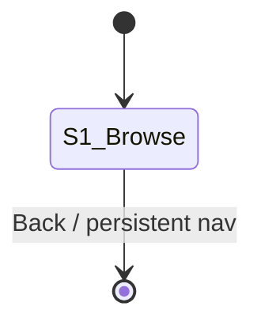

One state.

### State S1 — Browse

- **Trigger.** Navigation to P-09.
- **Visible components.** Persistent nav (C0); pillar tabs (C1): Air, GHG, Nature; within each tab, sub-sections (C2): Single values, Component scores, Decision aggregates; per-indicator card (C3) — clicking expands the card; search bar (C4); filter controls (C5); "active in current workflow" toggle (C6) which, when on, dims indicators not in the active selection.
- **User actions.** Switch pillars; expand/collapse cards; search; filter by criteria (ESG alignment, decision relevance, data source); toggle "active in workflow"; navigate away. (No direct "Add to workflow" or "Open in workflow" shortcut from this page — the library is reference-only.)

### Component reference

| ID | Component | Appears in |
|---|---|---|
| C0 | Persistent nav | S1 |
| C1 | Pillar tabs | S1 |
| C2 | Sub-section accordion (Single / Component / Aggregate) | S1 |
| C3 | Per-indicator card showing: name, definition, formula, data source (EE asset ID), temporal frequency, spatial resolution, ESG/regulatory alignment, decision relevance, limitations | S1 |
| C4 | Search bar | S1 |
| C5 | Filter controls | S1 |
| C6 | "Active in current workflow" toggle | S1 |

### Validation rules

None.

### Error states

None specific to this page.

### Side effects

| Event | Effect |
|---|---|
| Search or filter changed | Card visibility updates; no state persistence |

### Page-exit contract

None — the library is reference-only. No state changes propagate to other pages.

### Edge cases

| Case | Handling |
|---|---|
| User navigates here without an active workflow (e.g. from P-03) | "Active in workflow" toggle (C6) is hidden; library is fully browseable |
| Indicator definition has a TBD field (e.g. for future indicators) | Card renders with a "Coming soon" badge |

### Open design choices

| # | Question | Status |
|---|---|---|
| 1 | Static JSON manifest vs CMS-backed content | **Resolved.** Static JSON manifest in the repo for the demo. |
| 2 | Inline formula rendering | **Resolved.** MathJax/KaTeX. |
| 3 | Per-indicator "Open in workflow" shortcut | **Resolved.** Not in the demo. The library is reference-only. May return as a future extension. |

---

## P-10 — Saved Analyses (persistent)

### Summary

| Field | Value |
|---|---|
| Purpose | List of saved analyses with the ability to open each one back into its workflow page. |
| Reachable from | Persistent nav from any page. |
| Exits to | The workflow page corresponding to an opened analysis (P-05, P-06, P-08); any page via persistent nav. |
| Inputs from prior pages | None directly; loads the user's saved-analysis index. |
| Outputs to next pages | When opening: the relevant result object is hydrated into session and the corresponding workflow page is opened. |
| Persistent modules touched | This is a persistent module. |

**Demo scope.** This page is deliberately minimal for the demo. Bulk select, side-by-side compare, tags, search, and the "Add to report" shortcut are all deferred to future extensions. **The demo supports: list, open, delete, and export JSON.** Export JSON acts as a safety hatch for the browser-state-only persistence (per `PLFS_v4.md` §14): the user can download an individual saved analysis as a portable JSON file. Re-importing the JSON back into the tool is deferred to v1.x.

### State model

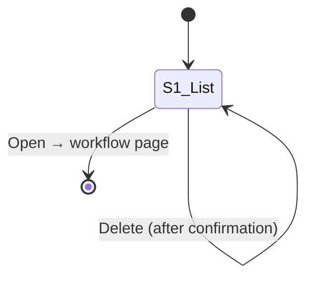

One state.

### State S1 — List view

- **Trigger.** Navigation to P-10.
- **Visible components.** Persistent nav (C0); list/table of saved analyses (C1); per-row Open, Export JSON, and Delete actions (C2); empty-state placeholder (C3) when no saves exist.
- **User actions.** Click Open on a row → exits to the corresponding workflow page (P-05 for screening, P-06 for trend, P-08 for prioritisation), with the result rehydrated. Click Export JSON → downloads the row's result object as `<analysis_name>_<date>.json` to the user's machine. Click Delete → confirmation dialog → delete.

### Component reference

| ID | Component | Appears in |
|---|---|---|
| C0 | Persistent nav | S1 |
| C1 | Analyses table — columns: Name, Type (screening / monitoring / prioritisation), Scope, Date saved | S1 |
| C2 | Per-row actions: Open, Export JSON, Delete | S1 |
| C3 | Empty-state placeholder shown when the list is empty | S1 |
| C4 | Delete confirmation dialog | Modal from S1 |
| C5 | Browser-state warning banner (demo only) — explains that saves live in localStorage and clear if browser storage is wiped; recommends Export JSON for important analyses | S1 |

### Validation rules

None.

### Error states

| ID | Trigger | Surface | Recovery |
|---|---|---|---|
| E1 | Saved analysis fails to hydrate (corrupt or schema mismatch) | Inline error on the row; row marked "corrupt" | User can delete or export JSON; opening blocked |
| E2 | Delete fails | Toast | Retry |
| E3 | Export JSON fails (e.g. browser blocked download) | Toast on the row with retry | User retries; result also available by copying from a fallback modal |

### Side effects

| Event | Effect |
|---|---|
| Open clicked | Hydrate the result object into session; route to the corresponding workflow page |
| Export JSON clicked | Serialise the row's result object to a JSON file; trigger browser download as `<analysis_name>_<date>.json`. No state change. |
| Delete confirmed | Remove from the saved-analysis store |

### Page-exit contract

If exiting via Open, the chosen analysis's result is fully hydrated and the destination workflow page can render its S2 directly (no recompute).

### Edge cases

| Case | Handling |
|---|---|
| Empty list (new user, no saves) | Empty-state placeholder (C3) explains how to save analyses (Save button on P-05/P-06/P-08) |
| Demo browser-state-only saves | localStorage-backed for the demo (per `PLFS_v4.md` §14). If browser storage clears, all saves are lost — banner C5 sits at the top of the page and recommends Export JSON for analyses the user wants to keep |
| User opens an analysis tied to a scope that no longer exists | Open is blocked; row shows "scope missing"; suggest re-creating the scope in P-02 |

### Open design choices

| # | Question | Status |
|---|---|---|
| 1 | Bulk select, compare, tags, search, "Add to report" from this page | **Resolved.** All deferred to future extensions. The demo build keeps the page minimal — list + open + delete + export JSON. |
| 2 | Auto-save vs explicit-save | **Resolved.** Explicit save — user must press "Save as report" on P-05/P-06/P-08. |
| 3 | Browser-state persistence for the demo | **Resolved (v4).** localStorage for the demo, with Export JSON as a safety hatch. Re-import deferred to v1.x. IndexedDB migration is a v1.x decision triggered by result-size growth. |

---

## P-11 — Reports Page (persistent)

### Summary

| Field | Value |
|---|---|
| Purpose | Build and export reports from saved analyses. |
| Reachable from | Persistent nav; "Save as report" button on P-05, P-06, and P-08. |
| Exits to | Returns to wherever the user came from; or persistent nav. |
| Inputs from prior pages | One or more `screeningResult` / `trendResult` / `prioritisationResult` objects from Saved Analyses or the previous page; `userType` for template filtering. |
| Outputs to next pages | A generated PDF (and optional CSV/JSON sidecar) downloaded to the user's machine. |
| Persistent modules touched | Saved Analyses (source). |

### State model

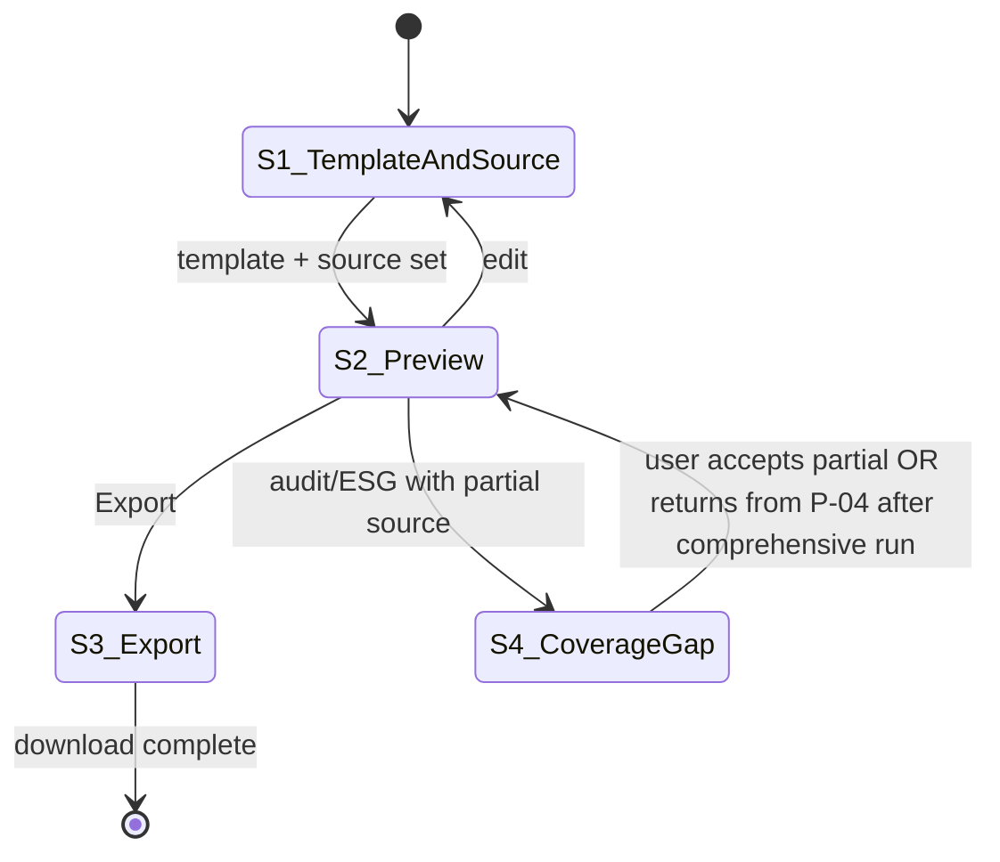

### State S1 — Template and source selection

- **Trigger.** Page load.
- **Visible components.** Persistent nav (C0); template selector (C1, filtered by `userType` to show only the four templates for this user); source-analysis selector (C2, multi-select from Saved Analyses or pre-populated if entered via a "Save as report" button on a result page); user-notes field (C3); report title field (C4); Next/Preview button (C5).
- **User actions.** Pick a template; pick one or more sources; type a title; optionally add notes; click Preview → S2.
- **Behaviour.** When the template is "Policy audit report" or "ESG / due-diligence report", a coverage indicator (C6) appears next to each source showing what fraction of the screening indicator set is present. Sources with full coverage are marked ✓; partial sources are marked with a warning icon.

### State S2 — Preview

- **Trigger.** S1 Next/Preview clicked.
- **Visible components.** Persistent nav; report preview pane (C7); editing controls (C8): title, notes, section toggles; export buttons (C9): PDF, CSV, JSON; Back to S1 link.
- **User actions.** Review preview; toggle sections; edit title/notes; click an export button → S3; click Back → S1.

### State S3 — Export

- **Trigger.** S2 Export clicked.
- **Visible components.** Loading indicator with status line ("Generating PDF…"); on success, a download confirmation with the file link (C10).
- **User actions.** None during generation; once complete, optionally generate another format or close.

### State S4 — Coverage gap

- **Trigger.** S1 with audit/ESG template + partial-coverage source(s) + user clicks Preview.
- **Visible components.** Modal-style or in-line warning (C11): "This source did not have every indicator computed. The report will mark missing indicators as 'not computed'." With buttons: *Run comprehensive screening for this target* (shortcut to P-04 with all indicators pre-selected, centre pre-filled from the source's `centreMetadata`, **radius set to 5 km** and **mode = screening** per `PLFS_v4.md` §15), *Continue with partial coverage* (proceeds to S2 normally), *Cancel*.
- **User actions.** Pick one of the three options.

### Component reference

| ID | Component | Appears in |
|---|---|---|
| C0 | Persistent nav | All |
| C1 | Template selector (filtered by `userType`) | S1 |
| C2 | Source-analysis multi-select from Saved Analyses | S1 |
| C3 | User-notes field | S1 |
| C4 | Report title field | S1 |
| C5 | Preview button | S1 |
| C6 | Coverage indicator per source (audit/ESG only) | S1 |
| C7 | Report preview pane | S2 |
| C8 | Editing controls: title, notes, section toggles | S2 |
| C9 | Export buttons: PDF, CSV, JSON | S2 |
| C10 | Download confirmation | S3 |
| C11 | Coverage-gap warning with three buttons | S4 |

### Validation rules

| ID | Rule | Where enforced |
|---|---|---|
| V1 | Template selected | Client-side; gates C5 |
| V2 | At least one source selected | Client-side; gates C5 |
| V3 | Source type matches template type (e.g. screening report needs a screening source) | Client-side; mismatched sources are hidden in C2 |
| V4 | Title non-empty | Client-side; gates export |

### Error states

| ID | Trigger | Surface | Recovery |
|---|---|---|---|
| E1 | PDF generation fails | Inline message on the export action | User retries or tries different export format |
| E2 | Source hydrate fails | Inline message on the source row in C2 | User picks a different source |
| E3 | CSV/JSON export fails | Same as E1 | Retry |

### Side effects

| Event | Effect |
|---|---|
| Preview generated | Server-side templating renders the HTML; client displays in C7 |
| Export PDF | Server-side HTML→PDF; file streamed for download |
| Export CSV | All numeric values + metadata flattened to a CSV |
| Export JSON | Full result object(s) serialised |
| Generate triggered from a result page ("Save as report" on P-05 / P-06 / P-08) | Report draft created and pre-populated when the user navigates to P-11 |

### Page-exit contract

If exiting via Export with success, the file is downloaded. No session state changes.

### Edge cases

| Case | Handling |
|---|---|
| Multiple sources from different time periods | Report renders them as chapters with chronological labels |
| Source from a different scope than the active one | Allowed; the report carries the source's own scope metadata |
| Audit/ESG template with one full-coverage source and one partial | S4 fires for the partial; user can run comprehensive on just the partial one |
| User navigates away mid-export | Export continues server-side; download notification appears on whichever page when ready (or fails silently for the demo) |
| Very long report (>50 pages) | Generation may take 15–30s; status line in S3 keeps the user informed; no streaming preview |

### Open design choices

| # | Question | Status |
|---|---|---|
| 1 | Section-toggle granularity | **Open.** Recommendation: in v1, offer toggles for high-level sections only (e.g. "Include trend appendix") rather than per-indicator. |
| 2 | "Run comprehensive screening" shortcut behaviour | **Resolved (v4).** Routes to P-04 with all indicators pre-selected, centre pre-filled from the source's `centreMetadata`, radius = 5 km (facility-level default), mode = screening. |
| 3 | PDF visual style — corporate vs technical-report | **Open.** Recommendation: clean technical-report style; matches the GSCO platform tone. |
| 4 | Co-branded reports (GSCO + user organisation) | **Future extension.** |

---

## Appendix A — Future extension: Authentication

The demo build deliberately omits authentication. When account management is added post-demo, P-01 expands to handle sign-in alongside user-type selection. The full logic is preserved here as a reference.

### Page-summary delta

| Field | Demo | Post-auth |
|---|---|---|
| Reachable from | Cold entry; sign-out | Cold entry; sign-out; session timeout |
| Inputs | None | Sign-in credentials |
| Outputs | `userType`, `session.id` | `userType`, `session.id`, `userId`, auth token |

### State model delta

The state model gains three new states (Sign-in, Authenticating, error overlays) before reaching the existing S1 (user-type selection, renamed S2 in the auth-enabled flow). The full diagram is the one in `Wireframe_P01_v1.md`.

### Cross-page impact

The Sign-out button on every page (already in the demo) gains a real responsibility — invalidating the auth token. The UI doesn't change.

Saved Analyses (P-10) and Reports (P-11) become per-user persistent stores rather than browser-state-only. The browser-state warning on P-10 is removed.

Open design choices that reactivate post-auth:

- Auth method: email/password vs SSO via the GSCO platform.
- Sign-up flow location: same page or separate URL.
- User-type defaulting from email domain (the demo deliberately doesn't do this; revisit when domain inference is meaningful).
- "Remember my user-type" toggle: meaningful only when there's a user profile to store it in.
- Pre-auth documentation access level.

### Migration note

The session contract from the demo (`userType` + `session.id`) is a strict subset of the post-auth contract (which adds `userId` and a real token). No downstream page needs to change to accommodate auth — they all already read from `session`. P-01's logic absorbs the entire change.

---

## Appendix B — Persistent navigation (component spec)

A single shared component used by every page from P-02 onwards. Reproducing the spec once here so it isn't repeated 10 times.

### Visible elements

| Slot | Content | Behaviour |
|---|---|---|
| Brand | GSCO tool name and logo | Click → P-03 (workflow hub) |
| Scope chip | Active scope name + "Change scope" link | Link → P-02 |
| Module links | Indicator Library, Saved Analyses, Reports | Click → P-09, P-10, P-11 respectively |
| User-type chip | Small label: "Policy Maker" or "MNC" | Static; not clickable |
| Sign out | Text link | Click → confirm (no-op for demo with no auth) → P-01 with cleared session |

### Behaviour rules

- The persistent nav is **always visible** on P-02 through P-11.
- The active page's module link is visually marked as current.
- Sign-out is the rightmost element; brand mark is leftmost.
- Clicking any nav link from a page with unsaved work prompts a "leave without saving?" dialog.

### Out of scope for v1

- Search across saved analyses from the nav.
- Notifications (e.g. "your analysis is ready").
- Multi-window state sync.

These are noted as future extensions.

---

## Appendix C — Traffic-light bands and confidence dots (shared component spec)

This spec defines the visual scoring grammar used everywhere a pillar Follow-Up Priority Score or a confidence score is rendered (P-05 traffic-light summary, P-06 trend score cards, P-08 ranking-table cells and risk-matrix point colour, plus the per-pillar drill-down panels). Reproducing the spec once here so it isn't repeated across pages.

### C.1 Traffic-light bands (for Follow-Up Priority Scores)

Applied to any 0–1 pillar Follow-Up Priority Score (`air.audit_followup_priority`, `ghg.audit_followup_priority`, `nature.followup_priority`, and the composite `composite.overall_screening`).

| Band | Score range | Semantic meaning | Default colour token |
|---|---|---|---|
| **Red** | `score ≥ 0.66` | High priority — warrants follow-up; surfaces in top-N highlights and audit reports as "elevated" | `--score-red` |
| **Amber** | `0.33 ≤ score < 0.66` | Moderate priority — investigate; surfaces as "noteworthy" | `--score-amber` |
| **Green** | `score < 0.33` | Low priority — routine; surfaces as "no flag" | `--score-green` |

Thresholds are **tertile-based** (equal-width bands). They are defensible without pre-computed empirical distributions across the supplier population — which the tool doesn't have access to in v1. Tunable as `TRAFFIC_LIGHT_THRESHOLDS = (0.33, 0.66)` in code; the demo locks them.

A score of exactly `0.33` or `0.66` lands in the *higher-severity* band (≥-based comparisons everywhere; documented to remove ambiguity).

### C.2 Confidence dots (for Quality / Attribution Confidence scores)

Applied to any 0–1 pillar confidence score (`air.attribution_confidence_score`, `ghg.data_quality_attribution`, `nature.quality_attribution`, and the composite `composite.confidence`).

| State | Score range | Glyph | Semantic meaning |
|---|---|---|---|
| **High** | `score ≥ 0.66` | ● (solid filled circle) | "Trust this score" — data coverage and retrieval quality are good |
| **Medium** | `0.33 ≤ score < 0.66` | ◐ (half-filled circle) | "Interpret with care" — some quality concerns |
| **Low** | `score < 0.33` | ○ (empty outline circle) | "Weak signal; do not act on this alone" — significant data quality issues |

Same tertile thresholds as the traffic-light bands; rendered next to the pillar chip / score with `8 px` spacing. **Hover behaviour**: tooltip shows the numeric confidence (e.g. "0.42") and the single *dominant limiting factor* — the lowest-scoring sub-component of the pillar's quality-attribution aggregate (e.g. "Limited by: Valid_Pixel_Coverage (0.18)"). The dominant-limiting-factor lookup uses the canonical sub-score names from `Indicators_Computation_v3.md` §1.3, §2.3, §3.3.

### C.3 Composition in chips

The combined "pillar chip" used in P-05's traffic-light summary (C3), P-06's per-pillar trend score cards (C2), and P-08's ranking table:

```
┌──────────────────────────────┐
│ Air Pollution           0.58 │ ← pillar name + numeric Follow-Up Priority
│ ████ ███                  ●○ │ ← band fill + confidence dot
└──────────────────────────────┘
   ▲                        ▲
   colour from §C.1         glyph from §C.2
```

The numeric score is always rendered to **two decimal places**. The pillar name uses the canonical labels: *Air Pollution*, *GHG Emissions*, *Nature/Land*, *Overall* (for the composite chip).

### C.4 Accessibility

- The colour-band semantic must **not** depend on hue alone. Each band also carries a textual band label ("High", "Moderate", "Low") rendered in the chip's tooltip and in the report exports.
- The confidence dot glyph (●/◐/○) is itself non-colour and is the primary accessibility carrier for confidence.
- Hover tooltips and report exports must use the textual band names, not the colour.

### C.5 Where the spec is referenced

| Page | Component(s) using this spec |
|---|---|
| P-05 | C3 traffic-light summary; C5a/b/c per-pillar drill-down panel chips; C6 confidence panel |
| P-06 | C2 per-pillar trend score cards (Follow-Up Priority band + dot); cell rendering in C3 anomaly markers |
| P-08 | C5 ranking-table score cells (band colour); C8 risk-matrix point colour (composite band) |
| P-11 | KPI table block in the ESG / Policy audit templates — band labels rendered as text + colour |

### C.6 Out of scope for v1

- A 4-band or 5-band scoring (more gradation than red/amber/green). v1.x may revisit once empirical distributions across runs are available.
- A continuous-gradient bar (no banding). Banding is a deliberate choice because the screening tool is for triage, not measurement.
- Confidence "intervals" or numeric uncertainty (e.g. ±0.15). Adds interpretation cost beyond what a screening tool needs.

---

## Implementation status (M-UI-E.1)

**Shipped 2026-05-19.** P-05 scaffold lives at `pages/05_Screening_Results.py`, with the pure-Python state machine in `ui/page_state.py`. The four states from §P-05 are live: **S1_Computing → S2_Results / S2_Partial / E1_AllFailed**, transitioning via `ui.page_state.classify_result(payload)` which reads the engine result's `_meta.pillars_run`, the three per-pillar follow-up priorities, and the `_failures` block.

Components shipped: **C1 (analysis header card)**. Components **C2, C3, C4b, C5a/b/c, C6, C7, C8, C9, C10** are rendered as `[Component CX — landing in M-UI-E.Y]` placeholders pinned to their target milestones.

Input hand-off: P-05 reads `st.session_state.screening_setup`. Until P-04 lands (post-M-UI-E.6), the scratch page (`pages/99_engine_scratch.py`) writes that key directly via a **"Run on P-05"** button in Full-screening mode. Setup shape: `{centre, radius_km, time_range, indicators, mode, centre_metadata}` — the same shape P-04 will write.

Tests: 9 new tests in `tests/test_page_state.py` cover the `classify_result` decision tree and `PageState` shape (no Streamlit / no EE).

**M-UI-E.2 shipped.** C3 traffic-light summary (`ui/components/c3_summary.py`) and C7 verbal summary (`ui/components/c7_verbal_summary.py`) are live. C3 reads the composite + three pillar follow-up priorities and renders one chip per score with band colour, score (2 d.p.), band label, and confidence dot per Appendix C. C7 calls `engine.verbal_summary.generate_verbal_summary(payload)` and renders the four-paragraph output. Both modules reuse `TRAFFIC_LIGHT_THRESHOLDS` from `engine/constants.py`, so chip colour and prose bucket never disagree.

Tests: `tests/test_traffic_light.py` (21 tests) pins the band + dot thresholds and parametrises a boundary-by-boundary lock-step against `engine.verbal_summary._bucket`.

**M-UI-E.3 shipped.** C4b KPI tile grid (`ui/components/c4b_kpi_grid.py`) live. 12-tile grid covering 9 air pollutants + 3 GHG indicators. Each tile renders headline value with unit, anomaly-direction arrow (↑/↓/→ in a neutral palette — direction, not severity, so the traffic-light colours are reserved for C3), and a confidence dot. Failed indicators render with a "Failed" badge and an expander showing the failure reason from `_failures[pillar]` (per-indicator path) or `_provenance.<pillar>.<indicator>.skipped_reason` (silent-skip path). CO₂ has no anomaly arrow because ODIAC is inventory-allocated, not an atmospheric observation — matches `engine.verbal_summary._ghg_dominant_slots`'s CO₂ branch.

C4b renders unconditionally for now; the user-type branch (Policy Maker → C4a hotspot map; MNC → C4b grid) lands with M-UI-E.6.

Tests: `tests/test_c4b_kpi_grid.py` (24 tests) covers tile-spec integrity (count, pillar split, key suffixes, CO₂ anomaly exception), failure detection, reason resolution across all three lookup paths, anomaly-direction edge cases (zero, sub-epsilon, None), and an end-to-end pass through a São Paulo-shaped payload exercising the success / per-indicator-failure / silent-skip combination.

**M-UI-E.4 shipped.** C5a/b/c drill-down panels (`ui/components/c5_drilldown.py`) live. Three pillar expanders, collapsed by default. Each panel renders a Follow-Up Priority Score headline with formula breakdown (per `Indicators_Computation_v4.md` §1.3 / §2.3 / §3.3), per-indicator rows, and a "Datasets used" sub-expander listing the canonical M5.6 provenance blocks for that pillar.

Air and GHG share a uniform 6-column row schema (indicator / site / anomaly / z / confidence / score). Nature is sub-sectioned by indicator class — Biodiversity exposure (KBA), Habitat conversion (+ Hansen forest loss as a sub-bullet), Vegetation condition (NDVI), and a Land-cover composition table (9-class Dynamic World breakdown) — because its outputs are too heterogeneous for a uniform row schema.

Formula weights are pulled from `engine.constants.{AIR,GHG,NATURE}_FOLLOWUP_WEIGHTS` rather than inlined, so the breakdown stays in lockstep with the live engine. `_build_formula` raises `KeyError` at import time if the engine adds or renames a weight key — fail-loud is the intended behaviour, since silent drift between the breakdown UI and the live formula is exactly the bug this design prevents.

Tests: `tests/test_c5_drilldown.py` (22 tests) covers helper functions (`_fmt`), formula-term integrity (4 terms per pillar, weights sum to ≈1.0, weights track `engine.constants`), payload-key namespacing, row specs (9 Air / 3 GHG, canonical NO₂-first ordering, CO₂ reads `.mean`), and spec/dataset alignment.

**M-UI-E.5 shipped.** C6 confidence panel (`ui/components/c6_confidence_panel.py`), C8 action bar (`ui/components/c8_action_bar.py`), and C9 partial-coverage banner (`ui/components/c9_partial_banner.py`) live.

- **C6** renders three pillar rows reusing the limiting-factor lookups from `engine/verbal_summary.py` — no duplication between the chip/prose/panel surfaces. If a pillar's resolver returns `None` (no scores to compare) the row falls back to "No limiting factor identified."
- **C8** "Save as report" pushes results into `st.session_state["saved_analyses"]` (half-real persistence, session-only). Schema mirrors the planned P-10 row shape: `id` (UUID4) / `name` (auto-generated from centre + UTC timestamp) / `type` ("screening") / `scope` / `date_saved` (ISO 8601) / `payload`. "Switch to Trend" is disabled with a tooltip until P-06 lands. Full localStorage persistence per PLFS_v4 §14 is a separate milestone.
- **C9** surfaces both explicit failures (`_failures`) and silent coverage-window skips (`_provenance.<x>.skipped_reason`) in one list, de-duplicated by `indicator_id` (failure wins). The renderer short-circuits to a no-op when nothing is missing, so the page can fire it unconditionally. The retry-failed-indicators action is deferred to v1.x — see `docs/v1x_followups.md`.

Layout change: `_render_s2` no longer takes a `partial` argument. S2_Results and S2_Partial render identically — the orchestrator's distinction is preserved in `classify_result` (for telemetry / future logic) but doesn't affect what the page outputs, since C9 decides for itself whether there's anything to surface.

The MNC vertical slice on P-05 is now feature-complete. Only remaining placeholder: **C4a hotspot map** (Policy Maker primary visualisation, M-UI-E.6).

Tests: `tests/test_c6_confidence_panel.py` (6 tests), `tests/test_c8_action_bar.py` (8 tests, `st.session_state` and `st.toast` monkeypatched), `tests/test_c9_partial_banner.py` (12 tests including a São Paulo end-to-end with 3 missing indicators and a de-duplication test for indicators that appear in both failure paths).

**M-UI-E.6 shipped.** Single-indicator P-05 variant + C4a indicator-map scaffolding live. **All C-components on P-05 now have an implementation; M-UI-E is closed.**

P-05 branches on `len(setup["indicators"])`:
- **Multi-indicator** (≥2) — the existing aggregate view (M-UI-E.1–.5).
- **Single-indicator** (1) — a lean variant: header (C1) → partial banner (C9, if relevant) → map (C4a) → indicator detail card → save bar (C8). C3, C4b, C5, C6, C7 are intentionally omitted because they visualise pillar-level aggregates that don't apply when only one indicator was selected.

C4a is built around an indicator-renderer registry (`ui/components/c4a_indicator_map.py::_RENDERERS`). v1 ships three renderers covering the three visualisation grammars:

- **Continuous z-raster** — `air.no2.score` (Sentinel-5P TROPOMI). Mean composite expressed as per-pixel z-score relative to the AOI buffer's spatial mean, on a diverging RdBu palette bounded at ±3σ.
- **Vector polygons** — `nature.kba.proximity_score` (KBAsGlobal). KBAs within a 5× radius envelope rendered in green; AOI centre as a red marker.
- **Categorical raster** — `nature.dw.trees_pct` (Dynamic World V1). Mode composite over the screening window with DW's official 9-class palette and inline legend.

Unknown indicator IDs fall back to a "not yet implemented in v1" notice — the rest of the page (header, indicator detail, action bar) still renders normally.

The Wireframes' original "user-type fork on C4a vs C4b" is superseded: both user types see C4b in multi-indicator mode and C4a in single-indicator mode. The user-type variation in the spec was always conditional on the indicator-set size; in v1 it makes more sense to drive the layout off cardinality directly.

`indicator_detail.py` reuses `_render_provenance_block` and `_fmt` from `c5_drilldown.py` so provenance display is identical across both variants.

Bridge: `pages/99_engine_scratch.py` ships a "Run single indicator on P-05" button with a selectbox of the three registered indicator IDs plus one unsupported one (`air.so2.score`) for exercising the fallback.

Tests: `tests/test_c4a_indicator_map.py` (12 tests) covers the registry shape, the zoom heuristic at boundaries + monotonicity, DW palette/class-name alignment, and canonical-ID cross-checks against `engine.air.AIR_POLLUTANT_CONFIG` / `engine.nature.NATURE_INDICATOR_CONFIG`. The renderers themselves are EE-touching and verified visually in the browser, not via pytest.

**M-P04 shipped.** P-04 Inspect Setup page ([pages/04_Inspect_Setup.py](../pages/04_Inspect_Setup.py)) live. The form body composes in [ui/components/p04_form.py](../ui/components/p04_form.py) and the indicator catalogue lives in [ui/components/p04_indicator_registry.py](../ui/components/p04_indicator_registry.py).

v1 scope:
- **Centre input.** Free Coordinates only. Region and Supplier tabs render explanatory info — both require a `supplyChain` object from P-02 (Scope Setup), which isn't built yet.
- **Radius.** Six fixed stops (1, 5, 10, 25, 50, 100 km); default 5 km. Caption explains that CAMS PM₁₀/₂.₅ need ≥ 25 km to produce a value.
- **Indicators.** Three per-pillar collapsible groups, all 19 pre-selected. "Reset to all" link restores the default. Selection persists across reruns via `st.session_state["p04_selected_indicators"]`.
- **Time range.** Hidden in screening mode per Wireframes §P-04 C7; the screening always uses the latest 90-day window. The selector lands with P-06.
- **Run Screening.** Primary button. Enabled when centre is set and ≥1 indicator is selected. Writes `screening_setup` in the same shape P-05 already reads, then `st.switch_page`s to P-05. A single-indicator selection routes naturally to P-05's single-indicator variant (M-UI-E.6).
- **Run Trend.** Disabled with a tooltip until P-06.

The scratch-page bridge in `pages/99_engine_scratch.py` is kept as a developer shortcut — P-04 is the user-facing entry point but the scratch bridge still exercises specific indicator combinations that the form doesn't expose directly.

Tests: [tests/test_p04_indicator_registry.py](../tests/test_p04_indicator_registry.py) (26 tests including 19 parametrised lockstep checks) pin the 19-indicator catalogue, the 9/3/7 pillar split, the no-duplicates invariant, and assert every P-04 indicator ID round-trips through `engine.ids.is_valid_id`. The last check is the one that fails loudly if the engine renames or removes an indicator the UI still offers.

**M-P04-Geocode shipped.** P-04's Free Coordinates tab now has a geocoded location search above the lat/lon inputs ([ui/components/geocoder.py](../ui/components/geocoder.py)). Uses Nominatim (OpenStreetMap, free, no API key) per Wireframes_All_v4 §P-02 Open Design Choice 3. The user types a place name (e.g. "São Paulo, Brazil"), clicks Search, picks one of up to 5 top matches; the lat/lon inputs fill automatically and the results list clears. Direct lat/lon entry still works — manual edits sync back into the same session defaults so picks don't get clobbered on rerun.

Network errors, JSON parse failures, and timeouts surface as `GeocodingError` with a UI-friendly message ("Geocoding service unavailable… You can still enter lat/lon directly below"). Rate-limit guard enforces Nominatim's 1 req/sec policy at the module level, and a meaningful User-Agent (`GSCO-Environmental-Tool/v1 (demo)`) is included per their usage policy.

Tests: [tests/test_geocoder.py](../tests/test_geocoder.py) (11 tests) stub `requests.get` and the `time` clock so the network path, the JSON-parse path, the timeout path, the rate-limit sleep, the User-Agent header, and the defensive entry-validation are all asserted without burning real seconds.

**M-DEMO-DATA shipped.** Two new module trees that the upcoming P-02 scope-setup page and the activated P-04 Region/Supplier tabs will consume:

- [demo/scopes/](../demo/scopes/) — three hand-curated MNC supply chains in Brazil (Iron & Steel — Minas Gerais, 8 nodes; Soy & Cattle — Pará/Mato Grosso, 10 nodes; Garments — São Paulo/Rio, 10 nodes). Coordinates placed near real industrial sites where the engine should produce demonstrable signal; company names are fictitious to avoid liability. Loaded once at import via [demo/scopes/\_\_init\_\_.py](../demo/scopes/__init__.py), exposed via `all_scopes()` and `get_scope(id)` as frozen `SupplyChain` / `SupplyChainNode` dataclasses. Pure Python; no EE.
- [demo/regions.py](../demo/regions.py) — GAUL level1 wrapper. `all_countries()` returns the sorted country list; `regions_for_country(country)` returns each admin1 with `(name, country, centroid_lat, centroid_lon, radius_km, natural_radius_km)`. **Lazy per-country cache** — first call per cold country fires one EE round-trip via a server-side `.map(...)` that annotates every feature with centroid + area in a single `getInfo()`; subsequent calls are instant. **Radius rule** locked at `min(√(area/π), 400 km)`; `Region.is_capped` surfaces whether the cap kicked in so the UI can render a tooltip.

Both modules are passive — they expose data, they don't write to `session_state`. P-02 (next milestone) wires user selections into `st.session_state.supplyChain` / `st.session_state.region`, then P-04 reads those.

Tests: [tests/test_demo_scopes.py](../tests/test_demo_scopes.py) (22 tests, mostly parametrised across the 3 scopes) covers load + parse + unique-ID + valid-coordinate invariants. [tests/test_demo_regions.py](../tests/test_demo_regions.py) splits into 8 pure-Python tests (radius math at small / cap-threshold / huge inputs, `Region.is_capped` branches, cache short-circuit behaviour via direct cache injection) plus 4 real-EE tests gated by `RUN_EE_TESTS=1` (mirrors `tests/test_ghg_integration.py`) that verify Brazil has ≥26 admin1 regions, every centroid + radius sits in sensible ranges, and the São Paulo state centroid lands near (-22, -49).

**M-P02 shipped.** P-02 Scope Setup page ([pages/02_Scope_Setup.py](../pages/02_Scope_Setup.py)) live, with the two-step state machine in [ui/components/p02_form.py](../ui/components/p02_form.py) and the per-mode preview renderers in [ui/components/p02_preview.py](../ui/components/p02_preview.py). Two stages: **ModePick → Preview**. Confirm writes `st.session_state["scope"]` as `{"kind": "supply_chain"|"region"|"none", "data": ...}` and routes onwards (P-03 Workflow Hub when it lands, P-04 Inspect Setup until then).

User-type **hard branch** per the locked design:

| User type    | Available modes              |
|--------------|------------------------------|
| MNC          | Supply Chain, None           |
| Policy Maker | Region, None                 |

No cross-type access. The defensive fallback (no `user_type` set) shows all three modes so the page stays usable if the session is in an unexpected state. Supply Chain mode reads from `demo.scopes`; Region mode reads from `demo.regions`. Preview renders a small geemap map for Supply Chain (one marker per node) and Region (centroid marker + buffer outline); None mode is text-only.

The existing `pages/01_scope_setup.py` (M5b geemap-stack placeholder) is retained for now; retirement of the placeholder is a follow-up cleanup once P-02 is the canonical entry.

P-02 always enters at ModePick — last scope is **not** remembered per the locked design (returning users see a fresh choice every visit). See `docs/v1x_followups.md` for the v1.x note on persisting last scope.

Tests: [tests/test_p02_form.py](../tests/test_p02_form.py) (10 tests including a 4-way parametrisation) covers the hard branch — MNC sees no Region, Policy Maker sees no Supply Chain, all branches always include None as an opt-out.

**M-P04-ACTIVATE shipped.** P-04 now reads `st.session_state["scope"]` and renders one of three forms:

| Scope kind        | P-04 form                                                                                                                          |
|-------------------|------------------------------------------------------------------------------------------------------------------------------------|
| `supply_chain`    | Scope header + node dropdown + radius slider + indicators + run. "Use free coordinates instead" escape link below.                 |
| `region`          | Scope header + locked centroid/radius display + indicators + run. Escape link below.                                               |
| `none` or unset   | Original three-tab form (Free Coordinates active, Region/Supplier disabled with informational text — unchanged from M-P04).        |

The dispatch lives in [ui/components/p04_form.py::render_setup_form](../ui/components/p04_form.py); the existing centre/radius/indicator/run helpers are reused by the no-scope form unchanged.

`centre_metadata.source` on `screening_setup` now reflects the active scope: `"P-04 supply-chain scope · <chain name>"`, `"P-04 region scope · <region>, <country>"`, or `"P-04 free coordinates"`. P-05's C1 header surfaces this attribution.

The **Change scope** button in the scope-header strip routes back to P-02 with the local P-02 stage state cleared, so the user lands fresh on Mode Pick. The **Use free coordinates instead** link sets `scope.kind = "none"` (rather than clearing the key) and seeds `p04_lat` / `p04_lon` from the scoped centre, so the no-scope form opens pre-filled — useful for "I picked this region but want to nudge the location" cases.

Tests: [tests/test_p04_scope_dispatch.py](../tests/test_p04_scope_dispatch.py) (7 tests) pins `_source_for_scope` for every scope kind including the defensive fallbacks (unknown `kind`, `data` is None despite a recognised `kind`).

**M-P02-POLISH shipped.** Two wiring/copy fixes:

- [app.py](../app.py) — every `st.switch_page` after role selection now routes to `pages/02_Scope_Setup.py` (the real P-02), not `pages/01_scope_setup.py` (the placeholder). Three call sites updated: the "Continue to scope set-up" button on the already-signed-in branch, and the post-role-pick routes for Policy Maker and MNC.
- [ui/components/p04_form.py](../ui/components/p04_form.py) — `_render_centre_section`'s tab labels drop the "(P-02)" forward-reference suffix; the Region and Supplier disabled-tab placeholders now reflect P-02's existence and carry a "Go to Scope Setup" button that routes to P-02. The Free Coordinates tab is unchanged.

The scratch page (`pages/99_engine_scratch.py`) remains accessible via the sidebar for developer use — only the default landing path changed.

No new tests — pure wiring + copy. Existing tests all still pass (558).

**M-P0103 shipped.** Three pieces:

- **P-01 is `app.py`.** The Streamlit entry-point file is the landing in this codebase. The wireframes' "P-01" name is a label, not a file path; there's no separate `pages/01_*.py` for it. (The M5b `pages/01_scope_setup.py` placeholder is unrelated and still slated for retirement once P-02 is the canonical pre-Inspect entry.)
- **P-03 — Workflow Hub** lives at [pages/03_Workflow_Hub.py](../pages/03_Workflow_Hub.py) with renderers in [ui/components/p03_hub.py](../ui/components/p03_hub.py). Three stacked sections: welcome + scope summary (no-scope, supply-chain, or region card per the loaded `scope`), two workflow cards (**Inspect** active → P-04; **Prioritisation** disabled until P-07/P-08), three persistent-module cards (Indicator Library, Saved Analyses, Reports — all v1.x placeholders). P-02's Confirm now routes here unconditionally; the M-P02 try/except fallback to P-04 was removed since P-03 exists.
- **Persistent nav** centralised in [ui/components/persistent_nav.py](../ui/components/persistent_nav.py). Pages 02, 03, 04, 05, and the developer scratch all import `render_persistent_nav` and drop their previous inline strips. Three elements left-to-right: user-type chip, scope chip (label + Change / Pick scope button routing to P-02 with stage state cleared), sign-out. The pure scope-chip wording helper `_scope_chip_label` is unit-testable.

The M5b placeholder `pages/01_scope_setup.py` retains its inline strip — it has no user-facing nav role and is slated for retirement.

Tests: [tests/test_persistent_nav.py](../tests/test_persistent_nav.py) (5 tests) pins `_scope_chip_label` for every scope kind including the unknown-kind defensive fallback. `test_p03_hub.py` skipped per the spec — the rendering helpers are pure Streamlit composition with no testable logic beyond what `_scope_chip_label` and `_source_for_scope` already cover.

**M-FOLLOWUP-FALLBACK shipped.** Audited and fixed the priority-score fallback bug across all three pillars and the composite. Pre-fix: when sub-aggregates of a pillar's follow-up priority were None due to upstream failures, the engine silently renormalised the weights over the surviving sub-aggregates — producing a misleading headline driven by a single input. Reproduced on Rio de Janeiro region screening: `nature.followup_priority = nature.quality_attribution = 0.858`, propagated as the composite. Three of four Nature sub-aggregates were None; the lone survivor became the headline.

**Engine.** Each pillar's `compute_*_followup_priority` ([engine/air.py](../engine/air.py), [engine/ghg.py](../engine/ghg.py), [engine/nature.py](../engine/nature.py)) now uses strict-None propagation: any None among the sub-aggregates takes the priority to None. The same fix is applied to `_compute_composite` and `_compute_composite_confidence` in [engine/orchestrator.py](../engine/orchestrator.py) — a missing pillar priority takes the composite to None instead of the prior survivor-mean.

**Known-zero handling.** Two sub-aggregates are intentionally 0.0 in v1 (not real failures):
- Air `air.trend_score` and GHG `ghg.trend` already returned `0.0` in screening mode (M5+ TODO for trend.py).
- Nature `nature.vegetation_condition` depended on `nature.ndvi.negative_trend` which is always None until M-TREND-ENGINE. `compute_vegetation_condition` now substitutes `0.0` for the known-zero negative_trend term up front, so the aggregate computes from the three real components — distinguishes "known v1 gap" from "real upstream failure" (e.g. NDVI indicator skipped on this AOI), which still propagates None.

**UI.** [ui/components/c3_summary.py](../ui/components/c3_summary.py) now renders a "No data" chip variant (empty grey fill bar, "—" in the score slot, label "No data") when the priority is None, instead of a band-coloured chip with "—" labels. [ui/components/c5_drilldown.py](../ui/components/c5_drilldown.py) renders the C5 headline's score pill as a grey "—" with "Not available" caption when priority is None.

**Tests.** [tests/test_followup_priority.py](../tests/test_followup_priority.py) (22 tests, parametrised across Air / GHG / Nature) pins the strict-None contract: all-populated → weighted sum, one None → None, all None → None, all-zero (known-zero) → 0.0, mixed-zero-and-real → weighted sum including the zeros. Vegetation-condition known-zero substitution covered in two cases (substitution fires when only `negative_trend` is None; real upstream failure still routes to None). Composite layer tested via direct `_compute_composite` / `_compute_composite_confidence` invocations. Nine existing tests in `test_air.py` / `test_ghg.py` / `test_nature.py` / `test_orchestrator.py` were updated in lock-step — their old "renormalises when X missing" assertions were exactly the bug this milestone fixes.

**M-OCEAN-RING shipped.** The §0.2 six-step pipeline's background ring reducer now distinguishes "ring landed over water / outside asset coverage" from other compute failures and routes the indicator through the canonical silent-skip path instead of bubbling up as a pillar-wide failure.

A new exception subclass [engine/exceptions.py](../engine/exceptions.py)::`BackgroundRingNoDataError` extends `IndicatorComputeError`; [engine/core/repeatable_core.py](../engine/core/repeatable_core.py)::`background_value` raises the specific subclass when `reduceRegion(...).getInfo()` returns a dict missing either `<band>_median` or `<band>_stdDev`. [engine/air.py](../engine/air.py)::`run_pillar` and [engine/ghg.py](../engine/ghg.py)::`run_pillar` each catch the new subclass *before* the generic `IndicatorComputeError` and emit a canonical skipped payload via new `_emit_skipped_air_result` / `_emit_skipped_ghg_result` helpers (every emitted measurement → `None`; provenance carries `skipped_reason="background_ring_no_data"`). The pillar-wide-fail trigger (`PillarComputeError` when every indicator failed) is computed on `_failures` membership only, so ring-skipped indicators no longer count against it — coastal AOIs where every pollutant trips the ring no longer collapse the whole page into the E1 error state.

Discovered when Rio de Janeiro region screening (281 km buffer → 562 km ring, largely Atlantic Ocean) surfaced as "all selected air pollutants failed to compute" with no actionable explanation. Now each tile renders as Failed with the new prose: *"Background ring (outside the AOI buffer) had no usable data — likely because the ring extends over water or outside the data source's coverage."* The C9 partial banner counts the silent skips correctly.

New `skipped_reason` code registered in [ui/components/c4b_kpi_grid.py](../ui/components/c4b_kpi_grid.py)::`_SKIPPED_REASON_TRANSLATIONS` and [ui/components/c9_partial_banner.py](../ui/components/c9_partial_banner.py)::`_SKIPPED_REASON_PROSE` (lock-step). Tests: [tests/test_ocean_ring.py](../tests/test_ocean_ring.py) (11 tests) covers the exception hierarchy (subclass IS-A relationship), `background_value` raising the specific error on empty / partial reductions, the canonical shape of `_emit_skipped_air_result` / `_emit_skipped_ghg_result`, the air + GHG `run_pillar` routing into silent-skip (and the regression that plain `IndicatorComputeError` still routes to `_failures`), and lock-step C4b/C9 prose registration.

Out of scope: changing the ring-construction logic to use only-land-pixels or to substitute a regional climatology baseline. That's v1.x methodology work — this milestone makes the failure mode user-visible and actionable.

**M-HIDE-SUMMARY shipped.** C7 verbal summary on multi-indicator P-05 now renders only when the user runs the full canonical set of 19 indicators (`selected == set(ALL_INDICATOR_IDS)`). Subset runs hide C7 entirely — the verbal summary templates assume breadth-of-coverage, so a partial run with, say, NO₂ + CH₄ + KBA selected would produce prose claiming things "across the monitored pollutants" when most weren't measured. C3 chips, C4b grid, C5 drill-downs, C6 confidence panel, and C8 action bar all render unchanged for partial runs. The single-indicator P-05 variant never rendered C7 in the first place, so that path is unchanged.

Set equality — not just count — guards against the (extremely unlikely) edge case of 19 non-canonical IDs being selected, and against silent breakage if the canonical set grows in a later milestone. Single-file change in [pages/05_Screening_Results.py](../pages/05_Screening_Results.py); no engine, component, or test changes.

**M-P10-POLISH shipped.** Two bug-fixes on P-10:

1. **Saves no longer overwrite each other across the session.** UUID generation in [ui/components/c8_action_bar.py](../ui/components/c8_action_bar.py)::`_save_as_report` was verified inline (per-call). The seed function in [demo/saved_analyses/__init__.py](../demo/saved_analyses/__init__.py) was switched from a list-emptiness guard to a flag-based guard (`saved_analyses_seeded` in `session_state`). The flag survives mutations of `saved_analyses` (user-added saves, deleted entries), so a stray re-render of [app.py](../app.py) can't clobber user data the way the list-emptiness guard could. The earlier guard also failed defensively when the user deleted all stubs — the next re-render would silently re-seed them; the flag-based guard fixes that.
2. **Save names use loaded scope context.** A new pure helper `_build_save_name(setup, scope, now)` builds names with three branches: supply-chain scope with a node name on `centre_metadata` → `"<node> — <chain>"`; region scope with a region name + country → `"<region>, <country> — Region screening"`; otherwise (none scope / no metadata / unexpected shape) → the original `"Screening @ (lat, lon) — YYYY-MM-DD HH:MM UTC"` fallback. [ui/components/p04_form.py](../ui/components/p04_form.py)::`_render_node_picker` was extended to expose `node_id` + `node_name` alongside `lat`/`lon`, and `_commit_and_navigate` routes those (plus `region_name` + `country` when scope is a region) into `screening_setup.centre_metadata`. The `centre` field itself stays clean as `{lat, lon}` — downstream engine code keys on the clean shape.

Tests: [tests/test_save_name_builder.py](../tests/test_save_name_builder.py) (8 tests) parametrises every branch of the precedence rules (supply-chain hit, supply-chain miss → fallback; region hit, region miss → fallback; none/missing/unexpected scope → fallback). [tests/test_seeded_saves.py](../tests/test_seeded_saves.py) gained four tests for the flag-based behaviour (flag set on first call; no-op via flag on second call; user save preserved between two seed calls — the Bug 1 regression guard; pre-seed entries preserved through the seed). [tests/test_c8_action_bar.py](../tests/test_c8_action_bar.py) gained two end-to-end tests covering the supply-chain and region naming paths via `session_state` stubs.

**M-NATURE-KEYS shipped.** Audited every formula `payload_key` in [ui/components/c5_drilldown.py](../ui/components/c5_drilldown.py) (`_AIR_FORMULA`, `_GHG_FORMULA`, `_NATURE_FORMULA`) against the keys each pillar's aggregate `compute_*` functions actually emit. All 12 keys match — there was no wrong-key drift to fix. The "—" rows the user observed on a Soy/Cattle node were the *correct* keys reading `None` values because:

1. **`nature.vegetation_condition` is always `None` in v1.** It depends on `nature.ndvi.negative_trend`, which is `None` until [engine/core/trend.py](../engine/core/) lands (the M-TREND-ENGINE milestone — `_trend = None` falls through in `engine/core/repeatable_core.py`).
2. **`nature.biodiversity_exposure` / `nature.habitat.conversion_score` go `None`** via strict-null propagation when upstream Dynamic World or Hansen indicators are skipped (typical on frontier-Amazon AOIs with thin DW coverage). Post-M-NATURE-DEFENSIVE these are silent skips, not crashes, but the sub-aggregate is still `None`.

Fix: `_render_headline` now surfaces a caption below the formula table whenever any term is `None`, naming both possibilities (engine gap or upstream skip) and pointing users at the C9 partial banner / C4b "Failed" tiles for the per-indicator details. No key changes — the formula payload_keys were already correct.

Canary: [tests/test_formula_keys_match_engine.py](../tests/test_formula_keys_match_engine.py) (15 tests) parametrises each formula term against the engine's emitted keys, harvested at import time by calling each aggregate `compute_*` function with `{}` (synthetic — no EE). The test is designed to fail loudly in either direction of drift: a UI term pointing at a key the engine doesn't emit, OR an engine rename that the UI didn't track. The latter would have caught the bug this milestone was scoped to fix had the audit found one.

**M-NATURE-DEFENSIVE shipped.** Defensive empty-result handling across the Nature pillar's reducers. Each reducer that previously crashed on an empty EE dict result now materialises the reduction client-side and falls through to a canonical "indicator skipped" payload — every emitted canonical ID set to `None` plus a provenance block with `skipped_reason` populated. Mirrors the M5.5c out-of-coverage pattern used by ODIAC.

Discovered when Altamira Frontier Farm screening (Pará, 25 km buffer) crashed with `Dictionary.get: Dictionary does not contain key: 'label'`. Root cause: the reducer chain called `reduceRegion(...).get("label").getInfo()`, which throws server-side when the AOI has zero usable Dynamic World scenes (remote rainforest, high recent cloud cover). The fix is to call `.getInfo()` on the full `ee.Dictionary` first, then guard with Python's `dict.get()` — the missing-key branch routes through the new `_emit_skipped_nature_result` helper.

Five Nature call sites hardened in [engine/nature.py](../engine/nature.py): `compute_current_land_cover`, `compute_habitat_conversion` (via `_dw_mode_histogram`, plus an explicit empty-composite check in the parent), `compute_forest_loss`, `_ndvi_low_area_pct` (inline guard — the parent's six-step path already raises on truly absent NDVI), and `compute_water_exposure`. Audit found `engine/air.py` clean (every reducer flows through `engine.core.six_step`, which already raises `IndicatorComputeError` on empty buffers) and `engine/ghg.py` gated for CO₂ via `coverage_window` (CH₄ / VIIRS via six-step).

New `skipped_reason` codes registered in [ui/components/c4b_kpi_grid.py](../ui/components/c4b_kpi_grid.py)::`_SKIPPED_REASON_TRANSLATIONS` and [ui/components/c9_partial_banner.py](../ui/components/c9_partial_banner.py)::`_SKIPPED_REASON_PROSE` (kept in lock-step): `no_dw_pixels`, `no_hansen_pixels`, `no_modis_pixels`, `no_cams_pixels`. Each renders in C4b's "Failed" tile reason expander and in C9's partial banner. `no_cams_pixels` is registered for parity even though Air's reducers currently route through `six_step` — future-proofs the UI against later defensive guards on the Air side.

Tests: [tests/test_nature_defensive.py](../tests/test_nature_defensive.py) (19 tests) stubs the EE chain to return empty / partial reductions, asserts each reducer emits the canonical skipped shape (None-valued IDs + `skipped_reason` in provenance + `observations.count=0`), pins the happy-path regression (a zero-loss Hansen result is *not* a skip; a DW result with only non-water classes is *not* a skip), and parametrises the C4b/C9 prose-dict lock-step across all four new codes.

Out of scope: the broader pillar-wide error-wrapping followup (raw `ee.EEException` strings → user-readable messages). That stays a v1.x milestone — see `docs/v1x_followups.md`. This milestone handled the *expected* "no data" case, not the "EE call literally failed" case.

**M-P10 shipped.** P-10 Saved Analyses page ([pages/10_Saved_Analyses.py](../pages/10_Saved_Analyses.py)) live. List view + per-row Open / Delete / Export JSON actions, rendered by [ui/components/p10_list.py](../ui/components/p10_list.py). Delete uses `st.dialog` for confirmation. Open hydrates `st.session_state["screening_setup"]` and `page_state` (as `S2_Results` with the stored payload), then routes to P-05 to render the cached result without re-running EE.

The M-UI-E.5 save action ([ui/components/c8_action_bar.py](../ui/components/c8_action_bar.py)) was refactored to capture the full `screening_setup` (centre, radius_km, time_range, indicators, mode, centre_metadata) alongside `payload`, so Open works with no information loss. Earlier-shape entries don't exist outside a session, so no migration was needed; `tests/test_c8_action_bar.py` was updated in lockstep with the entry-key change.

Two demo saves are seeded at session entry from [demo/saved_analyses/](../demo/saved_analyses/) via `seed_saved_analyses(session_state)`, called once from [app.py](../app.py) after `init_session()`. The loader is idempotent — no-op when the list is already populated, so user saves added within a session are never overwritten. The shipped JSON files are currently minimal stubs; Phase 2 demo prep (real screening runs at Altamira Frontier Farm and Distrito Federal) replaces them with real screening data. Stub entries render in the list as broken rows; Open surfaces a "this save is missing data" error rather than routing to a half-empty P-05.

Cold-boot session state always has the two seeded saves available; the user can add, delete, and export others within the session. Persistence beyond session lifetime is deferred to v1.x per PLFS_v4 §14 — Export JSON serves as the user-facing persistence path.

Tests: [tests/test_p10_list.py](../tests/test_p10_list.py) (8 tests) pins the pure helpers (`_format_row_caption` happy path / stub-safe fallbacks / partial-centre fallback; `_apply_delete` filter purity + order preservation). [tests/test_seeded_saves.py](../tests/test_seeded_saves.py) (7 tests) pins the loader (cold-start populate, idempotent no-op even on a single-entry list, defensive empty-dir behaviour, sorted-glob order, plus a parametrised shape check on each shipped JSON). [tests/test_c8_action_bar.py](../tests/test_c8_action_bar.py) updated: the canonical-keys assertion now expects `screening_setup` instead of `scope`, and the new `test_saved_entry_captures_full_screening_setup` pins the identity-preserving capture.

**M-ADAPTIVE-SCALE shipped.** Nature pillar reducers now scale to AOI size. New helper [engine/core/adaptive_scale.py](../engine/core/adaptive_scale.py) exposes `adaptive_scale_m(geometry, native_scale_m, target_pixels=1M)` returning a reduction scale that keeps pixel counts bounded. Every Nature reducer (`compute_current_land_cover`, `compute_habitat_conversion`, `compute_forest_loss`, `compute_ndvi_condition`, `compute_water_exposure`) calls the helper and passes the result as `scale=` to its EE reducer.

Provenance's `method_note` records the effective scale via `method_note_fragment`. For small AOIs (e.g. MNC 5 km buffer), the helper returns the asset's native scale, so behaviour is unchanged. For region-scale AOIs (Brazilian states), the helper returns a coarsened scale, bounding pixel count to ~1M.

Discovered when Rio de Janeiro region screening hung after Air completed (Nature reducers running at 10 m native over ~43,000 km² → ~430M pixels, exceeded EE planner capacity). Air and GHG pillars unchanged — their assets are already coarse enough to scale gracefully.

Tests: [tests/test_adaptive_scale.py](../tests/test_adaptive_scale.py) (10 tests, no EE) pins the math at small / region / capped AOIs, the native-scale floor for coarse assets, custom `target_pixels`, and both `method_note_fragment` branches. EE-touching path covered indirectly via [tests/test_nature.py](../tests/test_nature.py).

**M-PARTIAL-CAVEAT shipped.** Three small UX fixes:

1. **Partial-selection caveat banner** ([ui/components/c_partial_caveat.py](../ui/components/c_partial_caveat.py)) renders on P-05 when the user ran fewer than the full 19 indicators. Explains that pillar scores reflect the selected indicators, not a full pillar assessment. Distinct from C9 (which surfaces failures of selected indicators) — both can fire on the same page. Wired into [pages/05_Screening_Results.py](../pages/05_Screening_Results.py) between the C9 banner and the C3 summary chips.
2. **Landing page browser tab and sidebar display title** now reads "Landing" instead of "app" via `st.set_page_config(page_title="Landing — GSCO")` in [app.py](../app.py).
3. **Uniform card heights** for role-selection cards (P-01, [app.py](../app.py)) and scope-mode cards (P-02, [ui/components/p02_form.py](../ui/components/p02_form.py)) via injected CSS targeting Streamlit's `stHorizontalBlock` + `stVerticalBlockBorderWrapper` containers with a `min-height` rule. Adjacent cards now match heights regardless of content variation.

Tests: [tests/test_partial_caveat.py](../tests/test_partial_caveat.py) (5 tests, no Streamlit runtime — patches `st.info` on the module). Covers the no-op on full selection, banner-with-count on subsets, defensive empty selection, and that unknown IDs don't inflate the count.

**M-AIR-GHG-DEFENSIVE shipped.** Defensive empty-result handling across Air and GHG reducers, mirroring M-NATURE-DEFENSIVE for the third pillar pair. Each reducer that previously raised a generic `IndicatorComputeError` on an empty site buffer now routes through the canonical "indicator skipped" shape (score=None, confidence=None, provenance with `skipped_reason` populated) — surfacing in C4b's failed-tile expander and C9's partial banner with an asset-specific reason ("Sentinel-5P had no usable observations…") instead of bubbling up as a `_failures` entry.

Discovered when Acre region screening hit the `E1_AllFailed` path with the generic "All pillars returned no data" message. EE timing logs showed retry behaviour (4× identical durations per indicator); root cause was Sentinel-5P returning no usable data over the western Amazon during the recent 90-day window (persistent cloud cover + sparse overpass density). The engine's `IndicatorComputeError` from `engine.core.repeatable_core.site_value` was correct but the message wasn't user-actionable.

Implementation. New `SiteBufferNoDataError(IndicatorComputeError)` exception in [engine/exceptions.py](../engine/exceptions.py) parallels the M-OCEAN-RING `BackgroundRingNoDataError`. [engine/core/repeatable_core.py](../engine/core/repeatable_core.py)::`site_value` now raises the new subclass when the site reduction yields no usable pixels. Each pillar's `PollutantConfig` / `GhgIndicatorConfig` carries a new `skipped_reason_no_data` field that names the asset family (S5P / CAMS / MAIAC / VIIRS / ODIAC); [engine/air.py](../engine/air.py)::`run_pillar` and [engine/ghg.py](../engine/ghg.py)::`run_pillar` catch `SiteBufferNoDataError` before generic `IndicatorComputeError` and route through the existing `_emit_skipped_*_result` helpers with the per-config code. Pixel-size pre-checks (buffer < native pixel) still raise plain `IndicatorComputeError` → `_failures` entry; that's a user-input issue, not a coverage statement.

Also hardened: CO₂ ODIAC reduceRegion chains in `compute_co2_snapshot` now materialise the dict via `.getInfo() or {}` before `.get(band)`, matching the explicit pattern Nature uses. Previous form relied on Python's `or 0.0` short-circuit, which worked but was fragile.

New `skipped_reason` codes registered in [ui/components/c4b_kpi_grid.py](../ui/components/c4b_kpi_grid.py)::`_SKIPPED_REASON_TRANSLATIONS` and [ui/components/c9_partial_banner.py](../ui/components/c9_partial_banner.py)::`_SKIPPED_REASON_PROSE` (kept in lock-step): `no_s5p_pixels`, `no_maiac_pixels`, `no_viirs_pixels`. The existing `no_cams_pixels` (registered for parity in M-NATURE-DEFENSIVE) now has a real producer.

Tests: [tests/test_air_ghg_defensive.py](../tests/test_air_ghg_defensive.py) (31 tests, no EE) parametrises across the 9 air pollutants + 3 GHG indicators, pins the per-config `skipped_reason_no_data` mappings, asserts Air/GHG `run_pillar` routes `SiteBufferNoDataError` to the skipped payload (not `_failures`), pins the buffer-too-small regression (still goes to `_failures`), and locks the C4b ↔ C9 prose-dict parity across all four new codes. Test-mock update: `tests/test_ghg.py::_FakeReducerResult` now returns a dict in `getInfo()` to match the new defensive materialise-first pattern. Full suite: 704 passed.

**M-RING-UX shipped.** Three UX improvements for the background-ring-empty failure case:

1. **Skipped-reason prose broadened** in [ui/components/c4b_kpi_grid.py](../ui/components/c4b_kpi_grid.py)::`_SKIPPED_REASON_TRANSLATIONS` and [ui/components/c9_partial_banner.py](../ui/components/c9_partial_banner.py)::`_SKIPPED_REASON_PROSE` (kept in lock-step). The `background_ring_no_data` entry now acknowledges both possible causes — ring over water (Rio de Janeiro coastal case) *and* ring over a region with persistent cloud cover / sparse satellite overpasses (Acre, deep-Amazon case) — and ends with an actionable suggestion ("try a smaller buffer or a region with better satellite coverage").
2. **Engine method-note string** in [engine/core/repeatable_core.py](../engine/core/repeatable_core.py)::`background_value` updated to match the broader explanation. The same data fields (n_obs, scale, buffer) survive; only the explanatory clause changes. Surfaces through each pillar's `_emit_skipped_*_result` helper into the provenance's `method_note`.
3. **E1_AllFailed page now inspects the payload** via a new pure helper [ui/page_state.py](../ui/page_state.py)::`detect_e1_reason` to pick a methodology-aware error message. Three buckets: `ring_empty` (every skipped indicator carries `background_ring_no_data` — renders the explicit "AOI too large or sparse satellite coverage" message with try-this suggestions), `no_data_at_all` (every skip is one of the `no_*_pixels`/`out_of_coverage` family or mixed with ring-empty — renders a cloud-cover/over-water explanation), or `unknown` (falls back to the existing "All pillars returned no data" generic message, and the orchestrator-exception path with `state.error` set keeps its specific error string).

Acre (deep-Amazon, ~220 km buffer, all 19 indicators) is the canonical case: every Air pollutant skips via `BackgroundRingNoDataError` → every pillar's follow-up priority is `None` → page routes to E1. Previously the user saw "All pillars returned no data" with no explanation; now they see a methodology-aware message and concrete suggestions.

Tests: [tests/test_e1_reason.py](../tests/test_e1_reason.py) (11 tests, no Streamlit) parametrises the helper across all-ring-empty / single-indicator-ring-empty / mixed no-data codes / ring-empty-plus-asset-empty / empty payload / no-provenance / unknown-code / malformed-dict / non-provenance-key cases. [tests/test_ocean_ring.py](../tests/test_ocean_ring.py)::`test_skipped_reason_prose_registered_in_c9` updated to match the broadened prose (asserts both "water" and "cloud cover" appear). Full suite: 715 passed.

**M-P07 shipped.** P-07 Prioritisation Setup page ([pages/07_Prioritisation_Setup.py](../pages/07_Prioritisation_Setup.py)) live. Three-mode interface per locked design:

| Mode | Behaviour |
|------|-----------|
| Supply chain | When a scope is loaded, lists the chain's nodes as checkboxes (all selected by default). Select all / Deselect all utilities. |
| Ad hoc list | Textarea for `name, lat, lon` per line. `#`-prefixed lines treated as comments. Parser surfaces per-line errors in an expander. |
| Country supplier database | Disabled placeholder; lands when a supplier-DB integration arrives (v1.x). |

Same radius slider as P-04 (1/5/10/25/50/100 km). Same indicator picker (all 19 by default, three pillar expanders). Run validation: 1 ≤ suppliers ≤ 20, ≥ 1 indicator. Estimated time warning fires for ≥ 10 suppliers.

Writes `st.session_state.prioritisation_setup` (canonical batch shape) and routes to P-08. P-08 lands in M-P08.1.

Tests: [tests/test_p07_form.py](../tests/test_p07_form.py) (13 tests, no Streamlit runtime) covers every branch of the ad hoc parser (happy path, comments / blank lines, lat/lon out of range, non-numeric, wrong field count, empty name, mixed valid+invalid, whitespace), pins the `_MAX_SUPPLIERS = 20` cap and the `Supplier` dataclass shape (5 frozen fields with float lat/lon), and confirms parse-time doesn't enforce the cap (a 21-line list still parses to 21 entries — the warning fires in the run section). Full suite: 728 passed.

**M-P07-POLISH shipped.** Two small fixes after M-P07's first manual verification:

1. P-03 Workflow Hub's Prioritisation card ([ui/components/p03_hub.py](../ui/components/p03_hub.py)::`_render_prioritisation_card`) is no longer disabled; routes to P-07 with the same `type="primary"` treatment as the Inspect card.
2. P-07's indicator-picker button labels harmonised to **Select all** / **Deselect all** (was "All" / "None"), matching the supply chain picker's labels above. Same behaviour, consistent wording.

No new tests — pure label/routing changes; existing tests don't assert on button text. Full suite: 728 passed.

**M-P08.1 shipped.** P-08 Prioritisation Results page ([pages/08_Prioritisation_Results.py](../pages/08_Prioritisation_Results.py)) live with sequential batch executor.

Page state machine ([ui/prioritisation_state.py](../ui/prioritisation_state.py)) has four kinds: **S1_Configuring** (defensive — user shouldn't arrive here), **S2_Running** (executor active), **S3_Results** (batch complete or cancelled), **E1_Failed** (couldn't start). Lives in `st.session_state.prioritisation_state` as a `PrioritisationState` dataclass; the per-supplier outcome shape is `SupplierResult` (supplier_id / name / lat / lon / source / status / result / error). The `setup` is snapshotted at run start so an in-flight batch is immune to P-07 edits.

Executor ([engine/prioritisation_executor.py](../engine/prioritisation_executor.py)::`run_batch`) walks suppliers sequentially, calls `ScreeningRun` per supplier with that supplier's lat/lon as the AOI centre, catches per-supplier exceptions (Q2: continue on errors), checks `state.cancelled` between suppliers (Q3: graceful cancellation). Each supplier becomes a `SupplierResult` with one of four statuses:

- **success** — at least one pillar has a real score AND `_has_failures(result)` is false (no `_failures[pillar]` entries and no provenance `skipped_reason` flags).
- **partial** — at least one pillar has a real score but `_has_failures(result)` is true.
- **failed** — every pillar's follow-up priority is `None` (engine gave up entirely for this supplier).
- **cancelled** — skipped because the user clicked Cancel before this supplier started.

The classifier deliberately does NOT key on `composite.overall_screening`. With M-P07-PILLAR-CONSTRAINT, a batch only attempts pillars the user selected; composite is `None` whenever any pillar wasn't selected (strict-None propagation in the orchestrator, M-FOLLOWUP-FALLBACK), so composite=None doesn't distinguish "didn't try" from "tried and failed". `_has_failures` is the right signal.

`centre_metadata` on each `ScreeningRun` carries `node_id` + `node_name` + `source="P-08 batch · <supply_chain|ad_hoc>"` so the cached payload could later round-trip into P-05 with attribution intact.

S2_Running renders a live results table that updates as each supplier completes (Q1: live results table, not just a progress bar) via an `on_progress` callback that re-renders the table container on each tick. **Q1 — locked: the table hides pillars the user didn't select in P-07.** A new pure helper `selected_pillars(setup)` in [ui/prioritisation_state.py](../ui/prioritisation_state.py) inspects indicator IDs for `air.` / `ghg.` / `nature.` prefixes; the renderer uses it to drop unselected pillar columns rather than showing them with "—" values. The Composite column shows only when all three pillars are selected (otherwise composite is `None` by definition). The setup-summary header above the table lists the selected pillars in canonical order.

The minimum-viable table shipped here (Supplier / Status / per-pillar score columns / [Composite] / [Error]) gets replaced by the M-P08.2 ranked table component (sort + rank-by selector + Rank column); the column-presence logic carries forward unchanged.

Action bar in S3_Results: **Save as report** (disabled, lands in M-P08.4) and **New prioritisation** (clears `prioritisation_state` + `prioritisation_setup` and routes to P-07).

Tests: [tests/test_prioritisation_state.py](../tests/test_prioritisation_state.py) (12 tests) pins `classify` for every input branch, the dataclass shapes, and parametrises `selected_pillars` across all-three / single-pillar / two-pillar / empty-setup / None-setup / empty-indicator-list cases. [tests/test_prioritisation_executor.py](../tests/test_prioritisation_executor.py) (19 tests) monkeypatches `ScreeningRun` on the executor module and covers the happy path (3-supplier walkthrough with callback log), per-supplier failure continuation, cancellation at the first-supplier boundary, mixed success/partial/failed classification, empty supplier list defence, the per-supplier `ScreeningRun` kwargs (AOI lat/lon + centre_metadata threading), plus parametrised tables for `_classify_per_supplier` (6 payloads — including Air-only-success and the two partial paths via `_failures` and via provenance `skipped_reason`) and `_has_failures` (7 payloads — empty / `_failures` populated / provenance skip / mixed). Full suite: 759 passed.

**M-P08.2 shipped.** Ranked table component ([ui/components/p08_ranked_table.py](../ui/components/p08_ranked_table.py)) replaces M-P08.1's minimum-viable dataframe. Three additions:

1. **Rank-by selector** — horizontal radio above the table. Options are filtered to the pillars selected in P-07; **Composite** is offered only when all three pillars are selected (otherwise composite is `None` by definition). Defaults to the first option (Composite when available, else the first pillar).
2. **Rank column** (leftmost) — re-numbers 1, 2, 3, … by the active rank-by selector. Failed and cancelled suppliers sort to the end with an empty Rank cell; partial suppliers carrying a real rank-by score rank alongside successes (only `failed` / `cancelled` fall to the bottom).
3. **Sortable numeric columns** — every score column is click-sortable via Streamlit's `column_config.NumberColumn(format="%.2f")`. The explicit rank-by selector and native click-sort are independent: the Rank column reflects only the selector (set at dataframe-build time), while column-header sort is exploratory.

Column-hiding from M-P08.1 carries forward unchanged — pillar columns absent when not selected; Composite shown only when all 3 pillars are selected. An Error column appears only when at least one supplier in the batch has `status="failed"` with an error string (truncated to 60 chars; full text lands in M-P08.2-POLISH or M-P08.3 drill-down).

The M-P08.1 renderer's `_render_results_table`, `_status_label`, and `_fmt_score` helpers were removed — both `_render_s2_running` and `_render_s3_results` now call `render_ranked_table(state)` into their `st.empty()` placeholder via `with results_container.container():`. The `on_progress` callback re-renders the same placeholder on each tick so the ranked table updates live as suppliers complete.

Out of scope here: traffic-light cell colouring (deferred — Streamlit's `column_config` makes per-cell colouring awkward); 2D risk matrix (M-P08.3); save action (M-P08.4).

Tests: [tests/test_p08_ranked_table.py](../tests/test_p08_ranked_table.py) (19 tests, no Streamlit runtime) parametrises `_rank_by_to_payload_key` across all four labels plus the defensive unknown-label fallback; pins `_extract_score` happy-path / None-result / missing-key / non-numeric defences; covers `_build_ranked_dataframe` for the happy 3-supplier rank-by-Composite ordering, failed-at-end with no Rank, rank-by-Air vs rank-by-Composite ordering divergence, partial-suppliers ranked alongside successes, Air-only column hiding, Composite hidden on two-pillar batches, and Error-column conditional presence; and asserts `_build_column_config`'s column set across all-three vs Air-only plus the `%.2f` format on every numeric column. Full suite: 778 passed.

**M-P08.2-FIX shipped.** The rank-by radio was originally rendered inside `render_ranked_table`, which the S2_Running progress callback re-invokes on every supplier completion. Streamlit's same-key check fired a duplicate-key crash. Fix: split `render_rank_by_selector` (called once outside the redraw container) from `render_ranked_table(state, rank_by)` (safe to call repeatedly inside the live-update loop). The rank-by choice flows from the selector into the table as an argument; the public-API change is reflected at both renderer call sites ([ui/components/p08_renderer.py](../ui/components/p08_renderer.py)::`_render_s2_running` and `_render_s3_results`). Added one regression test ([tests/test_p08_ranked_table.py](../tests/test_p08_ranked_table.py)::`test_render_functions_split_into_selector_and_table`) that pins the two-function signatures via `inspect.signature`, so the split can't silently collapse again. Full suite: 779 passed.
