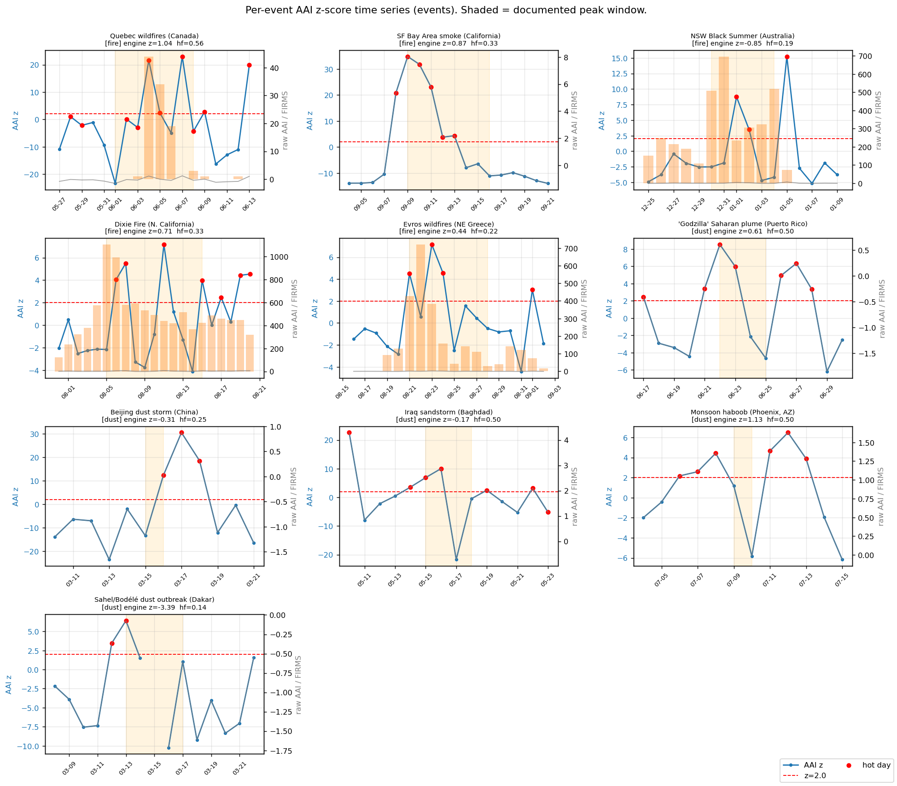
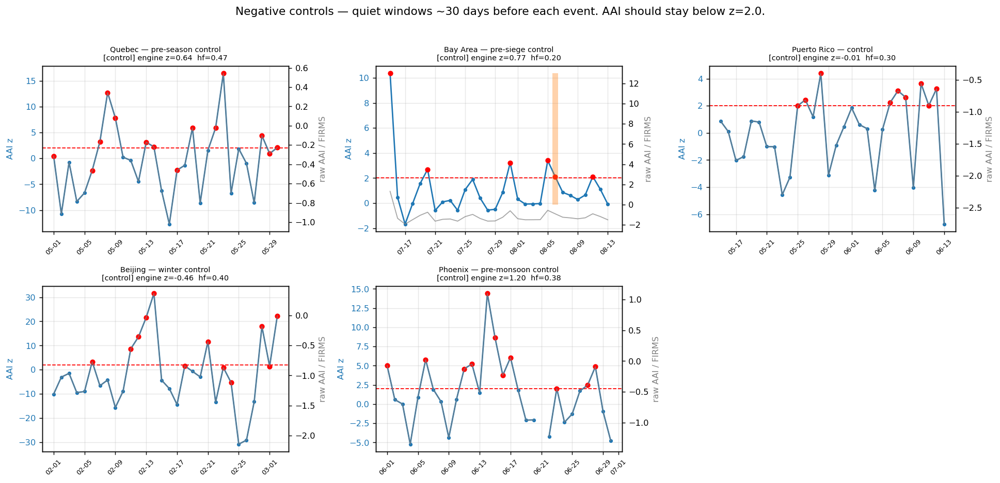
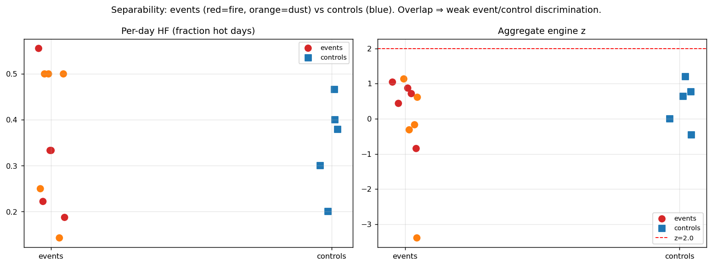

# AAI ↔ FIRMS / Dust-Catalog Event Validation

*Version 1.0 — 30 May 2026. Authored against the post-M-DIAG-A1 engine state. Single source of truth for this validation. Data: `analysis/aai_firms_validation.csv` (308 per-day rows) + `analysis/aai_firms_event_summary.csv` (15 cases). Reproduce: `analysis/aai_firms_extract.py` → `analysis/aai_firms_validation.ipynb`.*

---

## §1 Summary

**Does AAI catch known smoke/dust events post-M-DIAG-A1? — Partly, and the answer depends on which AAI metric you ask about.**

- **The M-DIAG-A1 fix is confirmed live and behaving as intended.** Across all 15 cases the per-day high-frequency flag `hf` is *intermediate* (0.14–0.56), never saturated at 0 or 1 — the pre-fix tropical artefact (every day firing) is gone. The per-day series reconstructed in this validation matches the engine's official `hf` **to machine precision** in all 15 cases, so the reconstruction is engine-faithful and the conclusions below transfer directly to production.
- **High sensitivity at the per-day level.** The documented peak window contained at least one hot AAI day (`z ≥ 2.0`) in **9 of 10 events (90 %)** — **fires 5/5 (100 %)**, **dust 4/5 (80 %)**.
- **Poor specificity at the per-day level.** **All 5 negative controls (100 %)** also fired at least one hot day during their known-clean window. The per-day `z ≥ 2.0` flag is therefore a *sensitive but non-specific* detector — it lights up on quiet days too.
- **The aggregate `z` never reaches the 2.0 screening threshold** for *any* event (max +1.04) or control (max +1.20), and it goes **negative on real events** (Dakar −3.39, NSW Black Summer −0.85). As an aggregate flag at threshold 2.0, AAI would have missed every one of these major events.

The net read: post-M-DIAG-A1 AAI **does** respond to real smoke/dust — raw AAI and per-day z rise clearly during fires — but the engine's *anomaly construction* (local site-vs-25 km-ring, baseline computed over the same window) neither cleanly fires at the aggregate level nor stays quiet on controls. The behaviour is dominated by a small-`bg_std` regime that inflates per-day z and a contaminated-ring regime that suppresses aggregate z. Both are calibration issues, not data issues, and both are concrete inputs to the calibration sweep (§7–§8).

---

## §2 Method

### Event-based design
We ask "did AAI fire when and where a documented event occurred," not "does AAI correlate with something continuously." 10 events (5 fires, 5 dust) + 5 negative controls.

### Hard constraint — AAI start date
The engine's AAI asset is `COPERNICUS/S5P/OFFL/L3_AER_AI` (Sentinel-5P, OFFL only), band `absorbing_aerosol_index`. **Sentinel-5P AER_AI data begins ~2018-07.** Three events proposed in the original brief (2017 Portugal, 2010 Russia, 2009 Sydney) have **no AAI data at all** and were replaced with post-2018 equivalents (Dixie 2021, Evros 2023, etc.).

### FIRMS — ground truth, not an engine input
**FIRMS is not in the GSCO engine catalog** (the brief assumed it was). It is read here directly as a public EE asset, `ee.ImageCollection("FIRMS")` (bands `T21`, `confidence`, `line_number`), purely to confirm fire events happened where/when expected. Fire-pixel counts are summed over a 50 km buffer per UTC day. Dust events have no FIRMS signal by nature.

### Engine fidelity — why the per-day series is *reconstructed*
The screening engine computes the per-day `is_hot` flag **server-side** in `engine/core/repeatable_core.py::_server_side_hf::per_image` and returns only the aggregate `hf = n_hot_days/n_valid_days` to callers. To plot a per-day z time series we re-run the *identical* reduction in `analysis/aai_firms_extract.py`:

1. Build the scaled IC via `engine.air._build_image_collection`.
2. Background `(bg_median, bg_std)` via `engine.core.repeatable_core.background_value` over the **land-masked annulus 5–25 km** (`background_ring`, `Indicators_Computation_v4` §6.2), computed over the **same event window** — the engine has no climatology baseline for AAI, and the seasonal filter is a no-op (`seasonality.py` does not exist).
3. Per-granule `z = (site_mean − bg_median)/bg_std`; `is_hot = z ≥ 2.0 ∧ valid`; a UTC day is hot if **any** granule that day fires — exactly `per_image` after the M-DIAG-A1 `{band}_mean`-key fix.

The notebook asserts `|recon_hf − engine_hf| < 1e-9` for all 15 cases (it passes), and carries the engine-official aggregate `z`/`hf` from `compute_pollutant_snapshot(…, "aai", …)` alongside as an independent cross-check.

### Parameters
`radius_km = 5` (the production-seed standard, `demo/saved_analyses/*.json`); `ANOMALY_Z_THRESHOLD = 2.0`; event window = peak − 5 d … peak + 5 d; control window = ~30 d ending before the event.

### Event set (locked)

| # | Type | Location (lat, lon) | Peak window | Source |
|---|------|--------------------|-------------|--------|
| 1 | Fire | Quebec, CA (49.7, −76.0) | 2023-06-01 → 06-08 | 2023 Canadian wildfires |
| 2 | Fire | SF Bay Area (37.7, −122.2) | 2020-09-09 → 09-16 | CA Aug/Sep 2020 complex ("orange sky") |
| 3 | Fire | NSW, AU (−35.5, 150.0) | 2019-12-30 → 2020-01-04 | Black Summer |
| 4 | Fire | N. California (40.0, −121.2) | 2021-08-05 → 08-15 | Dixie Fire |
| 5 | Fire | NE Greece (41.0, 26.2) | 2023-08-21 → 08-28 | Evros wildfires |
| 6 | Dust | Puerto Rico (18.2, −66.5) | 2020-06-22 → 06-25 | "Godzilla" Saharan plume |
| 7 | Dust | Beijing (39.9, 116.4) | 2021-03-15 → 03-16 | Beijing dust storm |
| 8 | Dust | Baghdad (33.3, 44.4) | 2022-05-15 → 05-18 | Iraq sandstorm |
| 9 | Dust | Phoenix (33.4, −112.0) | 2021-07-09 → 07-10 | Monsoon haboob |
| 10 | Dust | Dakar (14.7, −17.4) | 2021-03-13 → 03-17 | Sahel/Bodélé dust outbreak |

Controls: Quebec (2023-05), Bay Area (2020-07-15→08-14, before the 08-16 siege), Puerto Rico (2020-05-15→06-14), Beijing (2021-02), Phoenix (2021-06, pre-monsoon).

---

## §3 Per-event findings

Blue = per-day AAI z (left axis); red dashed = z = 2.0; red dots = hot days; grey = raw AAI (right axis); orange bars = FIRMS fire pixels; shaded = documented peak window.

Per-event detail (`analysis/aai_firms_event_summary.csv`):

| Event | Type | Peak hit? | max z in peak | peak raw AAI | FIRMS px (peak) | engine z | engine hf | bg_std |
|---|---|:--:|--:|--:|--:|--:|--:|--:|
| Quebec 2023 | fire | ✓ | 23.0 | 1.19 | 101 | 1.04 | 0.56 | 0.059 |
| SF Bay Area 2020 | fire | ✓ | 34.8 | 8.04 | 0 (transported) | 0.87 | 0.33 | 0.192 |
| NSW Black Summer | fire | ✓ | 8.7 | 4.43 | 2 588 | −0.85 | 0.19 | 0.389 |
| Dixie 2021 | fire | ✓ | 7.2 | 6.95 | 6 439 | 0.71 | 0.33 | 0.666 |
| Evros 2023 | fire | ✓ | 7.2 | 2.22 | 2 017 | 0.44 | 0.22 | 0.281 |
| Godzilla (PR) 2020 | dust | ✓ | 8.5 | 0.61 | — | 0.61 | 0.50 | 0.168 |
| Beijing 2021 | dust | ✓ | 12.3 | 0.02 | — | −0.31 | 0.25 | 0.047 |
| Baghdad 2022 | dust | ✓ | 10.0 | 2.87 | — | −0.17 | 0.50 | 0.113 |
| Phoenix 2021 | dust | **✗ MISS** | 1.18 | 0.92 | — | 1.13 | 0.50 | 0.134 |
| Dakar 2021 | dust | ✓ | 6.4 | −0.07 | — | **−3.39** | 0.14 | 0.099 |

Notable cases:

- **SF Bay Area (transported smoke).** Zero FIRMS pixels within 50 km — the CZU/SCU fires were 60–150 km away — yet AAI fired hard (raw AAI 8.04, peak z 34.8). AAI correctly caught the *transported* smoke pall, which is exactly the proxy claim and is a genuine strength.
- **Phoenix (the one miss).** A single-day haboob; the peak window is only two days and the local 5 km vs 25 km contrast over a uniformly dusty scene never crossed z = 2.0 (max z 1.18). Short, spatially-uniform events are the worst case for a local, same-window anomaly.
- **Dakar (aggregate z = −3.39).** The 5 km site sat *inside* a region whose 5–25 km ring was even dustier (Bodélé source to the interior), so the local anomaly is strongly **negative** during a real dust outbreak. The per-day flag still caught it (2 hot days) on transient within-window variation.
- **Beijing (raw AAI ≈ 0 but z huge).** Clean-air AAI here is strongly negative (bg_median −0.55) with a tiny `bg_std` (0.047); a modest absolute rise produces z up to 30. Illustrates the small-`bg_std` amplification (§5).

---

## §4 Catch rate

**Per-day `z ≥ 2.0` during the documented peak window:**

| Cohort | Catch rate |
|---|---|
| **Overall** | **9 / 10 = 90 %** |
| Fires | 5 / 5 = 100 % |
| Dust | 4 / 5 = 80 % |

**Aggregate `z ≥ 2.0` (the engine's headline anomaly):** **0 / 10**. No event's aggregate z reaches 2.0 (max +1.04). The catch rate is entirely carried by the per-day flag, not the aggregate.

**Event-type comparison.** Fires score a perfect per-day catch and produce clearly elevated *raw* AAI (1.2–8.0). Dust catches one fewer (Phoenix) and — importantly — produces only modest *raw* AAI at these sites (−0.07 to 2.87); dust is detected mostly through the negative-baseline contrast, not a large absolute signal. AAI is *theoretically* equally sensitive to smoke and dust, but in this local-anomaly construction fires are the more reliably-caught class.

---

## §5 False-positive rate

**Per-day `z ≥ 2.0` during the known-clean control window:**

| Control | hot days | per-day hf | max day z | engine z | bg_std |
|---|--:|--:|--:|--:|--:|
| Quebec (pre-season) | 14/30 | 0.47 | 16.4 | 0.64 | 0.054 |
| Bay Area (pre-siege) | 6/30 | 0.20 | 10.4 | 0.77 | 0.270 |
| Puerto Rico | 9/30 | 0.30 | 4.4 | −0.01 | 0.212 |
| Beijing (winter) | 12/30 | 0.40 | 31.6 | −0.46 | 0.040 |
| Phoenix (pre-monsoon) | 11/29 | 0.38 | 14.4 | 1.20 | 0.125 |

**False-positive rate = 5 / 5 controls (100 %)** fired at least one hot day. The per-day flag is not specific. (Aggregate `z ≥ 2.0`: 0/5 controls — the aggregate is quiet on controls, but it is also quiet on events, so that is not discrimination.)

**Separability is weak on both metrics:**

- Per-day `hf`: events 0.14–0.56, controls 0.20–0.47 — fully overlapping.
- Aggregate `z`: events −3.39…+1.04, controls −0.46…+1.20 — overlapping, both far below 2.0.

The **driver is a collapsing `bg_std`** (0.04–0.27 across cases; e.g. Beijing control `bg_std = 0.040` → max day z 31.6). A near-zero denominator turns ordinary clean-air fluctuation into a "hot" day. This is the **same denominator-collapse family** that M-DIAG-A1 diagnosed, but on the **background-std side**; M-DIAG-A1 fixed the *numerator* (the silently-zeroed `site_mean`) and explicitly did not touch the small-`bg_std` regime (see `docs/M-DIAG-A1_diagnosis_report.md` §7 and the `engine/constants.py` Q-WA-1 note).

---

## §6 Where AAI diverges (honest about both)

**Misses (false negatives):**
- **Phoenix haboob** — only miss at the per-day level: a single-day, spatially-uniform desert dust event never crosses z = 2.0 against its own 5–25 km ring.
- **Every event at the aggregate level** — no aggregate z reaches 2.0; NSW (−0.85) and **Dakar (−3.39)** are negative during unambiguous events because the background ring is contaminated by (or more intense than) the same regional plume.

**False alarms (false positives):**
- **All 5 controls** fire ≥ 1 hot day. Beijing-winter and Quebec-pre-season are the worst (max day z 31.6 and 16.4) — both have tiny `bg_std`, so clean-air noise is amplified into hot days.

**Structural reading.** AAI's data clearly responds to real events (raw AAI and per-day z rise during fires; transported smoke is caught at Bay Area). The failures are properties of the **anomaly construction**, not the AAI data:
1. *Same-window background* → sustained/regional events raise both site and ring, cancelling the anomaly (suppresses aggregate z, can go negative).
2. *Small `bg_std`* → per-day z is over-sensitive at clean, low-variance locations (inflates per-day hf, kills specificity).

---

## §7 Implications for calibration

1. **Floor `bg_std` (regime-aware z).** A minimum-`bg_std` floor (or a robust scale estimate) would stop the per-day flag from firing on near-zero-variance clean air. Beijing/Quebec controls would stop false-firing. This is the most direct fix and is the natural extension of the M-DIAG-A1 line of work to the denominator.
2. **Climatological, not same-window, baseline for AAI.** Compute `bg_median`/`bg_std` from a prior reference period (e.g. same calendar month, previous year, or a trailing 90 d) rather than the event window. This would prevent regional plumes from contaminating their own baseline and would let the aggregate z actually rise on events like NSW and Dakar. (Requires the deferred `engine/core/seasonality.py` or a climatology fallback for AAI.)
3. **An absolute-AAI gate for widespread events.** A simple "raw AAI ≥ X" co-trigger would catch spatially-uniform events (Phoenix, regional dust) that the local-contrast detector structurally cannot. Fires already show clearly elevated raw AAI; dust at some sites does not, so the gate would need to be tuned per regime.
4. **The per-day flag is sensitive, the aggregate z is (currently) inert.** If AAI screening leans on aggregate z at threshold 2.0 it will miss real events; if it leans on per-day hf it will over-fire. The calibration sweep should decide which metric carries the AAI proxy and set its threshold against this event/control set.
5. **The M-DIAG-A1 fix itself is not implicated.** It does what its name implies — per-day hf is now intermediate and engine-faithful. The remaining misbehaviour is upstream (baseline construction) and downstream (threshold choice), not the per-day key-naming fix.

---

## §8 Open questions for the calibration-sweep spec

1. **Which AAI metric is the proxy** — aggregate z, per-day hf, raw absolute AAI, or a composite? This validation shows the first is inert at 2.0 and the second is non-specific.
2. **What `bg_std` floor** (and estimated how — fixed minimum, MAD-based, percentile) removes control false-positives without killing event sensitivity? Sweep against the 5 controls here.
3. **Same-window vs climatological baseline for AAI** — is a climatology baseline worth the seasonality/fallback work, given how badly the same-window baseline performs on regional events (Dakar, NSW)?
4. **Regime-aware thresholds** — should fire vs dust (or column-loading regime) use different z thresholds or different metrics, given fires produce large raw AAI and dust often does not?
5. **AOI radius sensitivity** — all results use `radius_km = 5`. Does pushing the background ring out (larger site, ring at 100–200 km) restore event/control separability for regional plumes, and is that compatible with the production AOI contract?
6. **Should this event/control set be folded into the standing calibration fixtures**, alongside the diagnostic seeds, so threshold changes are regression-tested against known events?

---

*Deliverables: this report (`docs/aai_firms_validation.md`), the notebook (`analysis/aai_firms_validation.ipynb`), the per-day table (`analysis/aai_firms_validation.csv`), the per-event summary (`analysis/aai_firms_event_summary.csv`), and the extraction harness (`analysis/aai_firms_extract.py`). No engine code was modified. Word export at `docs/aai_firms_validation.docx` (Step F).*
