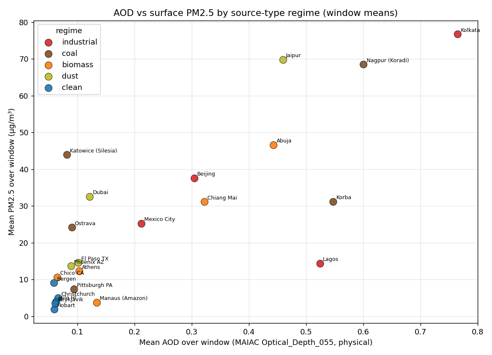
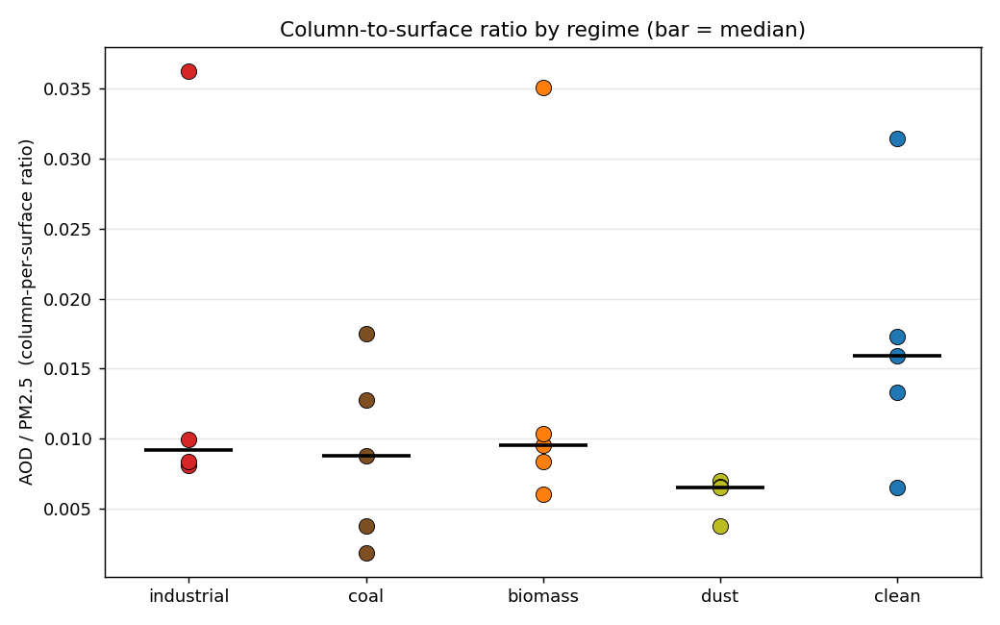
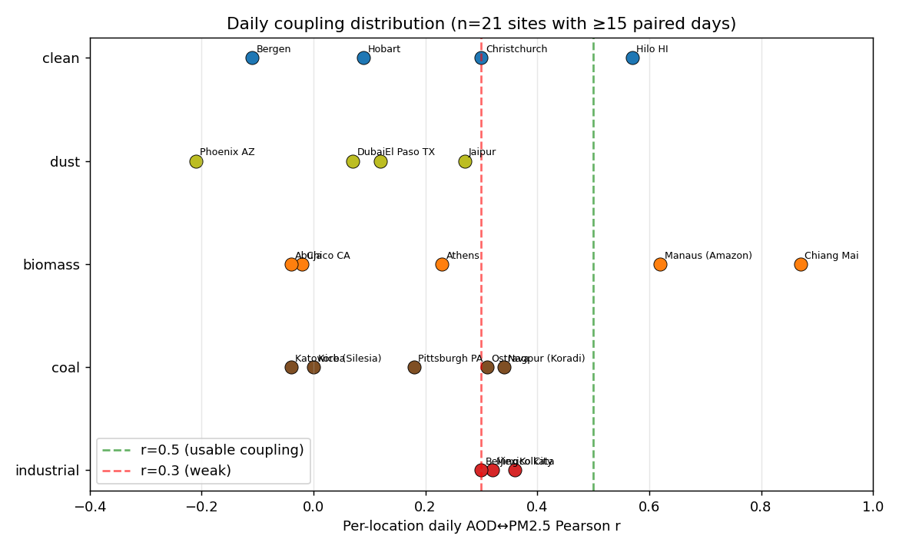

# AOD ↔ PM2.5 — Empirical Validation Report

*Investigation milestone. Status: DRAFT (Steps A–F complete; pending operator review of §8).*
*Date authored: 30 May 2026.*
*Authority pointer: AOD ↔ PM2.5 Validation brief (operator-side, 30 May 2026).*
*Scope guard: empirical validation only. No engine code, AOD severity bands, score logic, or seeds were changed. Analysis artefacts live in `analysis/` and `docs/`, never in `engine/` or `ui/`.*
*Supporting evidence: `analysis/aod_pm25_validation.ipynb` (executed), `analysis/aod_pm25_validation.csv` (per-location data table), `analysis/aod_pm25_daily.csv` (daily series), `analysis/aod_pm25_fig_*.png` (three figures).*

---

## §1. Summary

**AOD is a defensible proxy for surface PM2.5 only in a coarse, cross-site, climatological sense — not as a day-to-day surface signal, and not in the way the engine currently consumes it.** Three results, in order of how load-bearing they are.

1. **Across locations, window means correlate** — pooled Pearson **0.78**, Spearman **0.75** (n=23). But this number is the one the brief warned would be misleading: it is driven almost entirely by the **clean-vs-polluted contrast** (clean sites cluster at low AOD / low PM2.5; polluted sites at high AOD / high PM2.5). It says "satellites can tell a clean place from a dirty place," which is real but weak. Within regimes the picture frays: biomass and dust show high Pearson (0.95, 0.96) but on n=4–5 and with Spearman that swings (0.70, 1.00); industrial and coal are moderate-and-not-significant (0.67 p=0.33; 0.62 p=0.26); clean is ≈0 (all near-zero PM2.5, pure noise).

2. **Day-to-day, AOD is a weak proxy at most individual sites** — and this is the axis screening actually keys on. Across the 21 sites with enough cloud-free retrievals, the **median per-location daily AOD↔PM2.5 Pearson r is just 0.23**; only **14%** of sites clear r > 0.5, and **57%** sit below r = 0.3. The one strong exception is **Chiang Mai (r = 0.87)** during the Southeast-Asian burn season — when smoke loads the surface and the column together, the proxy is genuinely tight. Most industrial, coal and dust cities sit at r = 0.0–0.36: AOD and surface PM2.5 drift apart day to day.

3. **The engine's AOD severity tracks neither absolute AOD nor surface PM2.5.** The Air-pillar severity is a **local anomaly z-score** (site vs background ring), not an absolute-AOD band, so the four highest-AOD sites in the set (Kolkata, Jaipur, Korba, Abuja — all PM2.5-heavy) read **Normal**, because their whole region is uniformly hazy and there is no local contrast. Conversely, clean Hilo reads **Concern** off a small local anomaly. Engine band is uncorrelated with AOD quartile (4 of the highest-AOD-quartile sites are Normal). "AOD severity," as emitted today, cannot be read as a surface-PM2.5 severity.

The two failure modes the brief asked us to surface: **(B) high surface PM2.5 with low AOD is the clearest one in the data** — European winter coal towns (Katowice PM2.5 44 µg/m³ at AOD 0.08; Ostrava 24 at 0.09) trap pollution under a shallow boundary layer that the column never sees, and cloud leaves only ~30 retrieval days to see it with. **(A) the canonical "elevated dust column inflates AOD while surface stays moderate" mode is largely absent from this sample** — not because it isn't real, but because the pure-dust candidate sites (Cairo, Lanzhou, Kano) had no live PM2.5 stations and were replaced by dust-*influenced urban* sites (Jaipur, Dubai, Phoenix, El Paso) that carry high surface PM2.5 too. This is a sampling limitation, flagged throughout.

N=23, operator-picked (the brief's 25 minus Delhi and Kuwait City, dropped at Step B for <55% station coverage). These findings are **illustrative, not statistically conclusive** — per-regime correlations rest on n=4–5 and are noise-prone. They are strong enough to motivate the calibration-sweep questions in §7–§8.

---

## §2. Method

### 2.1 Locations

Twenty-three locations across five PM2.5 source-type regimes, each co-located with a live OpenAQ PM2.5 station (coordinates and station IDs in `analysis/locked_locations.json`). Ten of the brief's original candidates had **no live station with >50% in-window reporting** and were substituted at Step A (marked *sub*); the substitutions preserve regime character where possible (see §6 for what was lost).

| Regime | Locations (station) | Design expectation |
|---|---|---|
| Heavy industrial / urban combustion | Mexico City, Kolkata *sub*, Beijing, Lagos | AOD high, PM2.5 high, strong coupling |
| Coal-fired power proximity | Pittsburgh, Ostrava *sub*, Katowice, Nagpur/Koradi *sub*, Korba *sub* | AOD mod-high, PM2.5 mod-high, coupling present |
| Biomass-burning | Chico CA, Manaus, Abuja, Chiang Mai *sub*, Athens | AOD & PM2.5 spike in burn season; quiet otherwise |
| Dust-dominated | Phoenix, El Paso *sub*, Dubai, Jaipur *sub* | AOD high (dust column), PM2.5 ratio different from industrial |
| Background / clean | Hobart, Hilo *sub*, Christchurch, Bergen *sub*, Reykjavik | AOD low, PM2.5 low |

The brief's flagship dust sites (Cairo, Lanzhou) and several China/Africa sites (Datong, eMalahleni, Kano) had **zero live PM2.5 stations within 25 km** — the geographic-coverage gap §6 predicted, now concrete.

### 2.2 Window (locked at Step B, operator confirmation)

- **2025-11-01 → 2026-04-30** (181 days), the most recent complete six-month window. Applied identically to PM2.5 and AOD.
- The window deliberately maximises station-data recency at the cost of **missing the Northern-Hemisphere summer/autumn biomass-burning season** (Chico, Manaus and the Amazon burn ~Jul–Oct). Only **Chiang Mai** sits in its own burn season (SE-Asia burning is Feb–Apr, inside the window) — which is exactly why it is the one biomass site that shows tight daily coupling. The off-season biomass sites are quiet by construction (§5).

### 2.3 What each input and benchmark is

- **AOD (the proxy under test)** is **MODIS MAIAC** (`MODIS/061/MCD19A2_GRANULES`, band `Optical_Depth_055`, 1 km native), the engine's Air-pillar column-aerosol indicator. It is a **column-integrated** optical measurement — total light extinction by aerosol through the whole atmospheric column — not a surface concentration. The engine applies the `AOD_QA` bits-8–11 best-retrieval mask (`0xF00`) and carries the **raw integer DN** (`scale_factor=1.0`); physical AOD = DN × 0.001. Both are recorded; `aod_scaled` (physical) is used for all comparison and the figures, because it is the literature-comparable quantity. The DN choice is scale-invariant for the engine's z-score, so it changes no engine behaviour — but it does mean the engine's reported "AOD value" is ~1000× the physical AOD (noted for the calibration sweep).
- **PM2.5 (the benchmark)** is the **OpenAQ v3** daily aggregate at each station — a **surface** mass concentration (µg/m³) from a reference or low-cost ground monitor. Daily mean and the daily maximum (from OpenAQ's per-day `summary`) are both captured; the daily mean drives the comparison because AOD is a daily quantity. OpenAQ v3 **requires an API key** (the brief's "no auth" is out of date; v1/v2 are retired) — confirmed and used at Step A.
- **Alignment choice (Step A.4):** AOD is sampled at the **station's exact coordinates** (a 1 km ≈ single-MAIAC-pixel reduction at the point), *not* at an AOI centre, so AOD↔PM2.5 is a like-for-like point comparison. The separate **engine-severity** column instead runs the engine's real AOD snapshot over the **5 km facility AOI** (the P-04 single-supplier default) centred on the station, because the engine's band is an anomaly z-score that structurally needs the site buffer + background ring.

### 2.4 Extraction and analysis

`analysis/extract.py` does both halves per location: PM2.5 daily series via the OpenAQ `/v3/sensors/{id}/days` endpoint (`date_from`/`date_to` — the days endpoint uses those names, *not* `datetime_*`, a v3 inconsistency found at Step A), and AOD daily series via Earth Engine `getRegion` at the station point on the QA-masked `Optical_Depth_055` collection, aggregated to UTC-day means. It also runs `engine.air.compute_aod` over the 5 km AOI to capture what the engine emits (`site`, `background`, `anomaly`, `z`, `confidence`), mapped to the engine band via `ui.components.severity.severity_zscore`. Outputs: `analysis/aod_pm25_validation.csv` (one row per location) and `analysis/aod_pm25_daily.csv` (long daily). Analysis, correlations and the three figures are produced by `analysis/aod_pm25_build_notebook.py` and rendered in the executed notebook.

---

## §3. Findings

### 3.1 Cross-location: AOD vs PM2.5 window means, by regime



The scatter is **stratified, as expected — but the dominant axis is clean-vs-polluted, not a per-regime fan.** Clean sites (PM2.5 1.9–9.1 µg/m³, AOD ≈ 0.06) sit in a tight low corner; everything polluted spreads up and right. Pooled and per-regime correlations of the window means:

| Regime | n | Pearson r | (p) | Spearman ρ | mean AOD | mean PM2.5 |
|---|---|---|---|---|---|---|
| Industrial | 4 | 0.67 | 0.33 | 0.40 | 0.451 | 38.5 |
| Coal | 5 | 0.62 | 0.26 | 0.30 | 0.283 | 35.1 |
| Biomass | 5 | 0.95 | 0.013 | 0.70 | 0.213 | 20.9 |
| Dust | 4 | 0.96 | 0.036 | 1.00 | 0.193 | 32.7 |
| Clean | 5 | −0.11 | 0.86 | 0.00 | 0.062 | 4.7 |
| **ALL (pooled)** | **23** | **0.78** | **<0.001** | **0.75** | — | — |

The pooled 0.78/0.75 is **flagged misleading per the brief**: drop the clean cluster and the relationship across the 18 polluted sites is far weaker. The high biomass/dust Pearson values are real in-sample but rest on 4–5 points and on a single high-AOD anchor each (Kolkata-adjacent for industrial; Jaipur/Nagpur for dust/coal); their Spearman values (0.70, 1.00) are more honest and still small-n.

### 3.2 Column-to-surface ratio by regime



The brief expected **dust to show the highest AOD-per-µg/m³** (aerosol elevated in the column, less at the surface). The data show the **opposite ordering** — dust has the *lowest* median ratio (0.0065), clean the highest (0.0159):

| Regime | industrial | coal | biomass | dust | clean |
|---|---|---|---|---|---|
| median AOD/PM2.5 | 0.0092 | 0.0088 | 0.0095 | **0.0065** | **0.0159** |

Two reasons, both methodological rather than physical: (1) the **clean** ratio is a denominator artefact — PM2.5 of 2–5 µg/m³ makes any non-zero AOD look large; it is not a meaningful "column-rich" signal. (2) the **dust** regime in this sample is dust-*influenced urban* (Jaipur PM2.5 70, Dubai 33), which carries heavy surface PM2.5 alongside the dust, so the ratio is surface-weighted — the **pure elevated-dust-column sites that would have shown the high ratio (Cairo, Lanzhou) were exactly the ones with no PM2.5 station** (§6). The expected dust signature is not refuted here; it is **untested**, because the sample could not reach it.

### 3.3 Day-to-day coupling per location



For each location, AOD and PM2.5 are aligned on shared days and a day-by-day Pearson r computed (≥15 paired days required; Reykjavik at 2 paired days and Lagos at 7 are excluded as insufficient). This is the **proxy-strength metric that matters for screening** — does AOD move with surface PM2.5 over time at a given place?

- **Median r = 0.23** across 21 sites; **14%** above r = 0.5; **57%** below r = 0.3.
- **Strong coupling (r ≥ 0.5):** Chiang Mai **0.87** (burn season — smoke at surface and column together), Manaus 0.62 (but 15 days only), Hilo 0.57 (17 days).
- **Weak/none (r < 0.3):** most coal (Korba 0.00, Katowice −0.04, Pittsburgh 0.18), most dust (Phoenix −0.21, Dubai 0.07, El Paso 0.12), and several biomass off-season sites (Chico −0.02, Abuja −0.04).
- **Industrial sits in a consistent middle band** (Kolkata 0.36, Lagos 0.34, Mexico City 0.32, Beijing 0.30) — a real but modest day-to-day signal.

---

## §4. Where the proxy works

Weighted by evidence strength:

1. **Telling clean from polluted, climatologically** — the pooled cross-site correlation (Spearman 0.75) and the clean cluster's separation are robust. If the question is "is this a high-aerosol location or a clean one," AOD answers it.
2. **Active biomass-burning, day to day** — Chiang Mai (r = 0.87, 119 paired days) is the single clean win: when combustion smoke is the dominant aerosol, it loads the surface and the column in lockstep and AOD tracks PM2.5 tightly. This is the regime and condition where AOD is genuinely a strong surface proxy.
3. **Industrial/urban-combustion, moderately** — the four industrial cities cluster around daily r ≈ 0.30–0.36 and high window means; AOD carries a real, if modest, surface signal there.

---

## §5. Where the proxy diverges, and why

### 5.1 Failure mode B — high surface PM2.5, invisible column (the clearest one here)

The strongest divergence in the data is the **opposite** of the brief's headline dust case. **European winter coal towns** load the surface heavily while the column stays thin:

| Location | PM2.5 (µg/m³) | AOD | AOD/PM2.5 | engine z | engine band | AOD days |
|---|---|---|---|---|---|---|
| Katowice (Silesia) | 44.0 | 0.082 | 0.0019 | −0.31 | Normal | 32 |
| Ostrava | 24.2 | 0.090 | 0.0037 | −0.27 | Normal | 33 |
| Nagpur/Koradi | 68.6 | 0.600 | 0.0087 | +1.19 | Concern | 134 |

Two compounding causes: a **shallow winter boundary layer** concentrates combustion PM2.5 in the lowest few hundred metres, which barely registers in a column-integrated AOD; and **winter cloud leaves only ~30 cloud-free retrievals** out of 181 days to see even that. A screening run keying on AOD would read Katowice — a genuinely polluted place — as unremarkable.

### 5.2 Failure mode A — elevated column, moderate surface (mostly untested)

Ranked by AOD-per-PM2.5, the high-ratio sites are **not** the clean-dust-transport cases the brief anticipated; they are coastal/sparse-retrieval and wet-season-tropical artefacts:

| Location | regime | AOD | PM2.5 | AOD/PM2.5 | engine band | AOD days |
|---|---|---|---|---|---|---|
| Lagos | industrial | 0.524 | 14.4 | 0.036 | Concern | **16** |
| Manaus | biomass | 0.134 | 3.8 | 0.035 | Concern | **15** |

Both rest on **15–16 retrieval days** — too few to trust, and both are coastal/humid where MAIAC retrieval is sparse and aerosol may be hygroscopically swollen in the column. The canonical dust version of this failure mode (Saharan/Gobi dust aloft over a moderate surface) **could not be sampled** because its sites had no ground stations — this is the validation's biggest sampling gap (§6), not a finding that the mode is absent in nature.

### 5.3 The engine's anomaly severity is orthogonal to both axes

Because Air-pillar severity is a local-anomaly z-score, engine band is **uncorrelated with absolute AOD**:

| AOD quartile | Q1-low | Q2 | Q3 | Q4-high |
|---|---|---|---|---|
| engine **Normal** | 5 | 3 | 3 | **4** |
| engine **Concern** | 1 | 3 | 2 | 2 |

The four highest-AOD sites that read Normal (Kolkata AOD 0.76, Korba 0.55, Abuja 0.44, Beijing 0.30) are all **uniformly hazy regions** — the 5 km site and its background ring sit in the same haze, so `(site − background)` collapses and z ≈ 0 (Korba z = +0.03, Beijing −0.21, Abuja −0.05). Meanwhile Hilo (clean, AOD 0.06) fires **Concern** on a small local anomaly. The engine band therefore tracks **local spatial contrast**, which is neither absolute column loading nor surface PM2.5.

---

## §6. Caveats about the benchmarks themselves

- **AOD is column; PM2.5 is surface — the mismatch is structural, not a flaw.** Column AOD integrates aerosol through the whole atmosphere and is sensitive to aerosol type, vertical distribution and humidity swelling; surface PM2.5 is a dry-ish mass at breathing height. They are *expected* to decouple whenever aerosol is elevated (dust, smoke aloft) or trapped low (winter inversions). This validation measures that decoupling; it does not treat it as error.
- **N=23, operator-picked, not sampled.** Findings are illustrative. Per-regime correlations rest on n=4–5 and are noise-prone; the dust Spearman of 1.00 is four points.
- **Station coverage is geographically lopsided.** Europe, the US, India, Australia/NZ have dense live networks; **China, the Sahara/Sahel and southern Africa effectively have none on OpenAQ** for this window. Five brief candidates (Cairo, Lanzhou, Datong, Kano, eMalahleni) were dropped for zero live stations, and the dust regime in particular was pulled toward dust-*influenced urban* sites — so the **pure elevated-dust-column failure mode is under-sampled**. This is the single most important limitation.
- **AOD retrieval requires cloud-free daylight, and that bias is severe and regime-correlated.** Valid AOD days per regime (of 181): **dust 120–128** (arid clear skies), industrial 16–117, biomass 15–120, **coal 30–33** at the European sites, **clean median 23** (Reykjavik **2**, Bergen 23, Hilo 18). The proxy is best-observed exactly where aerosol is dust and worst-observed where it is winter combustion or high-latitude — which compounds failure mode B.
- **The window misses two of the three biomass burn seasons** (§2.2). Off-season biomass sites are quiet by construction; only Chiang Mai is in-season. The biomass conclusion is "works in burn season, dormant otherwise," with one in-season site supporting the first clause.
- **OpenAQ mixes reference monitors and low-cost sensors** of varying calibration; the Beijing station is a research feed (weaker provenance than a reference monitor), and Hilo can carry episodic Kīlauea volcanic vog rather than pure clean background.

The honest framing: **AOD and PM2.5 measure different physical quantities, and the satellite column is not surface ground truth.** Where aerosol is co-located at surface and column (fresh combustion smoke), they agree well; where it is layered or trapped, they diverge for sound physical reasons. The validation's reach is bounded by where ground stations exist — and they do not exist where the most diagnostic dust cases live.

---

## §7. Implications for calibration

For the upcoming calibration-sweep spec:

1. **AOD severity should be regime-aware, or AOD should be reframed as context.** Today the engine emits one anomaly-z grammar everywhere, and it tracks neither surface PM2.5 nor absolute AOD (§5.3). Options for the sweep to weigh: (a) **regime-tag AOD** so that known dust regions carry an explicit *"AOD-as-PM2.5-proxy unreliable here — elevated column"* flag and known winter-inversion regions carry a *"column under-reads surface"* flag; (b) **demote AOD to a context indicator** (as Hansen/ODIAC were demoted) rather than a firing severity, since absolute column is not a surface-PM2.5 severity; (c) keep the anomaly z but **stop presenting it as an air-quality severity** — it is a spatial-contrast detector.
2. **Do not build an absolute-AOD severity band naïvely.** A fixed "AOD > X → severe" cut would fire on Saharan dust outbreaks (high column, breathable surface load far lower) and stay silent on Katowice-style trapped winter PM2.5 (high surface, thin column). Any absolute band must be **paired with a dust/biomass regime tag and a boundary-layer or season conditioner**.
3. **Surface the retrieval-coverage caveat in the M-UX-A1 transparency layer.** When AOD has <~30 valid days in the window (high-latitude, winter, cloudy-tropical), the score should declare low AOD observability rather than implying a confident reading — mirroring the GHG validation's "known-weak for this source type" recommendation.
4. **Treat the column-DN-vs-physical-AOD factor of 1000 as a documentation item.** `scale_factor=1.0` is harmless for the z-score but means any future absolute-AOD threshold must be specified in DN, or the band will be off by 1000×. The sweep should pick one convention and state it.

---

## §8. Open questions for the calibration-sweep spec

1. **Regime-aware AOD:** should the sweep introduce a per-location dust/biomass/inversion tag that conditions AOD severity (or suppresses it), and where would that tag come from — a static climatology, the AAI absorbing-aerosol channel, or a live boundary-layer-height feed?
2. **Dust sampling gap:** the most diagnostic dust cases (Saharan/Gobi transport over moderate-surface sites) have no ground PM2.5. Should the spec commission a **non-OpenAQ benchmark for dust** (e.g. AERONET AOD + a reanalysis PM2.5 like CAMS or MERRA-2) to characterise the elevated-column failure mode the station network cannot reach?
3. **Burn-season AOD:** Chiang Mai shows AOD is a strong surface proxy *in active burning*. Should AOD severity be **seasonally gated** for biomass regions (trusted in burn season, context-only otherwise), and how is "burn season" detected operationally — FIRMS fire counts, AAI, or a fixed calendar?
4. **Boundary-layer conditioning:** failure mode B (winter coal) is a shallow-mixing-height effect. Is an ERA5 boundary-layer-height conditioner worth adding so the score knows when the column is structurally blind to the surface?
5. **Daily vs window severity:** the engine scores a window mean, but daily coupling is weak (median r 0.23) and concentrated in episodes. Should AOD severity be **event-based** (peak-day anomalies) rather than window-mean, to capture the burn-season/dust-outbreak episodes where the proxy is real?
6. **Should AOD remain a scored Air indicator at all?** Given it tracks neither surface PM2.5 day-to-day nor absolute loading via the current anomaly grammar, the spec should decide explicitly between regime-aware scoring (§7.1a) and context-only demotion (§7.1b) before tuning any threshold.

These feed the calibration-sweep spec, the next milestone after this validation.

---

## §9. Reproducibility

```
# 0. Credentials (Step A): OpenAQ v3 API key + Earth Engine project
export OPENAQ_API_KEY=...          # free key from explore.openaq.org
export EE_PROJECT_ID=supply-chain-observatory

# 1. Station reconnaissance (Step A) — confirms live PM2.5 coverage, picks the 23
python analysis/_recon_stations.py     # → _recon_stations_result.json
python analysis/_recon_subs.py         # → _recon_subs_result.json (substitutions)

# 2. Extraction (Step C) — PM2.5 (OpenAQ) + AOD (Earth Engine) + engine severity
python analysis/extract.py             # → aod_pm25_validation.csv, aod_pm25_daily.csv

# 3. Analysis, figures, correlation tables (Step D)
python analysis/aod_pm25_build_notebook.py
jupyter nbconvert --to notebook --execute --inplace analysis/aod_pm25_validation.ipynb
# → aod_pm25_fig_*.png, aod_pm25_analysis_results.json

# 4. Export (Step F)
pandoc docs/aod_pm25_validation.md -o docs/aod_pm25_validation.docx
```

Figures embed from `analysis/aod_pm25_fig_*.png` (referenced relatively as `../analysis/…` from this report); regenerate them with step 3 before re-exporting the `.docx`. The committed `analysis/aod_pm25_validation.csv` (per-location) and `analysis/aod_pm25_daily.csv` (daily series) are the data tables behind every number above.

*PM2.5 ground data: OpenAQ v3 (aggregating EEA, US EPA AirNow, India CPCB, and national networks). AOD: MODIS MAIAC (`MCD19A2`, NASA) via Google Earth Engine. Engine severity computed via `engine.air.compute_aod` at the 5 km facility AOI.*
