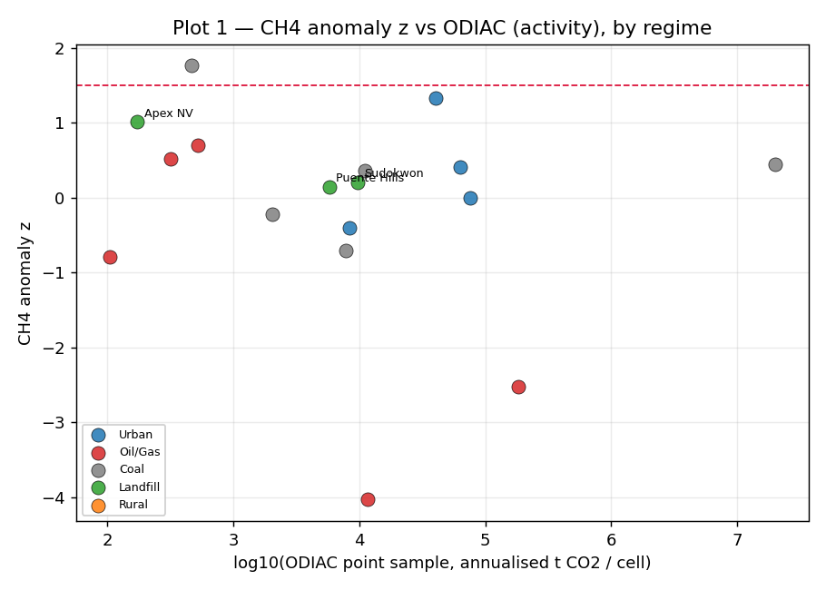
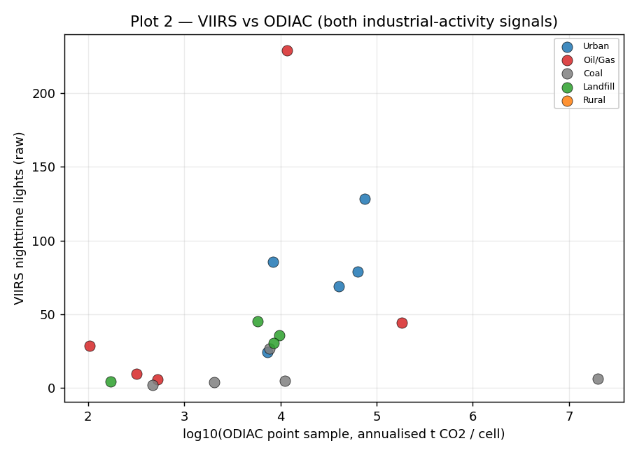
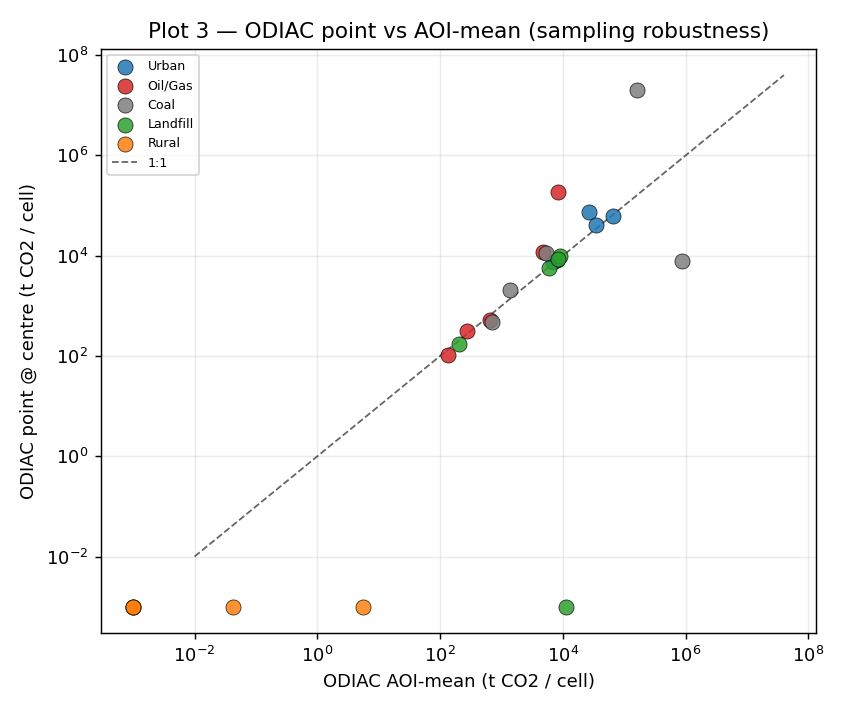
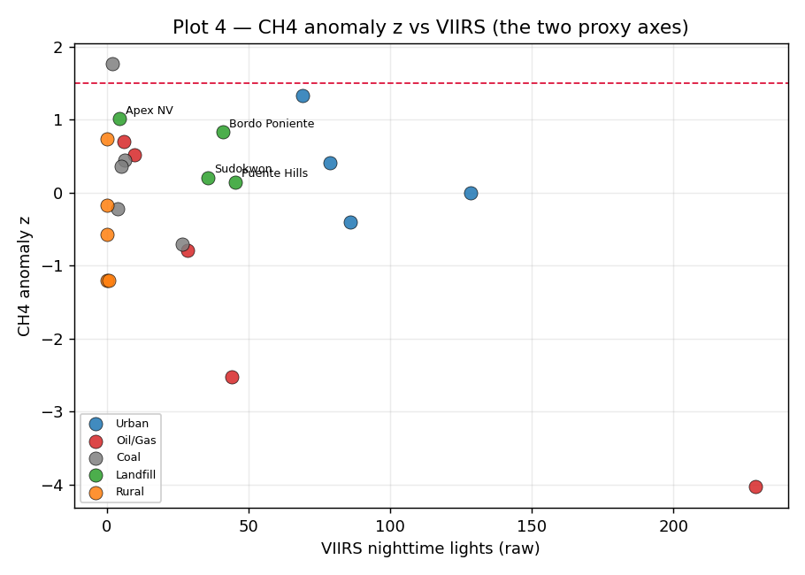
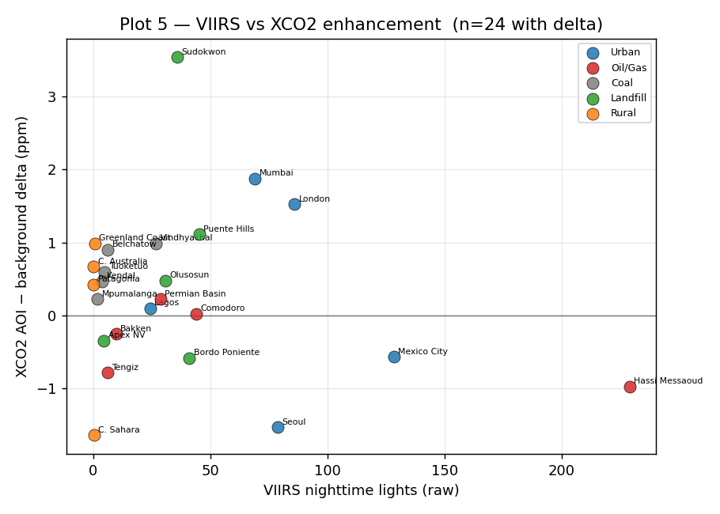
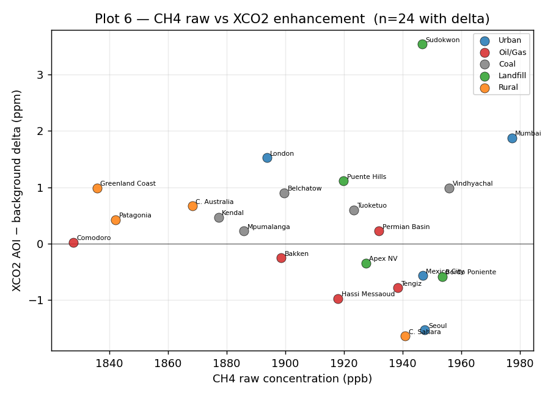
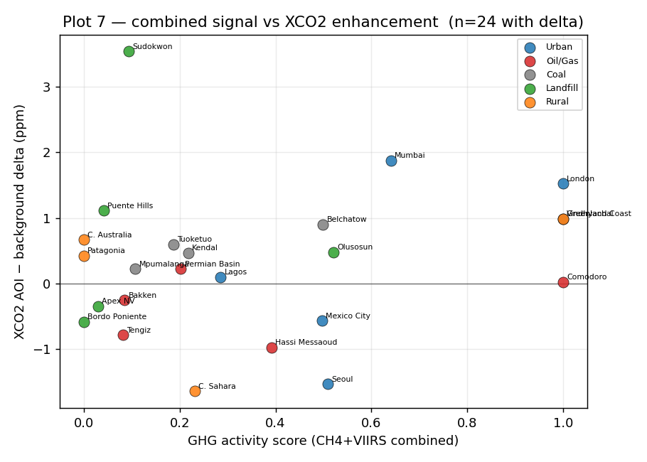
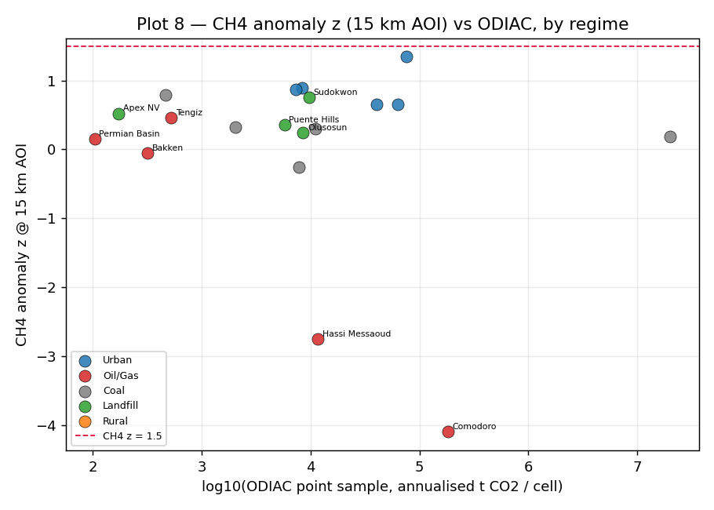

# GHG ↔ ODIAC + OCO-2/OCO-3 — Empirical Validation Report

*Investigation milestone. Status: DRAFT (Steps A–H complete; Response B AOI-widening follow-up added as §10; pending operator review of §9).*
*Date authored: 30 May 2026 (Response B §10 appended same day).*
*Authority pointer: GHG↔ODIAC+OCO-2/OCO-3 Validation brief (operator-side, 30 May 2026).*
*Scope guard: empirical validation only. No engine code, thresholds, score logic, or seeds were changed. Analysis artefacts live in `analysis/` and `docs/`, never in `engine/` or `ui/`.*
*Supporting evidence: `analysis/ghg_odiac_validation.ipynb` (executed), `analysis/ghg_odiac_validation.csv` (the data table), `analysis/plots/*.png` (the seven figures).*

---

## §1. Summary

The GHG pillar's **VIIRS activity proxy is validated; its CH₄ anomaly-z proxy is not.** Across 25 stratified locations, VIIRS nightlights track ODIAC fossil-CO₂ emissions with a moderate-to-good rank correlation (Spearman **0.70** overall, n=25) — the two industrial-activity signals agree, as a working proxy should. The CH₄ anomaly z-score, by contrast, shows **no relationship to ODIAC** (Pearson −0.00, Spearman −0.01, n=23) and — the headline gap — **fired its z>1.5 threshold at only 1 of 25 sites (Mpumalanga, coal), missing every oil/gas site and every landfill**, the two regimes it is meant to detect. Landfills, the most CH₄-diagnostic regime in the design, sit low on the CH₄ axis: at the 5 km screening radius, Sentinel-5P TROPOMI's ~7 km native CH₄ footprint and the site-minus-background construction wash the point-source plume into the local background.

Against atmospheric CO₂ (OCO-2/OCO-3 XCO₂), the picture is the one atmospheric transport predicts: **XCO₂ column enhancement does not track the activity proxy in general** (overall |Spearman| ≤ 0.17) — local emissions rarely produce a clean local column signal because the column is dominated by well-mixed background and is smeared by wind. The **one regime where it does work is coal-fired power**, the cleanest fossil-CO₂ point sources, where both VIIRS (Spearman **1.0**) and raw CH₄ concentration (Spearman **0.8**) track the AOI-vs-background XCO₂ delta. Oil/gas and landfills correctly show *no* XCO₂ tracking — consistent with them being CH₄, not CO₂, emitters.

**The headline number for "does it work":** VIIRS↔ODIAC Spearman 0.70 (activity proxy validated); CH₄-z↔ODIAC ≈ 0 with a 1/25 firing rate (CH₄ proxy gap confirmed); XCO₂ agreement confined to the coal regime (transport-limited elsewhere). The proxy captures **industrial activity** well through VIIRS and captures **fossil-CO₂ point sources** where ODIAC and XCO₂ agree; it **misses diffuse and CH₄-dominated sources** (landfills, oil/gas) through the CH₄ channel at the current radius and thresholding.

N=25, operator-picked — these findings are **illustrative, not statistically conclusive**, and the per-regime correlations (n=4–5 each) are noise-prone. They are strong enough to motivate the calibration-sweep questions in §8–§9.

---

## §2. Method

### 2.1 Locations

Twenty-five locations, five per source-type regime, chosen to span the proxy's expected behaviour (see `analysis/locations.py` for coordinates):

| Regime | Locations | Design expectation |
|---|---|---|
| Urban CO₂-dominant | London, Mexico City, Mumbai, Lagos, Seoul | CH₄ low, VIIRS high, ODIAC high, XCO₂ elevated |
| Oil/gas CH₄-dominant | Permian, Bakken, Hassi Messaoud, Tengiz, Comodoro | CH₄ high, VIIRS mod-high, ODIAC moderate |
| Coal-fired power | Bełchatów, Tuoketuo, Vindhyachal, Mpumalanga, Kendal | CH₄ moderate, VIIRS high, ODIAC high, XCO₂ high |
| Landfill / waste | Sudokwon, Bordo Poniente, Apex (NV), Puente Hills, Olusosun | CH₄ very high, VIIRS low-mod, ODIAC low — **most diagnostic** |
| Rural / clean | Patagonia, C. Sahara, C. Australia, Greenland coast, Siberian taiga | all-low |

Comodoro reuses the existing engine seed coordinates (−45.8645, −67.4969).

### 2.2 Windows (locked at Step B, operator confirmation)

- **CH₄ + VIIRS:** 2025-06-01 → 2025-12-01 (recent, production-style). All at the 5 km production radius.
- **ODIAC:** 2023 annual (`projects/supply-chain-observatory/assets/odiac`, 48 monthly grids covering 2020–2023; 2023 is the latest vintage). ODIAC stops at 2023, so it necessarily lags the CH₄/VIIRS window by ~2.5 years — a temporal-aggregation mismatch (see §7).
- **OCO XCO₂:** 2025-06-01 → 2025-12-01 (aligned with CH₄/VIIRS). Per-location soundings pooled from a **±0.25° (~25 km) box**, OCO-2 (v11.2r) and OCO-3 (v11r) combined, good-quality only (`xco2_quality_flag == 0`).

### 2.3 What each input and benchmark is

- **GHG raw inputs** were read directly from the engine's stateless snapshot functions (`engine.ghg.compute_ch4_snapshot`, `compute_viirs_activity`, `compute_co2_snapshot`) at the production radius — the same code the screening run executes. The raw `z` (not the bucketed severity) and raw VIIRS (not the bucketed value) were used. The GHG composite (`ghg.core_audit_support`, CH₄+VIIRS — ODIAC is demoted from the live composite per M5.5b) is carried for context only.
- **ODIAC** (NIES Japan) is a **bottom-up fossil-fuel CO₂ emissions inventory**, not an observation. National statistics are *allocated* to a 1 km grid using point-source databases and nightlights. It answers "where is fossil CO₂ *emitted*". The engine samples it as an AOI-mean over the buffer; for this validation a **centre-point sample** was added so both point and AOI-mean are surfaced (annualised t CO₂/cell, identical units).
- **OCO-2 / OCO-3 XCO₂** (NASA ACOS L2 Lite FP) is the **column-averaged atmospheric CO₂ dry-air mole fraction** retrieved from reflected sunlight. It answers "what is the CO₂ *concentration* in the air column". OCO-2 flies a narrow nadir/glint swath; OCO-3 adds Snapshot Area Map (SAM) targeting that densely samples cities and point sources. **OCO is not available in Earth Engine** (confirmed in Step A across the official catalog, the community mirror, and direct asset probing); XCO₂ was sourced outside EE via `earthaccess` from NASA GES DISC.

### 2.4 Extraction and analysis

`analysis/extract_part_a.py` runs the engine per location (ODIAC on its 2023 window, CH₄/VIIRS on the 2025 window) and writes the Part A columns. `analysis/extract_part_b.py` scans **every** OCO-2 (173) and OCO-3 (180) daily-global granule in the window — there is no per-location server-side subsetting for these sounding products — and for each location pools good-quality soundings inside the AOI box and a 0.25°–1.0° background annulus. The **XCO₂ delta** = AOI-box mean − background-annulus mean; because AOI and ring soundings come from the same overpasses, the seasonal/latitudinal column gradient largely cancels in the delta. A location needs ≥5 AOI and ≥20 background soundings to report a delta. Analysis and the seven figures are produced by `analysis/analysis_plots.py` and rendered in the notebook.

---

## §3. Part A findings — activity validation (vs ODIAC)

### 3.1 VIIRS tracks ODIAC; CH₄ anomaly z does not





Per-regime and overall correlations (vs log₁₀ ODIAC point sample):

| Regime | CH₄–ODIAC Pearson | CH₄–ODIAC Spearman | n | VIIRS–ODIAC Pearson | VIIRS–ODIAC Spearman | n |
|---|---|---|---|---|---|---|
| Urban | 0.44 | 0.20 | 4 | 0.66 | 0.70 | 5 |
| Oil/Gas | −0.72 | −0.50 | 5 | 0.42 | 0.50 | 5 |
| Coal | −0.15 | −0.10 | 5 | 0.03 | 0.70 | 5 |
| Landfill | −0.63 | −0.60 | 4 | −0.12 | −0.10 | 5 |
| Rural | n/a (ODIAC=0) | n/a | 5 | n/a (ODIAC=0) | n/a | 5 |
| **ALL** | **−0.00** | **−0.01** | 23 | **0.38** | **0.70** | 25 |

VIIRS↔ODIAC is the **proxy-works signal**: both are industrial-activity measures and they agree in rank (Spearman 0.70 overall, 0.70 within urban and coal). The Pearson is lower (0.38) because a handful of mega-emitter ODIAC cells (Bełchatów's point sample hits ~2×10⁷ t CO₂/cell) stretch the linear axis; rank correlation is the honest statistic here.

CH₄ anomaly z↔ODIAC is **flat-to-negative** (overall ≈ 0; oil/gas −0.72, landfill −0.63). The negative within-regime slopes are not a hidden inverse signal — they are noise around a detector that is not responding to the emission field at all (§6.1).

### 3.2 Divergence cases — does CH₄ fire where it should?

CH₄ anomaly z firing at the z>1.5 threshold, by regime:

| Regime | Fired (z>1.5) | Did not fire |
|---|---|---|
| Urban | (none) | London, Mexico City, Mumbai, Seoul — **correct** (urban is CO₂/VIIRS-driven, not CH₄) |
| Oil/Gas | (none) | Permian, Bakken, Hassi Messaoud, Tengiz, Comodoro — **should have fired** |
| Coal | Mpumalanga | Bełchatów, Tuoketuo, Vindhyachal, Kendal |
| Landfill | (none) | Sudokwon, Bordo Poniente, Apex, Puente Hills — **should have fired (most diagnostic)** |
| Rural | (none) | all five — **correct** |

The detector is **right for the wrong-direction regimes and wrong for the right-direction regimes**: it correctly stays silent at urban and rural sites, but it also stays silent at every oil/gas and every landfill site — exactly where a CH₄ proxy must speak. Only Mpumalanga (z=1.76) clears the bar, and the single highest z in the whole set is 1.76. This is the central proxy gap (diagnosed in §6.1). Hassi Messaoud, a gas-flaring site bright in VIIRS (228.8, the set maximum), returns CH₄ z = **−4.03** — the detector reads it as anomalously *clean* (see §6.1 for why the desert background ring does this).

### 3.3 ODIAC sampling robustness (point vs AOI-mean)



The centre-point ODIAC sample and the radius-averaged AOI-mean agree well in rank (Spearman 0.81, n=19 non-zero), so the validation is not an artefact of which sampling the engine uses. They **diverge sharply at point sources**, in both directions: Bełchatów's point cell (~2×10⁷ t CO₂/cell) far exceeds its AOI-mean (~1.6×10⁵) because the buffer dilutes one mega-emitter cell, whereas Vindhyachal's AOI-mean (~8.7×10⁵) far exceeds its point sample (~7.8×10³) because the centre coordinate fell *beside* the plant cell. This sub-pixel sensitivity is itself a caution for any ODIAC-based scoring (§7).

### 3.4 The proxy's two axes



Plotting the two GHG raw axes against each other shows the regimes separate **horizontally (VIIRS)** but **not vertically (CH₄ z)** — the vertical spread is ~±1 z for almost every regime, with no regime lifted into the firing band. The proxy's discriminating power in this set comes almost entirely from VIIRS.

---

## §4. Part B findings — concentration validation (vs OCO-2/OCO-3 XCO₂)

### 4.1 Coverage (honest first)

Full-window scanning recovered usable XCO₂ at **24 of 25 locations** — better than the narrow-swath sampling feared at Step A. Only **Siberian taiga** returned zero good soundings in the window. Coverage is highly uneven, and the conclusions weigh it accordingly:

| Coverage tier | Locations (good AOI soundings) |
|---|---|
| Dense (>2000) | Puente Hills 16160 (OCO-3 SAM over the LA basin), Seoul 3661, Mexico City 3502, Bordo Poniente 3465, Kendal 2496, Bełchatów 2247 |
| Moderate (200–2000) | Tuoketuo, Tengiz, Permian, London, C. Australia, Mpumalanga, Apex, Patagonia, Comodoro, Vindhyachal, Bakken |
| Sparse (<200) | C. Sahara 184, Sudokwon 127, Olusosun 53, Lagos 50, Mumbai 46, Greenland 20, Hassi Messaoud 16 |
| None | Siberian taiga 0 |

Sparse-coverage deltas (Sudokwon, Mumbai, Greenland, Hassi Messaoud) are weak evidence and are flagged as such wherever they appear in a conclusion.

### 4.2 XCO₂ enhancement does not track activity — except at coal







Per-regime and overall correlations (vs XCO₂ AOI-minus-background delta):

| Regime | VIIRS–XCO₂ Pearson | VIIRS–XCO₂ Spearman | n | CH₄–XCO₂ Pearson | CH₄–XCO₂ Spearman | n |
|---|---|---|---|---|---|---|
| Urban | −0.18 | −0.30 | 5 | −0.10 | 0.20 | 4 |
| Oil/Gas | −0.57 | −0.10 | 5 | −0.40 | −0.20 | 5 |
| **Coal** | **0.74** | **1.00** | 5 | **0.71** | **0.80** | 5 |
| Landfill | 0.32 | 0.20 | 5 | 0.10 | −0.40 | 4 |
| Rural | 0.29 | 0.40 | 4 | −0.95 | −0.80 | 4 |
| **ALL** | **−0.17** | **−0.00** | 24 | **−0.06** | **−0.12** | 22 |

The XCO₂ deltas are **small and mixed** (range −1.64 to +3.54 ppm; most within ±1 ppm), which is the expected fingerprint of a transport-dominated, well-mixed column. Overall there is **no correlation** between either GHG input and the XCO₂ enhancement.

The exception is **coal-fired power**, where both VIIRS (Spearman 1.0) and raw CH₄ concentration (Spearman 0.8) track the XCO₂ delta. Coal plants are the cleanest large fossil-CO₂ point sources in the set, and their enhancements (Bełchatów +0.90, Vindhyachal +0.99, Tuoketuo +0.60, Kendal +0.47, Mpumalanga +0.22 ppm) are all positive and ordered with the activity signal. This is a genuine — if n=5, illustrative — concentration-side confirmation that the proxy captures real CO₂ where a strong CO₂ point source exists.

Correctly, **oil/gas and landfills show no positive XCO₂ tracking** (oil/gas slopes are negative; landfill rank ≈ 0). These regimes emit CH₄, not CO₂, so the absence of a CO₂ column enhancement is the *right* answer, not a failure. The rural CH₄–XCO₂ Spearman of −0.80 is spurious: four near-zero deltas (±background noise) with no physical emission to track. The largest single enhancement, **Sudokwon +3.54 ppm**, rests on only 127 soundings and sits in the Seoul CO₂ plume, so it is not cleanly attributable to the landfill.

---

## §5. Where the proxy works

Confirmed agreement against at least one benchmark, weighted by evidence strength:

1. **VIIRS as an industrial-activity proxy — validated against ODIAC** (Spearman 0.70, n=25, dense evidence). This is the proxy's load-bearing channel and it does what it claims.
2. **Fossil-CO₂ point sources — coal-fired power — validated against both benchmarks.** ODIAC is high at coal sites and the XCO₂ delta tracks the activity proxy there (VIIRS Spearman 1.0, CH₄ 0.8). Two independent benchmarks agree for this regime.
3. **Correct silence where it should be silent.** CH₄ z correctly does not fire at urban or rural sites; XCO₂ correctly shows no enhancement at CH₄-only sources (oil/gas, landfill) and at clean rural sites. The proxy's *negatives* are largely trustworthy.
4. **ODIAC point/AOI-mean equivalence** (Spearman 0.81) — the activity comparison is robust to the sampling choice.

---

## §6. Where the proxy diverges, and why

### 6.1 Structural gap — CH₄ anomaly z underperforms at oil/gas and landfills

The dominant divergence. CH₄ z fired at 1/25 sites and is uncorrelated with ODIAC. Three compounding causes:

- **Footprint mismatch.** Sentinel-5P TROPOMI CH₄ has a ~7 km native ground pixel; the screening AOI is a 5 km radius. A landfill or well-pad plume occupies a fraction of one TROPOMI pixel, so the AOI mean is dominated by regional background CH₄, not the source.
- **Site-minus-background self-cancellation.** The z-score is `(site − background) / bg_std`. When the coarse CH₄ pixel that covers the site *also* covers much of the background ring, site and background move together and the numerator collapses toward zero — or goes negative when the background ring happens to sit over locally higher CH₄ (the Hassi Messaoud z = −4.03 case: a desert background ring with high CH₄ variance and a flaring-but-not-CH₄-elevated centre).
- **Threshold tuned above the achievable signal.** The single largest z in the set is 1.76; the z>1.5 bar is effectively unreachable for diffuse and sub-pixel CH₄ sources at this radius.

This is a structural limitation of column CH₄ at the screening scale, not a coding bug — the snapshot path executes correctly (verified end-to-end).

### 6.2 Atmospheric-transport effects — XCO₂ decoupled from local emissions

Part B's overall null is the **same attributability story M-WIND-A1 told for air quality**, now for CO₂. A satellite XCO₂ retrieval measures the whole air column, which is dominated by the well-mixed global background (~420+ ppm) with only a thin local enhancement that wind advects away from the source. Under any appreciable wind the column peak decouples from the emitting cell. Hence small, sign-mixed deltas everywhere except where a source is strong and persistent enough to imprint the column — coal power (§4.2).

### 6.3 Benchmark-limitation divergences

- **ODIAC sub-pixel sensitivity** (§3.3): the point sample can over- or under-state a site by orders of magnitude depending on whether the centre coordinate lands on the emitter cell.
- **OCO coverage gaps** (§4.1): sparse regimes (rural, some landfills) yield weak deltas; Siberian taiga yields none.
- **Coverage failures on the GHG side too:** Lagos and Olusosun returned `SiteBufferNoDataError` for CH₄ — Sentinel-5P CH₄ retrieval is routinely absent over the bright/coastal Lagos region — so both Lagos-area sites have no CH₄ datapoint at all.

---

## §7. Caveats about the benchmarks themselves

- **N=25, operator-picked, not sampled.** Findings are illustrative. Per-regime correlations rest on n=4–5 and are noise-prone; the coal XCO₂ Spearman of 1.0 is striking but is five points.
- **ODIAC is a bottom-up inventory, not an observation.** Per-cell values are a *modelled allocation* of national statistics, partly *using nightlights themselves* — so a VIIRS↔ODIAC correlation is partly benchmarking VIIRS against a VIIRS-informed product. The provenance block carries `data_type="emissions_inventory_allocation"` for exactly this reason. ODIAC↔VIIRS agreement is necessary-but-not-sufficient evidence.
- **Temporal-aggregation mismatch.** ODIAC is annual and stops at 2023; the GHG pillar window is 2025. The comparison assumes the *spatial pattern* of emissions is roughly stationary over ~2.5 years, which is reasonable for fixed infrastructure but not guaranteed.
- **OCO measures column concentration, not surface concentration or emissions.** XCO₂ is a column-averaged mole fraction; it is not directly comparable to either ODIAC (emissions) or to a surface CH₄ reading.
- **Footprint-vs-AOI mismatch.** The XCO₂ comparison pools soundings over a ±0.25° (~25 km) box, far larger than the 5 km screening AOI, to obtain usable counts. At high latitudes (Greenland, Siberian) a 0.25° longitude box is narrower in km than at the equator. Both effects mean the XCO₂ "AOI" is not the screening AOI.
- **Atmospheric transport decouples sources from concentration peaks** (§6.2) — do not read the Part B null as "the proxy is wrong"; read it as "column concentration is the wrong benchmark for local activity except at strong point sources."

The honest framing: **ODIAC and OCO measure different things, and neither is ground truth.** Together — emissions allocation plus column concentration — they triangulate the proxy question more credibly than either could alone, and they agree with each other (and with the proxy) precisely where the physics says they should: strong fossil-CO₂ point sources.

---

## §8. Implications for calibration

For the upcoming calibration sweep spec:

1. **CH₄ anomaly z needs re-thresholding or re-scoping.** At a 5 km radius the z>1.5 bar is unreachable for the diffuse/sub-pixel CH₄ sources it targets (1/25 firing rate). Options for the sweep to weigh: (a) lower the threshold and re-characterise the false-positive rate; (b) widen the CH₄ AOI to match the ~7 km TROPOMI footprint so site and background stop cancelling — **tested directly in §10 (Response B) and rejected: widening to 15 km did not restore firing (1/25 → 0/25)**; (c) demote CH₄ z to a context indicator and stop treating non-firing as "clean", the way ODIAC was demoted. The current behaviour quietly reports CH₄-heavy landfills and well-fields as unremarkable. With (b) eliminated, the live options are (a) and (c).
2. **VIIRS buckets appear defensible.** VIIRS tracks ODIAC (0.70) and tracks XCO₂ at coal sites (1.0). The sweep should still confirm the *bucket boundaries* against this continuous evidence, but the signal itself is sound.
3. **Flag known-weak regimes explicitly in the M-UX-A1 parameter-transparency surface.** The score should declare, for landfill/waste and oil/gas sites, that the CH₄ channel is operating below its detection floor at this radius — i.e. surface "CH₄ proxy known-weak for this source type" rather than implying a confident low reading.
4. **Do not build an ODIAC- or XCO₂-severity score.** Both benchmarks have disqualifying limitations for scoring (ODIAC vintage + allocation circularity; XCO₂ transport-decoupling + coverage gaps). They are validation evidence, not score inputs.

---

## §9. Open questions for the calibration-sweep spec

1. **CH₄ radius vs threshold:** should the sweep widen the CH₄ AOI to the TROPOMI footprint, lower the z threshold, or reframe CH₄ z as context-only? (Evidence points away from "keep z>1.5 at 5 km".)
2. **Landfill detectability:** is there *any* satellite CH₄ configuration in the current stack that fires at these five landfills, or is landfill CH₄ simply below the achievable floor for column TROPOMI — implying the regime should be flagged known-weak rather than tuned?
3. **VIIRS bucket boundaries:** what continuous VIIRS↔(ODIAC, XCO₂) evidence should set the bucket cuts, given VIIRS is the validated channel?
4. **ODIAC circularity:** how much should a VIIRS↔ODIAC agreement count as independent validation, given ODIAC's diffuse allocation uses nightlights? Does the sweep need a non-VIIRS-derived emissions benchmark (e.g. EDGAR, GRA²PES) to break the circularity?
5. **Coal-only XCO₂ success — generalise or special-case?** Is the coal-regime XCO₂ agreement robust enough (beyond n=5) to claim concentration-side validation, or should the spec commission OCO-3 SAM-targeted extractions at more point sources before relying on it?
6. **Wind conditioning for Part B:** M-WIND-A1 conditioned air-quality attributability on wind. Should an XCO₂ re-run filter to low-wind overpasses to test whether the coal signal sharpens and other regimes emerge?

These feed the calibration-sweep spec, the next milestone after this validation.

---

## §10. Response B — AOI widening (5 km → 15 km)

*Follow-up test, 30 May 2026. Sibling extraction: `analysis/ghg_odiac_validation_widened_aoi.csv`; comparison: `analysis/response_b_compare.py` → `analysis/response_b_comparison.md`.*

### 10.1 Test and rationale

§1/§6.1 diagnosed the CH₄ proxy's 1/25 firing rate as **site-minus-background self-cancellation**: at the 5 km screening radius, the AOI sits *inside* Sentinel-5P TROPOMI's ~7 km native CH₄ footprint, so the site disc and the background ring sample largely the same pixels and the `(site − background)` numerator collapses. Response B tests the direct remedy: **re-run the CH₄ extraction at a 15 km AOI** — clearly exceeding the 7 km footprint, so the site disc spans multiple distinct CH₄ pixels and separates from the background ring — holding everything else constant (same 25 locations, same 2025-06→2025-12 window, same band, same per-day reducer, same engine path). At 15 km the background ring scales to 15–75 km (`BACKGROUND_RING_RADIUS_MULTIPLE=5`, uncapped below the 200 km ceiling). Step-A reconnaissance confirmed the engine runs cleanly at 15 km with no radius-dependent breakage; the ring/site geometry scales geodesically and the pixel-size guard passes trivially.

### 10.2 Findings



| Metric | 5 km | 15 km |
|---|---|---|
| Sites firing (z > 1.5) | **1/25** (Mpumalanga) | **0/25** (none) |
| Max z across all 25 | 1.76 | **1.46** (Bordo Poniente) |
| Mean \|z\| | 0.88 | 0.76 |
| CH₄ vs log₁₀(ODIAC) Spearman | −0.20 | −0.02 |
| Sites moved toward firing (Δz > 0) | — | 14 / 23 |

Per regime at 15 km, **no site in any regime fired** — including the two target regimes:

- **Oil/gas:** Permian −0.79→+0.15, Bakken +0.52→−0.05, Hassi Messaoud −4.03→−2.75, Tengiz +0.70→+0.46, Comodoro −2.52→−4.09. Range tops out at +0.46. None fire.
- **Landfill:** Sudokwon +0.21→+0.75, Bordo Poniente +0.83→**+1.46**, Apex +1.01→+0.52, Puente Hills +0.15→+0.36. Bordo Poniente gets closest of any site in the set, but still short of 1.5.

### 10.3 Verdict — **No** (does not restore the CH₄ proxy signal)

Widening the AOI to 15 km **did not restore firing** — the firing rate went *down*, from 1/25 to 0/25, and the maximum achievable z *fell* from 1.76 to 1.46. The CH₄↔ODIAC correlation stayed at ~0 (−0.20 → −0.02). The hypothesised mechanism is real but the remedy is self-defeating: separating the site from the background does remove the pathological *negative* z artifacts (14 of 23 sites moved toward zero/positive; the deeply negative oil/gas readings lifted — Permian, Hassi Messaoud, Comodoro's neighbours), so the widened distribution is *healthier* and centred nearer zero. But a 15 km disc averages the genuinely **sub-pixel** point-source plume over ~16× more area, diluting the very enhancement the detector needs faster than it gains separation from the background. Net effect: the z-distribution **regresses toward zero**, not toward the firing band.

A qualified **Partial** observation sits underneath the No: widening is directionally healthier (it kills the false-negative-looking deep-negative artifacts, and the closest-to-firing site is now correctly a landfill), but "healthier distribution" is not "restored signal", and zero sites firing is the operative result. The honest read is that **column CH₄ from TROPOMI cannot resolve these diffuse/sub-pixel sources at any AOI radius in this stack** — widening trades one failure mode (self-cancellation) for another (plume dilution).

### 10.4 Implications

Response B **eliminates option (b)** from §8.1 (widen the AOI). The CH₄ channel cannot be repaired by geometry alone. The next step is **Response A — reframe CH₄ anomaly z as a context-only indicator** (not a firing detector), and surface "CH₄ proxy known-weak for this source type" in the M-UX-A1 transparency layer (§8.3) rather than reporting CH₄-heavy landfills and well-fields as unremarkable. Option (a) (lower the threshold) remains available but is weakened by Response B: with the max achievable z at 1.46 and the distribution centred near zero, any threshold low enough to fire at landfills would also fire across rural and urban noise — a poor separability trade the calibration sweep would have to characterise explicitly.

This test changed no production code, thresholds, or the production AOI radius; CH₄ is not yet reframed as context-only (that is Response A, now the recommended next step).

---

## §11. Reproducibility

```
# 1. Activity extraction (Earth Engine; writes the CSV)
python analysis/extract_part_a.py
# 2. Concentration extraction (earthaccess/GES DISC; adds XCO2 columns)
#    Requires a NASA Earthdata login (~/.netrc) with the GES DISC app authorised.
python analysis/extract_part_b.py
# 3. Analysis, figures, correlation tables
python analysis/analysis_plots.py
# 4. (Re)build + execute the notebook
python analysis/build_notebook.py
jupyter nbconvert --to notebook --execute --inplace analysis/ghg_odiac_validation.ipynb
# 5. Response B (§10) — CH4 re-extraction at 15 km AOI + comparison
python analysis/extract_ch4_widened.py     # → ghg_odiac_validation_widened_aoi.csv
python analysis/response_b_compare.py       # → plot8 + response_b_comparison.md
```

Figures embed from `analysis/plots/*.png` (referenced relatively as `../analysis/plots/…` from this report); regenerate them with step 3 before re-exporting the `.docx`. The committed `analysis/ghg_odiac_validation.csv` is the single data table behind every number above.

*OCO-2/OCO-3 data: NASA ACOS L2 Lite FP, distributed by NASA GES DISC. ODIAC: NIES Japan. Sentinel-5P CH₄ and VIIRS via Google Earth Engine.*
