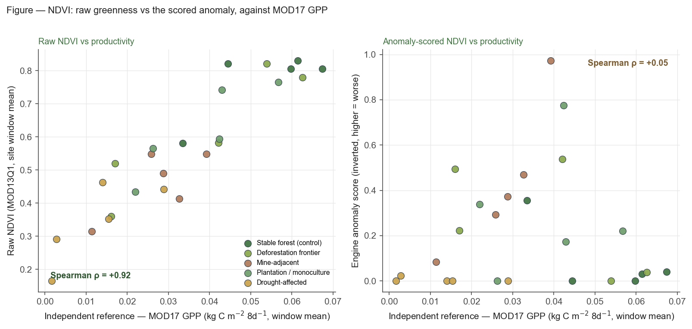

# NDVI validation — raw NDVI vs engine anomaly score, against MOD17 GPP

*Evidence-only diagnostic. No engine, constant, seed, or QA changes were made
(`git diff engine/` is empty). Mirrors the AOD↔PM2.5 and AAI↔FIRMS
raw-vs-anomaly checks, applied to the Nature pillar's vegetation indicator.*

**Date:** 5 June 2026 · **n = 25 sites** (operator-picked, illustrative — not
statistically conclusive, same caveat as the aerosol validations).

---

## 1. Summary (three findings)

1. **Raw NDVI tracks vegetation productivity almost perfectly across sites:
   Spearman ρ = +0.92** (p < 0.001, n = 25) against the independent MOD17 GPP
   reference. The raw site-mean NDVI is a strong absolute proxy for vegetation
   condition.

2. **The engine's anomaly-scored NDVI does *not* track absolute condition:
   Spearman ρ = +0.05** (p = 0.82, n = 25) — statistically indistinguishable
   from zero, and not even correctly signed (a worse-direction score should run
   *negative* against productivity). For the question "how healthy is the
   vegetation here," the anomaly score is **much worse** than raw NDVI.

3. **The reason is structural, not a bug.** The score is a *site-vs-local-ring*
   anomaly (IC §3.2 / §7.4). Where degradation is **regional** (drought: 4 of 5
   sites score exactly 0.0) the site is not anomalous against its equally-stressed
   surroundings, so it scores ≈ 0 — the same as a pristine forest (2 of 5
   controls also score 0.0). Where degradation is a **local contrast** (a mine
   clearing inside intact forest — Carajás scores 0.97) the anomaly fires hard.
   The score measures *local spatial contrast*, which is the right grammar for
   **attributing a supplier's local footprint** but the wrong grammar for
   **ranking cross-site absolute condition**.

---

## 2. Method

### 2.1 Reference dataset
**MOD17A2H GPP** (`MODIS/061/MOD17A2H`, 8-day, 500 m, band `Gpp`), the brief's
**preferred** ground-truth-equivalent — *not* the weaker NDVI-derived VCI
fallback. Independence: MOD17 GPP comes from the biome-property / light-use-
efficiency model driven by **MOD15A2H FPAR/LAI and GMAO meteorology**, a
structurally separate algorithm from the **MOD13Q1 NDVI** value the engine scores.
It is therefore a meaningful independent check on absolute vegetation condition.
*Caveat:* GPP measures **productivity**, not **ecosystem integrity** — see §5 on
the monoculture confound, which a productivity reference can only partially test.

### 2.2 Sites
~5 categories × 5 sites (`analysis/ndvi_gpp_sites.json`):
deforestation frontier, mine-adjacent, plantation/monoculture, drought-affected,
and stable-forest control (the healthy anchor).

### 2.3 Window / radius (consistent with the other validations)
- **Window:** 2025-05-01 → 2025-10-31 (184 days; AOD used 181 d).
- **Radius:** 5.0 km site buffer (same as AOD/AAI). Background ring per the
  engine default (5× site radius, capped 200 km).
- NH-growing-season window keeps temperate/boreal controls leaf-on; equatorial
  controls are aseasonal. Raw NDVI, the anomaly score, and GPP all read the
  **same window per site**, so phenology affects all three identically and the
  cross-site comparison stays apples-to-apples.

### 2.4 What was extracted (production code path only — no debug fork)
Per site, via `engine.nature.compute_ndvi_condition(aoi, window, "screening",
ee, fallback=FallbackContext())` — the exact function the live screening calls:
- **(a) raw NDVI** = `nature.ndvi.mean` (site window-mean NDVI).
- **(b) anomaly score** = `nature.ndvi.score` = `clamp((NDVI_bg − NDVI_site) /
  (3·σ_bg), 0, 1)`, inverted because lower NDVI is worse (IC §3.2, k = 3).
- **(c) reference** = window-mean MOD17 GPP over the same 5 km buffer,
  good-quality pixels only (`Psn_QC` MODLAND bit 0 = 0), fill values masked.

Harness: `analysis/ndvi_gpp_extract.py` → `analysis/ndvi_gpp_validation.csv`;
analysis + figure: `analysis/ndvi_gpp_analysis.py`.

---

## 3. Results

### 3.1 Cross-site rank correlation against MOD17 GPP

| Quantity | Spearman ρ vs GPP | p | n | Expected sign | Verdict |
|---|---|---|---|---|---|
| **Raw NDVI** (site mean) | **+0.92** | <0.001 | 25 | + | strong, correct |
| **Engine anomaly score** | **+0.05** | 0.82 | 25 | − (worse→lower GPP) | no signal |

### 3.2 Category separation (means, n = 5 each)

| Category | GPP ref | Raw NDVI | Anomaly score | # sites scoring 0.0 |
|---|---|---|---|---|
| Stable forest (control) | 0.0533 | 0.769 | 0.085 | 2 |
| Deforestation frontier | 0.0383 | 0.613 | 0.259 | 1 |
| Mine-adjacent | 0.0276 | 0.463 | 0.438 | 0 |
| Plantation / monoculture | 0.0381 | 0.620 | 0.302 | 1 |
| Drought-affected | 0.0126 | 0.343 | 0.005 | 4 |

- **Raw NDVI separates cleanly and monotonically** with the reference: control
  (0.769) > deforestation ≈ plantation (~0.62) > mine (0.463) > drought (0.343),
  the same rank order as GPP. It correctly flags every stressed category as below
  the control.
- **The anomaly score's separation is broken for absolute condition.**
  Drought-affected sites — the **most degraded** by the reference (GPP −76% vs
  control) — get the **lowest** concern score (0.005), *below* the healthy
  control (0.085). Mine-adjacent scores highest (0.438) not because mines are the
  most degraded overall but because a mine sits in the sharpest *local* contrast.

---

## 4. Raw vs anomaly — verdict

**For measuring absolute vegetation condition, raw NDVI is decisively better
than the engine's anomaly-scored NDVI** (ρ = +0.92 vs +0.05). This is a stronger
version of the same pattern the AOD and AAI checks found: the site-minus-ring
anomaly grammar is excellent at surfacing a *local* deviation from regional
context but is, by construction, blind to *regional-scale* condition — a
drought-flattened landscape and an intact rainforest both look "un-anomalous"
against their own surroundings and collapse to score ≈ 0. The anomaly is not
wrong; it answers a **different question** — "is there a supplier-attributable
local vegetation deficit?" — which is exactly why it ranks the mine clearing
(local contrast in forest) at 0.97 and the regional drought at 0.0. But it must
not be read as a cross-site "how healthy is this vegetation" gauge; raw NDVI (or
GPP directly) is the right surface for that.

---

## 5. The monoculture confound (§5.4 N1 / N4 / N6)

| | Oil-palm estates | Intact-forest controls | Δ |
|---|---|---|---|
| Raw NDVI mean | 0.753 | 0.769 | −0.016 |
| GPP mean | 0.0499 | 0.0533 | −0.0034 |

Raw NDVI reads oil-palm monoculture as **essentially as healthy as intact
forest** (Δ −0.016) — the §5.4 N1/N4/N6 concern. **But the independent
productivity reference only modestly disagrees** (GPP −6%): oil palm *is* a
fast-growing, high-productivity canopy, so by a *productivity* yardstick it
genuinely is nearly forest-like. The real loss from monoculture conversion is in
**biodiversity, structure, soil carbon and ecosystem integrity** — dimensions
that **neither NDVI nor GPP captures**. So: the §5.4 confound that "NDVI reads a
plantation as healthy" is **confirmed for greenness and only weakly contradicted
by productivity**, and a productivity reference is the wrong instrument to fully
adjudicate it. Flag for the decision log: testing the monoculture confound
properly needs a *biodiversity/structure* reference (e.g. canopy-height or
land-cover-class change), not a greenness or productivity proxy.

---

## 6. Recommendation (evidence only — decide separately)

- **Keep raw NDVI as the absolute-condition surface.** It tracks independent
  productivity at ρ = +0.92; it is doing its job.
- **Do not promote the anomaly score into any cross-site "vegetation health"
  ranking or traffic-light that users will read as absolute condition.** It is a
  local-contrast / attribution signal (ρ ≈ 0 vs absolute productivity) and should
  be labelled and used as such — consistent with how §7.5 frames
  `Supplier_Spatial_Link` / `External_Driver_Screening` as exposure-not-
  attribution. This mirrors the AOD/AAI recommendation that the scored anomaly
  and the raw level answer different questions.
- **The monoculture confound stands** at the greenness level but cannot be
  resolved by NDVI *or* GPP; if it matters to a user decision, it needs a
  structure/biodiversity reference (v1.x).

No values, weights, demotions, or QA fields were changed here.

---

## 7. Code ↔ assumption mismatches found

- **None in the engine.** The anomaly score behaves exactly as IC §3.2 / §7.4
  specify; the ρ ≈ 0 result is the *designed* behaviour of a site-vs-ring
  anomaly, not a defect.
- **Documentation nuance worth logging:** the §5.4 N6/N4 narrative ("NDVI reads a
  plantation/recovering crop as healthy") is real for greenness, but the natural
  independent reference to "catch" it (productivity) only partially does — the
  confound is fundamentally about ecosystem integrity. Worth a one-line note in
  §5.4 that a productivity reference is insufficient to test N1/N4/N6.

---

## 8. Reproducibility

```bash
# (a),(b) production NDVI path + (c) independent GPP reference → CSV
EE_PROJECT_ID=supply-chain-observatory python analysis/ndvi_gpp_extract.py
# correlations, category separation, monoculture spotlight, figure
python analysis/ndvi_gpp_analysis.py
```

Artifacts: `analysis/ndvi_gpp_sites.json`, `analysis/ndvi_gpp_validation.csv`,
`analysis/ndvi_gpp_fig.png`.



## 9. Limitations

- Small, operator-picked n = 25 (5×5); **illustrative, not conclusive** — same
  caveat as the aerosol validations.
- Single fixed window; cross-hemisphere phenology is only partly neutralised by
  the NH-growing-season choice (mitigated because all three metrics share the
  per-site window).
- GPP and NDVI both derive from MODIS surface reflectance, so they are not fully
  orthogonal; GPP is independent of the *NDVI value* (different algorithm, plus
  meteorology and biome LUE) but not of the underlying sensor family. This makes
  the +0.92 a fair test of "does NDVI track productivity," while keeping in mind
  neither captures biodiversity/structure (§5).
- The drought category is chronic semi-arid stress, not a single dated drought
  event; it anchors the low-productivity end robustly but is not an event study.
